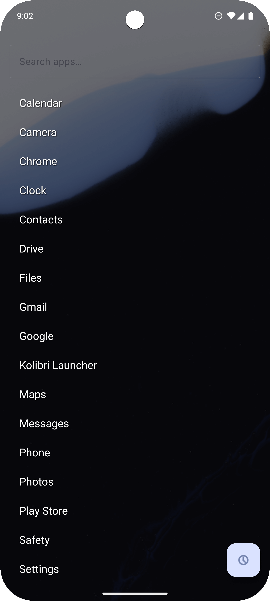
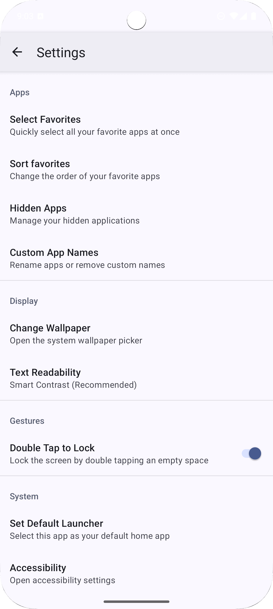

# Kolibri Launcher

A minimalist, open-source Android launcher designed for focus and speed, built with a state-of-the-art, reactive, and highly decoupled architecture.

## About The Project

In a world of distracting, cluttered home screens, Kolibri Launcher offers a breath of fresh air. It provides a clean, beautiful, and distraction-free environment that puts your essential apps front and center, keeping everything else neatly tucked away.

More than just a functional app, this project is a showcase of modern Android architecture best practices. It serves as a practical, real-world example of building a reactive, testable, and maintainable application from the ground up, following Google's latest recommendations.

## Requirements

*   **Android 16+** (API Level 36)
*   No backward compatibility for older Android versions

## Privacy & Crash Reporting

*   **ACRA (Application Crash Reports for Android):** The app uses ACRA to collect anonymous crash reports, helping improve stability and fix bugs.
*   **Fully Anonymous:** No personal data is collected. Reports contain only technical information about crashes (Android version, device model, stack trace).
*   **Opt-In:** Crash reporting is disabled by default. Users are asked for consent on first launch.
*   **User Control:** Can be enabled/disabled anytime in the app settings.
*   **Self-Hosted:** Reports are sent to a private server, not third-party services.

## Screenshots

  
  
  

## Features

*   **Minimalist Home Screen:** Displays only the time, date, battery, and your hand-picked favorite apps.
*   **Gesture Navigation:** A simple swipe up opens the full app drawer.
*   **App Drawer with Search:** Quickly find any app you need.
*   **Smart Sorting:** Sort apps alphabetically or by usage count.
*   **Dynamic Theming:** Text colors automatically adapt to your wallpaper for perfect readability.
*   **App Management:** Hide apps you want to see less often and manage favorites with ease.
*   **App Shortcuts:** Long-press an app to access its system shortcuts.
*   **Lightweight & Fast:** Built for performance and a smooth experience.

## Architectural Overview & Tech Stack

This launcher is built with a strong emphasis on clean architecture, SOLID principles, and a fully reactive design.

*   **100% Kotlin**
*   **MVVM Architecture:** A strict separation of concerns between the UI (`Fragments`), state-holding (`ViewModel`), and business logic.
*   **Clean Architecture & SOLID Principles:**
    *   **Dependency Inversion Principle (SOLID):** The entire application is decoupled through the use of interfaces (`...Repository`). High-level components like `ViewModel` and `UseCase` depend on abstract contracts, not concrete implementations.
    *   **UseCase Layer:** Centralizes complex business logic (`AppListUseCaseRepository`) by orchestrating multiple repositories.
    *   **Repository Pattern:** Each data source is managed by a dedicated repository (e.g., `FavoritesRepository`, `SettingsRepository`).
*   **Reactive UI & State Management:**
    *   **Kotlin Coroutines & Flows:** Used for the entire asynchronous pipeline, from the data layer (`DataStore`) to the UI.
    *   **Single Source of Truth:** The `HomeViewModel` exposes a single `UiState` data class via **StateFlow**, ensuring an atomic, predictable, and easily debuggable UI state.
    *   **Events vs. State:** A clear separation between state (`StateFlow`) and one-time UI events (`SharedFlow`) is maintained for robust UI logic.
*   **Dependency Injection:** With **Hilt** to manage all dependencies and bind interfaces to their implementations.
*   **Data Persistence:** With **Jetpack DataStore** for storing all user settings and preferences, ensuring safe, asynchronous data operations.
*   **Android Jetpack:**
    *   **Navigation Component** for managing fragment transactions.
    *   **ViewModel** for lifecycle-aware state management.
    *   **AndroidX Libraries** throughout.

### Comprehensive Testing Strategy

The project is built with testability as a first-class citizen, ensuring reliability and maintainability through a multi-layered testing approach. Every layer of the architecture is covered by the appropriate type of test.

*   **Unit Tests (JVM):**
    *   **Purpose:** Fast, local tests for the data, business, and presentation logic layers, running on the JVM without an emulator.
    *   **Coverage:** Covers `ViewModel` logic, the `AppListUseCaseRepository`, and all `Repository` interactions.
    *   **Tech Stack:** **JUnit**, **Mockito** (via mockito-kotlin for idiomatic syntax), and **Turbine** for robust testing of Kotlin Flows.

*   **UI / Instrumented Tests (On-Device):**
    *   **Purpose:** To verify the correctness of the UI layer, user interactions, and the integration between Fragments and the `ViewModel`. These tests run on an Android emulator or a physical device.
    *   **Coverage:** Covers UI state rendering (`HomeFragment`), navigation gestures (`swipe up`), `RecyclerView` display and filtering (`AppDrawerFragment`), and dialog interactions (`AppContextMenuDialogFragment`).
    *   **Tech Stack:** **Espresso** for UI interactions, **Hilt Android Testing** for robust dependency injection in tests, and `ActivityScenarioRule` for launching UI components in a controlled environment.
    *   **Stability:** Includes custom JUnit Rules (`DisableAnimationsRule`) to ensure test stability and eliminate flakiness by programmatically disabling system animations during test runs.

## Building The Project

1.  Clone the repository: `git clone https://github.com/reygnn/kolibri-launcher.git`
2.  Open the project in the latest stable version of Android Studio.
3.  Let Gradle sync the dependencies.
4.  Build and run the project.

## Contributing

Contributions are what make the open-source community such an amazing place to learn, inspire, and create. Any contributions you make are **greatly appreciated**.

If you have a suggestion that would make this better, please fork the repo and create a pull request. You can also simply open an issue with the tag "enhancement".

## License

This project is free software: you can redistribute it and/or modify it under the terms of the **GNU General Public License v3.0** as published by the Free Software Foundation.

This program is distributed in the hope that it will be useful, but WITHOUT ANY WARRANTY; without even the implied warranty of MERCHANTABILITY or FITNESS FOR A PARTICULAR PURPOSE. See the GNU General Public License for more details.

You should have received a copy of the GNU General Public License along with this program. If not, see <https://www.gnu.org/licenses/>.

See `LICENSE` for the full license text.