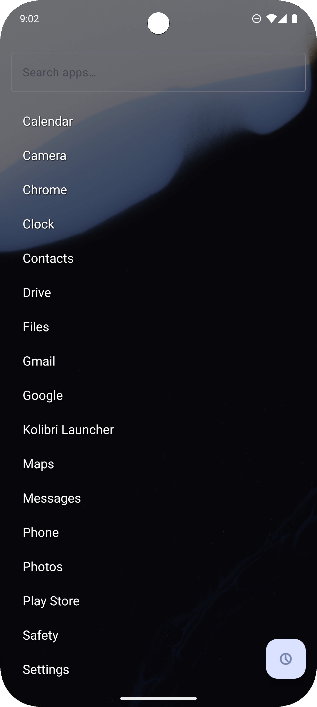
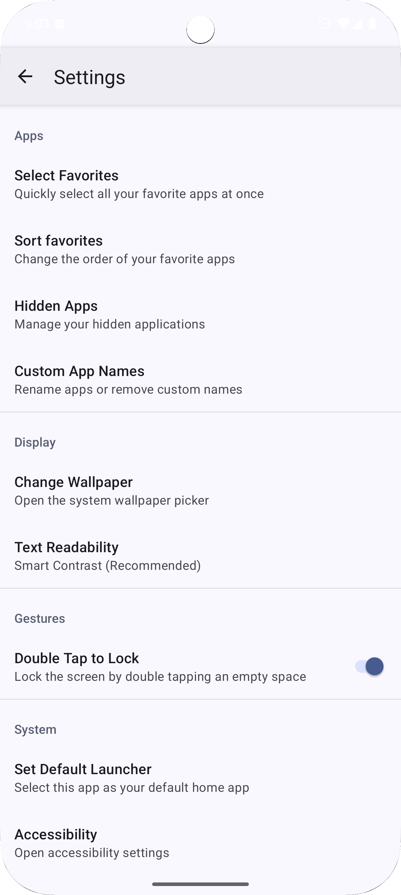

# Kolibri Launcher

[](https://github.com/reygnn/Kolibri-Launcher/actions/workflows/android.yml)
[](https://codecov.io/gh/reygnn/Kolibri-Launcher)
[](https://www.gnu.org/licenses/gpl-3.0)
[](https://source.android.com/docs/setup/about/build-numbers)

A minimalist Android home-screen launcher. Opinionated, single-platform, no clutter.

## What it is

Kolibri replaces your home screen with a stripped-down view: time, date,
battery, and a hand-picked list of favourite apps. Everything else lives
in a swipe-up app drawer with instant search. No widgets. No icon grid.
No "discover" tabs.

It's also a private playground for trying current Android architecture
ideas — Hilt, Coroutines/Flow, Jetpack Navigation, Clean-Architecture
module split, Robolectric + Espresso, the works. The codebase is
deliberately over-engineered relative to its size; if you're poking
around for examples of how a given pattern looks in 2026, you'll
probably find one.

## Requirements

- **Android 16** (API 36). `minSdk = compileSdk = targetSdk = 36`.
  No backwards-compat shims. If your device is older, this launcher
  won't install.
- **JDK 21** to build. Lower JDKs fail at the Robolectric / SDK-36
  test layer.

## Privacy & Crash Reporting

- **ACRA**, opt-in. Disabled by default; the consent dialog appears
  on first launch and the choice is remembered.
- **Self-hosted backend.** Reports go to a private server. No third-
  party telemetry, no analytics SDKs, no ads.
- **Anonymous payload.** Stack trace + device model + Android version.
  No user identifiers, no app contents.
- **Per-type rate-limited.** Same exception class within a 24 h window
  fires once. Stops a recurring crash from flooding the backend.
- **Toggle anytime** in Settings → Crash Reports.
- **Post-mortem ANR detection** uses Android's
  `ApplicationExitInfo` API (introduced in API 30, available natively
  here because of the `minSdk = 36` floor) plus a self-defense
  `RecoveryWatchdog` that kills the process if the main looper hangs
  for 8 s. No third-party ANR library.

## Screenshots

<p align="center">
  
  
  
</p>

## Features

### Home & navigation

- Minimalist home: time, date, battery, calendar event, alarm — all
  optional via Settings.
- Swipe-up to the app drawer; swipe-down inside the drawer to dismiss.
- Long-press any app for system shortcuts (LauncherApps API).
- Double-tap to lock screen (optional, requires accessibility service).
- Two configurable swipe-from-edge actions (left / right).

### App drawer

- Real-time search with debounced filter.
- Sort alphabetically or by time-weighted usage (decay constant
  configurable via the `USAGE_DECAY_LAMBDA`).
- Optional auto-launch when the search filter narrows to a single
  result.
- Hide apps you never want to see.
- Custom display names per app (rename "Slack" to "🐛", etc.).

### Wallpaper

- Single image or multi-layer composition with per-layer scale,
  translation, and blend modes.
- Dynamic text colours: foreground text adapts to wallpaper luminance
  so dark text never lands on a dark wallpaper region.

### Backup & Restore

- Full settings export / import via SAF (file picker).
- ZIP format with embedded wallpaper images; legacy JSON-only format
  still loads on import.
- Per-section import options: import only favourites, or only
  themes, etc.

### Reliability

- Crash-safety pattern across the codebase — every async boundary
  has its own coroutine exception handler, every external API call
  is in a `try/catch` that classifies the failure (see the
  four-category frame in `CLAUDE.md` Rule 11).
- Multi-layer global crash handler — OOM recovery, ACRA spam guard,
  process-restart paths.

## Architecture & Tech Stack

Three Gradle modules since the 2026-05 split:

```
:app     Android Application — UI (Activities, Fragments), main
          (Hilt entry, ACRA init, AnrReporter, RecoveryWatchdog),
          and per-feature packages under `ui/`.
:data    Android Library — repository implementations, DataStore,
          ContentResolver-touching code, package-update receiver.
          Depends on :domain.
:domain  Pure-Kotlin JVM module (no Android SDK). Repository
          interfaces, ~50 fine-grained use cases, pure-Kotlin
          domain models, dispatcher qualifiers, KolibriLog
          indirection (so :domain doesn't import Timber directly).
```

Module dependency direction is one-way: `:app → :data → :domain`.
Cycles eliminated in the cycle-elimination branches (see TODO.md
§9.2).

### Stack

- **100 % Kotlin 2.2.x**, no Java sources.
- **MVVM + Clean Architecture.** Activities/Fragments hold no
  business logic — every state path goes through a `ViewModel` which
  composes use cases.
- **Coroutines + Flow.** UI state is `StateFlow`, one-time events
  are `SharedFlow`. The `WhileSubscribed` cold-path bug class is
  audited and fixed (see `BackupDataAssembler.performImport` for the
  canonical pattern).
- **Hilt** for DI. Test variants use `HiltTestApplication` so the
  production `KolibriLauncherApp` doesn't leak into Robolectric runs.
- **Jetpack DataStore Preferences** is the *only* persistent store
  (two documented exceptions for crash-handler bootstrap state, see
  `CLAUDE.md` Rule 5).
- **Material 3** + AndroidX. View Binding, no Compose.
- **Navigation Component** for fragment transitions inside the
  HOME activity.
- **ACRA 5.11.4** for crash reporting (self-hosted, opt-in).

### Testing

The project is *aggressively* tested by personal-project standards.
Three layers:

- **JVM unit tests** (~2200 in total across `:domain`, `:data`,
  `:app`) — JUnit 4, MockK, Turbine, kotlinx-coroutines-test.
  No Mockito (fully migrated). The `:domain` module is pure-Kotlin
  so its 310 tests run in ~5 s without Robolectric bootstrap.
- **Robolectric tests** — only for code that legitimately touches
  Android types (`android.net.Uri`, real `ParcelFileDescriptor`,
  Activity-host fragment smoke tests). Project default `Application`
  is `android.app.Application`, NOT `KolibriLauncherApp`, to keep
  background services out of test runs (see TODO.md §6 for the
  OOM-incident memo).
- **Instrumented tests** (16 on a real AVD / device) — limited to
  things JVM and Robolectric structurally cannot reach: real
  ContentResolver descriptors, real RoleManager state,
  LauncherApps permission gates, real BroadcastReceiver `goAsync`,
  real RecyclerView measure pass, swipe-down gesture
  dispatch chains. AndroidX Test Orchestrator (`clearPackageData`)
  resets state between tests.

Per-repository contract-test pattern: each repository interface has
an abstract `XyzRepositoryContract` plus a `FakeXyzRepositoryContractTest`
+ `XyzRepositoryImplContractTest` — if fake and impl drift, the
contract catches it at JVM speed. Three real fake-vs-impl bugs were
caught this way.

Detailed conventions live in
[`app/src/test/CLAUDE.md`](app/src/test/CLAUDE.md) and
[`TESTING_CONVENTIONS.kt`](app/src/test/java/com/github/reygnn/kolibri_launcher/TESTING_CONVENTIONS.kt);
instrumented-test specifics in
[`INSTRUMENTED_TESTING_NOTES.kt`](app/src/androidTest/java/com/github/reygnn/kolibri_launcher/INSTRUMENTED_TESTING_NOTES.kt).

## Building

```bash
git clone https://github.com/reygnn/Kolibri-Launcher.git
cd Kolibri-Launcher
./gradlew assembleDebug         # debug APK
./gradlew testDebugUnitTest     # JVM unit tests
./gradlew connectedDebugAndroidTest   # instrumented tests (needs AVD/device)
./gradlew jacocoTestReport      # coverage
./gradlew assembleRelease       # release APK + ProGuard mapping upload to ACRA
```

Gradle is bundled via the wrapper. JDK 21 is required (Robolectric +
SDK 36 dependency).

For ACRA's release-build pipeline, two property files are expected at
the repo root and intentionally git-ignored:

- `keystore.properties` — release signing config (skipped if absent;
  CI uses a debug-signed APK).
- `secrets.properties` — ACRA backend URL + basic-auth credentials
  (skipped if absent; reports just won't be uploaded).

## Project documentation

- [`CLAUDE.md`](CLAUDE.md) — project conventions and the 13 hard
  architectural rules. Read this first before any code change.
- [`TODO.md`](TODO.md) — living roadmap, audit snapshot, and the
  quarterly-recheck process for pinned dependencies.
- [`KNOWN_ISSUES.md`](KNOWN_ISSUES.md) — StrictMode violations
  caused by the Android framework or OEM modifications that cannot
  be fixed in app code.

## Contributing

Solo-maintained, but issues and pull requests are welcome. If you're
fixing a bug, please include a failing test first (the project
treats tests as the source of truth for behaviour). Architectural
changes that contradict `CLAUDE.md` need an issue first to discuss
the rule trade-off.

## License

GNU General Public License v3.0 — see [`LICENSE`](LICENSE).

This program is distributed in the hope that it will be useful, but
WITHOUT ANY WARRANTY; without even the implied warranty of
MERCHANTABILITY or FITNESS FOR A PARTICULAR PURPOSE.
