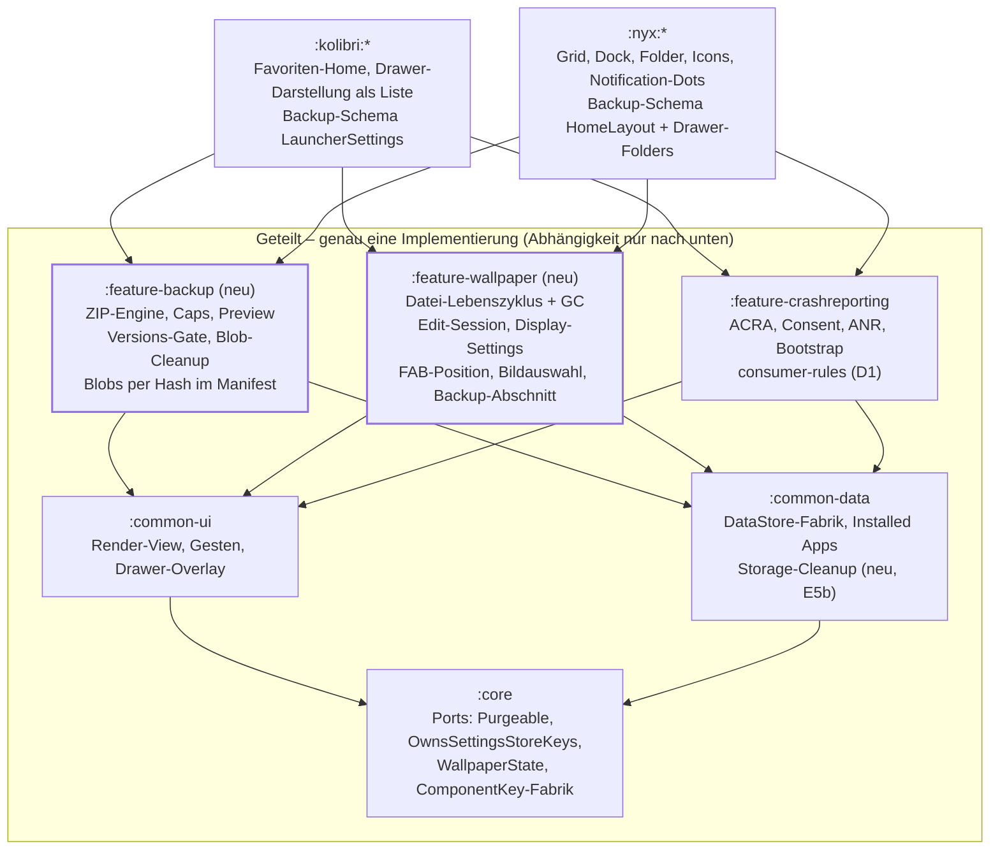

# Spec: Nyx-Rewrite – Anbindung an Kolibri

Stand: 30.09.2026 (Revision 44: 2b-4c-3 – Nyx auf `Purgeable`, `ResetRepository`, Meldung „unvollständig“, Säen nach jedem Reset; R2 geändert, O4 (c) neu. Revision 43: 2b-4c-2-b – lokaler `FakeDataStore` in `WallpaperRepositoryImplTest` nachgezogen; Aufräum-Kandidat vermerkt. Revision 42: 2b-4c-2 – F1, Teilfehler beim Zurücksetzen werden sichtbar, in beiden Apps. Revision 41: 2b-4c-1 überarbeitet – Befund des Contracts in Kolibri behoben. Revision 40: 2b-4c-1 – `ResetCompletenessContract` mit beiden Subklassen gegen die heutigen Resets; Inventur, F1 und Reihenfolge für 2b-4c eingetragen. Revision 39: 2b-4b – `NyxBackupManager` heißt `BackupRepositoryImpl`. Revision 38: 2b-4a – `SafDocuments` in `:common-data`, D1–D3; Arbeitsweise und Entscheidungen R1–R4 für den Reset in 2b-4c; O4 um den Repository-Vertrag ergänzt. Revision 37: 2b-3b-c – Vorschau-Timeout auf `await()`; 2b-3c-b – Kolibris Speicherpfad-Test, Zusammenstellen innerhalb von `writeOrDiscard`; 2b-3c-c – sechs vom `BackupFormatContract` abgedeckte Tests entfernt. Revision 36: 2b-3c – `BackupFormatContract` (Ablehnungen je App, Vorschau = Import), O3-Fälle im Rundlauf-Contract, Golden-Fall `kolibri-in-nyx` entfernt. Revision 35: 2b-3b-b – Sammler-Job aus `recordEmissions` in den ViewModel-Tests gekündigt. Revision 34: 2b-3b – Nyx-Backup-UI mit Vorschau, Optionen und eigener Meldung je Ergebnis. Revision 33: 2a-7b – Kolibris Vorschau nennt den Grund einer Ablehnung; Backup-Screen zeigt die Meldungen aus 2a-7 sofort. Revision 32: 2b-3a-b – Tippfehler im Test aus 2b-3a, ein Aufruf von `BlobSource`. Revision 31: Reihenfolge 2b-3b → 2b-3c → 2b-4 im Phasenplan klargestellt. Revision 30: 2b-4 um den Zusammenzug der SAF-Helfer nach `:common-data` ergänzt. Revision 29: 2b-3a – Nyx-`BackupRepository` mit SAF-Pfad, `ImportResult` in Kolibris Form, eigener Hidden-Apps-Schalter, Nyx-`WriteOrDiscard` entfernt; 2b-5 erledigt; O3 entschieden (Zusammenführen bleibt), O4 neu (gemeinsames `ImportResult`, Manifest-Vorschau). Revision 28: 2b-2c-Fix – Kolibris Rundlauf-Subklasse setzt die Sortierung über `setSortOrderForTest`. Revision 27: 2b-2c – geteilte Contracts `BackupRoundTripContract` und `ImportKeepsMissingAppsContract` mit je einer Subklasse pro App; E2 wandert in der Contract-Tabelle zum Rundlauf; O3 (Ersetzen oder Zusammenführen bei Custom Names und leeren Swipe-Slots) offen. Revision 26: 2b-2b – Nicht-endliche Zahlen machen ein Nyx-Backup ungültig, wie bei Kolibri; der NaN-Test aus 2b-2 ist ersetzt. Revision 25: 2b-2 – Nyx-Import nach E1, E2, B11, B13, B14, U4. Revision 24: Fix zu 2a-5 – Kolibri gibt jedem wiederhergestellten Layer eine eigene Datei, O2 für Kolibri erledigt. Revision 23: 2b-1 – Nyx schreibt und liest den E5a-Container über die Engine, Abschnitt `nyx.backup`; offene Frage O2 (geteilte Wallpaper-Dateien nach Import in Kolibri). Revision 22: 2b-0 – Rahmen um die Engine nach `:feature-backup` (`writeOrDiscard`, `readStaged` mit Staging und Größenprüfung), Kolibri umgestellt; Nyx gleicht sein Backup-Verhalten an Kolibri an, ein Abschnitt `nyx.backup`. Revision 21: 2a-7 – eigene Meldungen für fremde App und ältere Version; Phase 2a vollständig. Revision 20: 2a-4 bis 2a-6 umgesetzt, Legacy-Modul mit Sunset. Revision 19: Offene Designfrage O1 (verwaiste Custom-Names); 2a-4/2a-5 auf dem Gerät bestätigt. Revision 18: `BackupEngine` (2a-3); Befund E1/U4/B13 in Kolibri für 2a-4. Revision 17: `:feature-backup` mit Container-Format (2a-2). Revision 16: B14 umgesetzt (2a-1). Revision 15: Phase 1c umgesetzt (gemeinsamer Bootstrap, Health für Nyx). Revision 14: D1 auf dem Gerät belegt (Nyx). Revision 13: `AnrReporter` in `:feature-crashreporting`, Watermark im eigenen Store. Revision 12: Phase 1b umgesetzt, A10 als Gate. Revision 11: 1b – Kolibris Build-Stand für beide Apps (Lint, Orchestrator, MockK-Flag, JaCoCo, Discovery-Tasks). Revision 10: A13 gegen hart verdrahtete Dispatcher, in beiden Apps. Revision 9: Flow-Beobachtung über `recordEmissions` (Gesamtheit) oder Turbine (einzeln). Revision 8: `assertIs` als zweite A12-Ausnahme, nur mit genutztem Smart-Cast. Revision 7: Flows in Tests nur mit Turbine, Unconfined nur als Eager-Guard. Revision 6: eine Assertion-Bibliothek (Truth) mit Detektor A12. Revision 5: Nyx ohne Lese-Pfad für alte Backups, Kolibris Lese-Pfad als abschaltbares Modul mit Sunset-Warnung. Revision 4: Import ungezippter Legacy-JSON-Dateien entfällt. Revision 3: A7 an `TESTING_CONVENTIONS.kt` angeglichen, D1-Endform AGP-9-fest, Golden-Set um App-fremde Backups ergänzt. Revision 2: in Spec + Roadmap geteilt, Widersprüche aus dem Review bereinigt)

## Ziel & Kontext

Nyx wird auf seinen Produktkern reduziert (Icon, Grid, Folder, Dock). Backup, Reset, Wallpaper und Storage-Cleanup laufen über **eine** gemeinsame Implementierung mit Kolibri, und ein Build-Gate macht erneuten Drift unmöglich. Wo Nyx heute besser löst, wandert das zuerst in diese gemeinsame Implementierung und damit in Kolibri.

**Warum jetzt.** Backup/Restore existiert zweimal: Kolibri mit 1.894 Zeilen in drei Klassen (`BackupRepositoryImpl`, `BackupSerializer`, `BackupDataAssembler`), Nyx mit 417 Zeilen (`NyxBackupManager` + Schema + Serializer). Härtungen werden per Hand gespiegelt – der Code sagt es selbst: „port of nyx §Audit-3 A3-05“, „kolibri parity“, „nyx parity“. Beim Wallpaper nennt sich `NyxWallpaperEditCoordinator` im KDoc einen „faithful port“ von Kolibris 1.171-Zeilen-`WallpaperDelegate`. Jede Korrektur muss also zweimal gemacht und zweimal auditiert werden.

**Dieses Spec und die Roadmap.** Dieses Spec deckt Phase 0–5 ab: Hotfix, Regel-Fundament, Backup, Wallpaper, Storage-Cleanup und deren Verriegelung. Alle übrigen Angleichungen (Lazy-Verify, App-Start, Suche, Event-Indikatoren, Settings-Bausteine, Paket-Events u. a.) stehen in `ROADMAP_NYX_ANGLEICHUNG.md`. Sie bauen auf dem Fundament aus Phase 1 auf, blockieren dieses Spec aber nicht.

**Verhältnis zu bestehenden Specs.** Dieses Spec ersetzt die nie umgesetzten Phasen C/D von `BACKUP_SCHEMA_PORT_SPEC` und `WALLPAPER_RESTORE_SPEC` sowie WV5 von `WALLPAPER_SHARE_SPEC`. Die Doktrin bleibt: geteilt wird die Mechanik, nicht das Schema (MRG-INV-8).

**Nicht-Ziele.** Kein Merge der Home-Modelle. Keine In-Code-Datenmigration (Rule 5) – Kolibri liest seine heutigen Backup-Dateien für eine Übergangszeit weiter, über ein abschaltbares Lese-Modul statt über Migrationscode; Nyx hat keine Backups im Umlauf (siehe E5a).

**Ist die Aufgabe klar?** Ja. Alle Entscheidungen E1–E5 sind gefallen – siehe letzter Abschnitt.

## Scope

Nyx behält sein Home-Modell und alles, was Icons zeichnet; rund 1.500 Zeilen Backup-, Reset- und Wallpaper-Code verschwinden aus `nyx/` ersatzlos in geteilte Module.

| Bereich | Heutige Nyx-Dateien | Verbleib |
| --- | --- | --- |
| Grid & Home-Layout | `home/model/*` (Grid, HomeLayout, Invarianten, Queries), `transition/*` (Reconciler, Regridder, Transition), `HomeGrid*`, `HomePagerAdapter`, `HomeLayoutRepository` + DTOs | bleibt in Nyx |
| Drag-Engine | `home/drag/*`, `EdgeAdvanceController`, `DragPayload` | bleibt in Nyx |
| Folder | `FolderOverlayController`, `FolderMemberAdapter`, `FolderTitle`, `DrawerFolders*`, `FolderMembership` | bleibt in Nyx |
| Dock | `DockAdapter`, Dock-Teile von `HomeLayout` | bleibt in Nyx |
| Icon | `data/icon/*` (Loader, Rasterizer, Disk-Cache, `FolderIconRenderer`), `IconStyle`, `IconBinding` | bleibt in Nyx |
| Backup/Restore | `NyxBackup`, `NyxBackupManager`, `NyxBackupSerializer`, `ImportResult` | wird gelöscht; Nyx liefert nur noch seine Schema-Abschnitte |
| Reset | `NyxResetManager` | wird gelöscht; Reset über die `Purgeable`-Liste wie Kolibri |
| Wallpaper | `home/wallpaper/*` (Edit-Controller, Coordinator, Bitmap-Cache, `LaunchSafe`), `NyxWallpaperImageSetter`, `NyxWallpaperDisplaySettings`, `NyxFabPositionStore` | wird gelöscht; nur die Einbettung in `MainActivity` bleibt |
| Storage-Cleanup | – (fehlt in Nyx) | wird eingeführt (E5b) |
| Übriges | Usage, Hidden Apps, `PreferencesRepository`, Drawer-Suche, Launch, Shortcuts, Event-Indikatoren, `NyxApplication`/Pump/`PackageEventCoordinator`, Settings-UI | **nicht in diesem Spec** – Befunde und Ziele in `ROADMAP_NYX_ANGLEICHUNG.md` |

`MainActivity` (1.873 Zeilen) bleibt Nyx-eigen. Dieses Spec entfernt daraus Backup- und Wallpaper-Logik (Rule 10); die weitere Reduktion auf Glue ist Teil der Roadmap.

## Ist-Analyse: Drift-Befunde

19 Unterschiede im Code, davon 7 zugunsten Nyx, 10 zugunsten Kolibri und 2 gemischt. Keiner ist heute ein akuter Datenverlust, aber jeder zweite ist eine Härtung, die nur eine App hat.

### Backup/Restore

| # | Aspekt | Kolibri | Nyx | Besser |
| --- | --- | --- | --- | --- |
| B1 | Engine-Schnitt | 3 Klassen, an `Uri`/`ContentResolver` gebunden, `Dispatchers.IO` hart codiert | 1 Klasse, Streams kommen vom Aufrufer, `@IoDispatcher` injiziert | Nyx |
| B2 | Manifest-Lesen | `readBytes()` ohne eigenes Limit; Preview-Pfad `readJsonFromZip` ganz ohne `CappedInputStream` | `readNBytes` mit 5-MiB-Cap | Nyx |
| B3 | Abgebrochener Export | halbe ZIP bleibt liegen | `writeOrDiscard` löscht das Dokument (A3-06) | Nyx |
| B4 | Schreibreihenfolge Import | Favoriten zuerst (10 Phasen) | Home-Layout zuletzt: bei Teilfehler bleibt der wertvollste Stand intakt | Nyx |
| B5 | Nicht installierte Apps beim Import | Favoriten, Order, Hidden, CustomNames, Swipe werden gefiltert; Import wartet auf Installed-Prime, Timeout = Fehler | alle Referenzen bleiben (lazy-slot) | Nyx (E1: behalten) |
| B6 | Blob-Dedup beim Export | `entryByPath`: geteilte Datei nur einmal im ZIP | ein Blob pro Layer | Kolibri |
| B7 | Layer ohne Blob (Legacy-URI) | Zugriff geprüft, nach intern kopiert | URI ungeprüft übernommen – auf dem Zielgerät oft tot | Kolibri |
| B8 | Backup ohne Wallpaper | aktuelles Wallpaper bleibt | Wallpaper wird auf `NONE` gesetzt | Kolibri (E2: stehen lassen) |
| B9 | Ergebnis-Typ | `Success` mit Zählern, fehlenden Apps, verworfenen Layern; `UnsupportedVersion`; `LimitExceeded` | nur `Success` / `InvalidData` | Kolibri |
| B10 | Versions-Gate, Preview, selektive Optionen | vorhanden | `schemaVersion` wird geschrieben, nie geprüft; keine Preview; UI nutzt immer `NyxBackupOptions()` | Kolibri |
| B11 | Clamping importierter Werte | `coerceInSafe` pro Wert | keins (z. B. Scrim-Alpha) | Kolibri |
| B12 | Abbruch im UI-Aufrufer | – | `runCatching { withContext(IO) }` in `SettingsFragment` verschluckt `CancellationException` | Kolibri (Regelverstoß in Nyx) |
| B13 | Hidden-Apps beim Import | ergänzt (`componentsToShow = emptySet()`) – anders als Kolibris eigene Favoriten, die ersetzt werden | ersetzt | Nyx (bestätigt 29.09.: ein Backup ist ein Schnappschuss) |
| B14 | Component-Normalisierung | Regel „`.Main` → `pkg.Main`“ steckt nur in `AppInfo`; gespeicherte Strings aus Backups laufen ungeprüft durch | `ComponentKeyDto.toDomain()` normalisiert nicht | keiner – Normalisierung in einer `ComponentKey`-Fabrik, Konstruktor privat; sonst konserviert E1 eine Kurzform als „fehlend“, obwohl die App installiert ist |

### Wallpaper & Reset

| # | Aspekt | Kolibri | Nyx | Besser |
| --- | --- | --- | --- | --- |
| W1 | Datei-Lebenszyklus (setzen, ersetzen, löschen, Orphan-GC) | im `WallpaperDelegate` (App-Schicht); GC wartet, bis keine Edit-Session läuft | `NyxWallpaperImageSetter` in `:data`, löscht die alte Datei sofort; GC ohne Edit-Guard | Ort Nyx, Guard Kolibri |
| W2 | Edit-Session | im 1.171-Zeilen-Delegate verwoben | eigene Klasse: pure `Mutation` + ein synchroner `applyState`, Dispatcher injiziert | Nyx |
| W3 | Display-Settings (Scrim, Backdrop, Surface) | Teil der fetten `SettingsRepository` | schlanker Adapter, Enums defensiv geparst | Nyx |
| W4 | FAB-Position | `FabPositionRepository` + Contract-Triple | `NyxFabPositionStore`, konkret, ohne Interface | Kolibri |
| W5 | Bitmap-Cache | `WallpaperCompositeCache`, ein Eintrag | `WallpaperLayerBitmapCache`, LRU pro Layer, gegen Lösch-Flackern | Kolibri (E3, mit Messpunkt) |
| W6 | Factory-Reset | `Purgeable`-Liste; `WallpaperRepository.purgeRepository()` löscht auch die Dateien | `dataStore.clear()` + `fileManager.clearAll()` separat – umgeht den geteilten Purge | Kolibri |
| W7 | Dispatcher in Wallpaper-I/O | Delegate nutzt injizierte Scopes | `NyxWallpaperImageSetter` hart `Dispatchers.IO`; ebenso `WallpaperFileManager` in `:common-data` | keiner |
| W8 | Bildauswahl | `WallpaperImagePicker` legt `GetContent()` für alle Wege fest; im KDoc begründet: `PickVisualMedia()` erreicht keine Downloads, das Nebeneinander war „historical drift, not deliberate design“ | „Wallpaper wählen“ (Settings, Customization-Sheet) über `PickVisualMedia()`, „Layer hinzufügen“ über `GetContent()` – genau das in Kolibri behobene Nebeneinander | Kolibri; der nie umgesetzte `READ_MEDIA_IMAGES`-Entscheid aus `WALLPAPER_SHARE_SPEC` §9 gilt als ersetzt (bestätigt 29.09.) |

## Übernahmen: was Nyx besser löst

Acht Nyx-Lösungen gehen in die gemeinsame Implementierung und damit in Kolibri. Umgekehrt bringt die gemeinsame Implementierung Kolibris Stärken automatisch nach Nyx – dafür ist kein eigener Arbeitsschritt nötig.

**Nyx → gemeinsam (Kolibri profitiert):**

| ID | Übernahme | Quelle | Wirkung in Kolibri |
| --- | --- | --- | --- |
| Ü1 | Engine arbeitet auf `InputStream`/`OutputStream`, Dispatcher injiziert; SAF-Öffnen bleibt beim Aufrufer | B1 | Backup-Engine JVM-testbar ohne Robolectric; erfüllt die Ein-Dispatcher-Testregel |
| Ü2 | Manifest-Cap (`readNBytes`, 5 MiB) auch im Preview-Pfad | B2 | schließt die ungebremste Lesestelle in `readJsonFromZip` |
| Ü3 | `writeOrDiscard`: abgebrochener Export löscht das SAF-Dokument | B3 | keine halben, nicht importierbaren ZIPs mehr |
| Ü4 | Regel „wertvollster Store zuletzt“ als Engine-Vertrag (Schema legt Reihenfolge fest) | B4 | Favoriten + Order werden zuletzt geschrieben |
| Ü5 | Wallpaper-Datei-Lebenszyklus als eigene Klasse in der Daten-Schicht, mit Kolibris Edit-Session-Guard | W1 | `WallpaperDelegate` verliert Datei- und GC-Logik |
| Ü6 | Edit-Session als pure `Mutation` + ein synchroner Übergang | W2 | Delegate schrumpft auf Orchestrierung; Übergänge ohne Coroutine testbar |
| Ü7 | `WallpaperDisplaySettings` als eigener, schlanker Store | W3 | Wallpaper-Keys raus aus der fetten `SettingsRepository` |
| Ü8 | Import behält nicht installierte Apps (E1) | B5 | siehe unten |

**Ü8 (aus E1):** Der Import behält nicht installierte Apps in Favoriten, Order, Hidden, CustomNames und Swipe-Slots – wie das lazy-slot-Modell im Laufbetrieb. Sie erscheinen nur als Info; die `MissingAppsFormatter`-Anzeige bleibt. Damit entfällt auch das Warten auf den Installed-Prime samt Timeout-Fehler. Voraussetzung ist B14 (Normalisierung), sonst bleibt eine Kurzform als „fehlend“ stehen.

**Aus E2:** Nyx übernimmt Kolibris Verhalten – ein Backup ohne Wallpaper lässt das aktuelle stehen. Wer es löschen will, nutzt den Wallpaper-Schalter der Import-Optionen.

**Kolibri → gemeinsam (Nyx profitiert, ohne Extra-Arbeit):** Blob-Dedup (B6), Legacy-URI-Kopie (B7), reichhaltiges `ImportResult` (B9), Versions-Gate, Preview und selektive Optionen (B10), Clamping (B11), Repository-Form für FAB-Position (W4), Reset über `Purgeable` (W6), einheitliche Bildauswahl (W8). Kolibris org.json-Strict-Recovery für eine beschädigte `backup.json` im ZIP bleibt schema-spezifisch in Kolibri; der Import ungezippter Legacy-JSON-Dateien entfällt.

## Nutzersichtbare Änderungen

Beide Apps ändern ihr Verhalten, Kolibri nicht weniger als Nyx. Diese Liste ist die Grundlage für die Golden-Soll-Zustände und für die Release-Notes.

| App | Änderung | Quelle |
| --- | --- | --- |
| Kolibri | Import behält nicht installierte Apps (grau statt gefiltert); kein Timeout-Fehler mehr, wenn die App-Liste beim Import noch lädt | E1 |
| Kolibri | Hidden-Apps werden beim Import ersetzt statt ergänzt | B13 |
| Kolibri | Favoriten + Order werden als Letztes geschrieben; bei Teilfehler bleiben die bisherigen erhalten | Ü4 |
| Kolibri | Abgebrochener Export hinterlässt keine Datei mehr – seit 2b-3c-b auch, wenn schon das Lesen der Daten scheitert (vorher blieb dann eine leere Datei) | Ü3 |
| beide | Neue Backups nutzen das Container-Format (E5a). **Ältere App-Versionen lesen sie nicht** und melden „ungültiges Backup“; alte Kolibri-Backups bleiben bis zum Sunset lesbar (3 Monate nach dem Release von 2a), danach Meldung „Backup einer älteren Version – nicht mehr unterstützt“ | E5a |
| beide | Gespeicherte Kurzformen (`.Main`) werden beim Import normalisiert | B14 |
| Nyx | Backup ohne Wallpaper lässt das aktuelle stehen (heute: Wallpaper wird entfernt) | E2 |
| Nyx | Importierte Werte außerhalb des gültigen Bereichs werden begrenzt | B11 |
| Nyx | Backup-UI mit Preview, selektiven Optionen und ausführlichem Ergebnis | B9, B10 |
| Nyx | Wallpaper-Auswahl erreicht überall auch Downloads | W8 |
| Nyx | Im Anzeigemodus ein geflattetes Wallpaper; im Edit-Modus kann Löschen kurz flackern (Messpunkt vor 3b) | E3 |
| Kolibri | Ungezippte Legacy-JSON-Backups werden nicht mehr importiert; gültige Backups sind heute alle gezippt | E5a |
| Nyx | Backups aus Versionen vor 2b werden nicht gelesen (Meldung „ältere Version“); es gibt keine Nyx-Nutzer mit Backups | E5a |
| Kolibri | Nach dem Update werden ANRs, die Android noch in der Exit-Historie hält, einmal erneut an ACRA gemeldet (der Watermark startet im neuen Store bei null) – nur im ACRA-Backend sichtbar | 1c-1 |
| Nyx | Harte ANRs werden beim nächsten Start gemeldet (vorher No-op-Drainer, keine ANR-Reports) | 1c-1 |
| Nyx | Beim Wiederherstellen sind versteckte Apps ein eigener Schalter (nur angeboten, wenn das Backup mindestens eine enthält); an: die Menge wird ersetzt, ein Backup ohne das Feld lässt sie stehen | 2b-3b, B13 |
| Nyx | Abgelehnte Backup-Dateien melden ihren Grund sofort (andere App, ältere Version, nicht unterstützte Version, ungültig); ein Wiederherstellen meldet verworfene Wallpaper-Ebenen | 2b-3b |
| Kolibri | Scheitert beim Zurücksetzen auf Werkszustand ein Store, meldet Kolibri „Zurücksetzen fehlgeschlagen“ statt Erfolg (`PartialFailure` ist erstmals erreichbar); nur im Fehlerfall sichtbar | 2b-4c, F1 |
| Nyx | Scheitert beim Zurücksetzen das Löschen der Nutzungsdaten, meldet Nyx den Fehlschlag statt Erfolg; nur im Fehlerfall sichtbar | 2b-4c, F1 |
| Nyx | Ein unvollständiges Zurücksetzen meldet „Zurücksetzen unvollständig – einige Daten konnten nicht gelöscht werden“ statt „fehlgeschlagen“, kehrt wie ein vollständiges zum Home-Bildschirm zurück und sät Dock und Ordner neu, wo sie geleert wurden; nur im Fehlerfall sichtbar | 2b-4c, S3/S4 |
| Kolibri | Der Backup-Screen zeigt bei abgelehnten Dateien (andere App, ältere Version, nicht unterstützte Version, ungültig, zu groß) sofort die passende Meldung statt nach einem Timeout „Fehler“ | 2a-7b |

## Akute Befunde (vor und in Phase 1)

| # | Falle | Befund | Ziel |
| --- | --- | --- | --- |
| D1 | ACRA-Keep-Regeln | Nyx' `proguard-rules.pro` hat nur die zwei `-dontwarn`-Zeilen, Kolibris 12 Regeln. Es fehlen die No-Arg-Konstruktoren für `RetryPolicy`/`KeyStoreFactory`/`AttachmentUriProvider`, der `BuildConfig`-Keep (ACRA liest `buildConfigClass` per Reflection) und `LineNumberTable`. Genau diese Lücke hat Kolibri am 03.09. gefunden: „every send failed“. Nyx-Release läuft mit `isMinifyEnabled = true` | **Hotfix (Phase 0):** Kolibris Regeln mit Nyx-Paketnamen in `nyx/app/proguard-rules.pro` kopieren, Release-Crash auf dem Gerät prüfen. **Endform (Phase 1b):** siehe unten |
| D2 | Crash-Pipeline halb übernommen | Nyx: `NoOpAnrDrainer` (keine ANR-Post-Mortems), kein Health-Monitor und keine Backlog-Probe in den Settings, kein StrictMode; `NyxApplication` weicht vom Rule-7-Muster ab (`Log.e` statt `reportToAcra`, `silentError` in `onTrimMemory`) | ein gemeinsamer Application-Bootstrap in `:feature-crashreporting`; `AnrReporter` mit eigenem Watermark-Store dorthin; Health-Eintrag als geteilter Settings-Baustein (Phase 1c) |

**D1-Endform.** Die Regeln teilen sich in drei Arten, und nur eine kann ein Library-Modul tragen:

- **ACRA-generisch** (No-Arg-Konstruktoren der ACRA-Interfaces, `org.acra.**`-Konstruktoren, `ACRA`-keepnames, die beiden `-dontwarn`): als `consumerProguardFiles` in `:feature-crashreporting`. Jede App, die das Modul einbindet, erbt sie.
- **Global** (`-keepattributes SourceFile,LineNumberTable`, `-renamesourcefileattribute`): gehören nicht in Library-Consumer-Rules – AGP 9 (Projekt: 9.4.1) lässt globale Optionen dort standardmäßig nicht mehr zu; im Build zu bestätigen. Sie kommen in die generierte App-Regeldatei (nächster Punkt).
- **App-paketgebunden und global** (`<namespace>.BuildConfig`-Keep, `Throwable`-keepnames, Enum-Namen, dazu die globalen Optionen von oben): erzeugt das Convention-Plugin `launcher.android.application` aus `android.namespace` als generierte Regeldatei. So braucht keine App eigene Kopien, und `**.BuildConfig`-Wildcards (die auch Library-`BuildConfig`s behalten würden) entfallen.

Danach enthalten die App-`proguard-rules.pro` nur noch wirklich produkt-eigene Regeln; A10 verbietet, dass Apps `proguardFiles` selbst setzen.

## Zielarchitektur & Anti-Drift

Zwei neue Feature-Module nach dem Vorbild von `:feature-crashreporting` tragen Backup und Wallpaper; die Apps liefern nur noch ihr Schema und ihre Darstellung. Nyx und Kolibri hängen nie voneinander ab – beide hängen an denselben Modulen darunter.



Keine Abhängigkeit zwischen `:kolibri:*` und `:nyx:*`. Gates in beiden Apps: Forbidden-Imports · Paritäts-Config · Contract-Tests · jscpd.

Die Engine kennt kein Produkt-Schema (MRG-INV-8): jede App liefert ihr Backup-Schema, der Wallpaper-Abschnitt aus `:feature-wallpaper` stellt Blob-Einsammeln und -Zurückbinden bereit, und beide Schemata betten ihn ein.

**Warum Drift danach nicht mehr passieren kann** – jeder Mechanismus schließt einen konkreten Weg, auf dem er heute passiert:

| ID | Mechanismus | Schließt | Ab |
| --- | --- | --- | --- |
| A1 | Forbidden-Import-Detektor: in `kolibri/` und `nyx/` verboten sind `java.util.zip`, `WallpaperFileManager` und die Wallpaper-DataStore-Keys | eine zweite Backup- oder Wallpaper-Implementierung neben der geteilten | Phase 5 scharf |
| A2 | Geteilte Contract-Tests in den `testFixtures` der Feature-Module, je App eine Subklasse | Verhalten, das nur in einer App getestet ist | Phase 2 |
| A3 | Ein Orchestrator `tools/check-conventions.sh --app <n>` mit Config pro App; Paritäts-Gate: jeder Detektor in `tools/` braucht in jeder Config RUN oder SKIP mit Begründung, sonst Exit 2 | Regeln, die in Nyx still fehlen | Phase 1a |
| A4 | Produktneutraler Regeltext im Root-`CLAUDE.md`, Testkonventionen in einem geteilten Fixture-Modul | Regeltext, der nur in `kolibri/` geladen wird | Phase 1a |
| A5 | jscpd-Gate in CI über `kolibri/` ↔ `nyx/` mit kleiner, begründeter Allowlist | Copy-Paste mit Kommentar „mirrors kolibri“ | Phase 5 für die Bereiche dieses Specs |
| A6 | `ARCHITECTURAL_DIFFERENCES.md` deckt Backup und Wallpaper ab; jede Asymmetrie braucht einen Eintrag | undokumentierte Abweichungen | Phase 5 |
| A7 | Test-Dispatcher-Detektor (Regel siehe „Rules“) | zweite Dispatcher/Scheduler in Tests | Phase 1a |
| A8 | Spiegel-Detektor: ein **neuer** Kommentar mit „mirrors/parity/port of“ + „kolibri“ bzw. „nyx“ in App-Code bricht den Build; bestehende Stellen stehen in einer Allowlist | neue, unmarkierte Handkopien | Phase 1a |
| A10 | Build-Parität: App-`build.gradle.kts` dürfen `compileSdk`, `minSdk`, `lint`, `testOptions`, `proguardFiles` nicht selbst setzen – nur die Convention-Plugins | D1, D4 | Phase 1b |
| A11 | Kein Zahl-Literal in `WhileSubscribed(` in App-Code; Konstante statt `5_000` | Magic Numbers in geteilten Flow-Mustern | Phase 1a |
| A12 | Assertion-Detektor: Test-Code nutzt nur Truth; Ausnahmen sind `kotlin.test.assertFailsWith` und `kotlin.test.assertIs` – `assertIs` nur, wo eine spätere Zeile den Smart-Cast braucht (entschieden 29.09.); Typprüfungen sonst mit Truth `isInstanceOf`, dem etablierten Idiom (298 Stellen). JUnit-`Assert`, die übrigen `kotlin.test`-Assertions und `@Test(expected = …)` sind verboten; bestehende Dateien stehen in einer schrumpfenden Allowlist | drei Assertion-Stile, vertauschtes Erwartet/Ist, unterschiedliche Position der Fehlermeldung | Phase 1a (Allowlist leer bis Ende Phase 1) |
| A13 | Kein hart verdrahteter Dispatcher (`Dispatchers.IO/Default/Main/Unconfined`) in Produktionscode beider Apps und der geteilten Module; `DispatcherModule` als Provider ausgenommen. Bestehende 43 Stellen in einer zählenden Ratsche (`tools/dispatcher-allowlist.txt`), gemeinsam mit A8 über `tools/check-ratchet.sh` | neue harte Dispatcher, die Tests auf einen zweiten Scheduler zwingen | Phase 1a (entschieden 29.09.); Abbau der Liste in Roadmap D12/R10 |

**Was A8 kann und was nicht.** A8 misst Kommentare, nicht Nachbauten: es verhindert, dass neue Spiegel-Stellen dazukommen, und liefert mit der Allowlist eine Arbeitsliste. Es beweist nicht, dass ein Nachbau weg ist – wer einen Kommentar löscht, ohne den Code zu ersetzen, täuscht das Gate. Deshalb gilt: ein Allowlist-Eintrag darf nur entfernt werden, wenn er auf den Contract-Test oder die A1-Regel verweist, die den Ersatz prüfbar macht. Die eigentlichen Beweise sind A1 und A2.

A9 („geteilt heißt benutzt“) wird in der Roadmap eingeführt, weil es vor allem D3 fängt.

## Rules: Kolibri-Regeln in Nyx

Nach dem Rewrite gilt in Nyx derselbe Regelsatz mit denselben Detektoren wie in Kolibri. Ein Skip ist nur noch erlaubt, wenn das betroffene Feature in Nyx nicht existiert, und steht dann mit Begründung in einer geprüften Config.

| Regel | Nyx heute | Maßnahme |
| --- | --- | --- |
| Rule 1 – Repository-Interface | `NyxBackupManager`, `NyxResetManager`, `NyxWallpaperImageSetter`, `NyxFabPositionStore` konkret, ohne Interface | entfallen durch die geteilten Module; neue Nyx-Stores nur mit Interface |
| Rule 2 – Contract-Triple | Detektor läuft | neue geteilte Repos bekommen Triple in `testFixtures` des Feature-Moduls |
| Rule 5 – Purge-Vollständigkeit | übersprungen („kein `purgeRepository()`“) | Nyx-Stores werden `Purgeable`, Detektor an (Phase 2b) |
| Manager-Naming in `data/` | bewusst übersprungen | die `*Manager`-Klassen verschwinden, Detektor an, Ausnahme aus `nyx/CLAUDE.md` streichen |
| Stale-Replay-Point-Read | „deferred“ | Detektor an, Nyx-Whitelist anlegen (Phase 1a) |
| Settings-Keep-List | übersprungen (kein Storage-Cleanup in Nyx) | Storage-Cleanup kommt nach Nyx (E5b): alle drei Gates an – Owner-Vollständigkeit, Straggler-Guard, Binding-Parität (Phase 4b) |
| Rule 10 – Logik raus aus Android-Klassen | Backup-I/O in `SettingsFragment`; `MainActivity` 1.873 Zeilen | Backup-Aufruf über ViewModel/Use-Case (2b); Wallpaper-Logik raus aus `MainActivity` (3b) |
| Rule 11 + Cancellation-Rethrow | Rule-11-Liste leer; 23 `runCatching` in Nyx-Main (Kolibri: 1); B12 verschluckt Cancellation | alle 23 Stellen reviewen, Dateien in die Positivlisten (Phase 1a); B12 entfällt mit 2b |
| Exception-Breadth | nur geteilte Liste | Nyx-Allokationsgrenzen aufnehmen (`IconRasterizer`, `FolderIconRenderer`) |
| Injizierte Dispatcher | 12 harte `Dispatchers.IO/Default` in Nyx-Main (`SettingsFragment`, `MainActivity`, `FirstRunSeeder`, `NyxApplication`, `NyxWallpaperImageSetter`), dazu `WallpaperFileManager` | injizieren; die Backup- und Wallpaper-Stellen verschwinden mit 2b/3b, die übrigen in Phase 1a |
| Test-Dispatcher-Regel | Nyx: `TestScope()` als Adapter-Scope in `HomeGridAdapterTest`, `DockAdapterTest`, `FolderMemberAdapterTest`; `UnconfinedTestDispatcher()` als Konstruktor-Argument in `FolderIconRendererTest`; Property heißt `dispatcher` statt `testDispatcher`. **Kolibri ebenso:** `private val testDispatcher = StandardTestDispatcher()` in `BackupRepositoryImplStrictTest` und `BackupRepositoryImplMalformedTest`; `UnconfinedTestDispatcher()` als Konstruktor-Argument in `ComponentLabelResolverImplTest` und `WallpaperRepositoryImplContractTest` | fixen; neuer Detektor A7 (Regel unten); die drei `MainDispatcherRule`-Subklassen (Kolibri, Nyx, `:common-ui`) fallen zu einer zusammen – die Basis `MainDispatcherRuleBase` liegt schon in `:core`-`testFixtures` |
| Test-Assertions | Nyx: 91 Testdateien Truth, 3 JUnit. Kolibri: 102 JUnit, 52 Truth, 21 `kotlin.test`, 16 gemischt in einer Datei. Geteilte Module: 46 JUnit, 5 gemischt. Rund 3.000 Aufrufe im JUnit-Stil gegen 2.200 Truth-Aufrufe; 341 Asserts mit Meldung, deren Position zwischen JUnit und `kotlin.test` wechselt | Truth als einzige Assertion-Bibliothek (entschieden 29.09.), Ausnahmen `assertFailsWith` und `assertIs` (nur mit genutztem Smart-Cast); Konvention in `TESTING_CONVENTIONS.kt`; Detektor A12; Migration der rund 180 Dateien in 1a |
| Flow-Beobachtung in Tests | Zwei Werkzeuge für dasselbe Problem: Kolibri nutzt den `launch(UnconfinedTestDispatcher())`-Collector (9 Dateien) und Turbine (26), Nyx nur Turbine (6) bzw. direktes `.first()`/`.value`. Unconfined hat in der Historie Fehler verdeckt (fehlende `advanceUntilIdle` nach dem Umstieg der Rule) und Init-Events verschluckt; nützlich war es nur als Reproduzent des `FolderIconRenderer`-Init-Races | Umgesetzt in 1a-4d (entschieden 29.09., Variante B): `recordEmissions(flow, into = liste)` aus den `:core`-Testfixtures, wenn die Gesamtheit der Emissions geprüft wird; Turbine, wenn Emissions einzeln nacheinander erwartet werden. `UnconfinedTestDispatcher` steht nur noch in `recordEmissions` und in den Eager-Guards (Ausnahme 3); A7 verbietet eigene Collector |

**A7 – die Test-Dispatcher-Regel, präzise.** Sie folgt `TESTING_CONVENTIONS.kt` und erlaubt weder mehr noch weniger als dort steht:

- **Verboten:** `TestScope(` überall außer in `MainDispatcherRuleBase`; parameterloses `StandardTestDispatcher()` oder `UnconfinedTestDispatcher()` als Property, in `@Before` oder als Konstruktor-Argument eines Testobjekts; `Dispatchers.setMain(` außerhalb der Rule.
- **Flows beobachten (Konvention §5/§6):** `recordEmissions(flow, into = liste)` aus den `:core`-Testfixtures, wenn die Gesamtheit der Emissions geprüft wird; Turbine, wenn Emissions einzeln nacheinander erwartet werden. Ein eigener `launch(UnconfinedTestDispatcher())`-Collector ist seit 1a-4d verboten; `UnconfinedTestDispatcher(testScheduler)` darf nur in `RecordEmissions.kt` stehen.
- **Erlaubt (Ausnahme-Abschnitt):** `StandardTestDispatcher(testScheduler)` innerhalb von `runTest`, für die beiden dort genannten Fälle (DelegateScope-Test, Init-Events). Dazu Ausnahme 3 (seit 1a-2 in den Konventionen): `UnconfinedTestDispatcher(mainDispatcherRule.testDispatcher.scheduler)` für Tests, deren Zweck eager Ausführung ist – Referenz `FolderIconRendererTest`, der einen Init-Order-Race nachstellt. Jede weitere Form ergänzt zuerst die Konventionen, dann den Detektor.
- **Ersatz für die verbotenen Fälle:** Produktionscode, der einen Dispatcher braucht, bekommt im Test `mainDispatcherRule.testDispatcher`. Ein Scope für Adapter oder Delegates ist `CoroutineScope(mainDispatcherRule.testDispatcher + SupervisorJob())` (Konvention Regel 4) – nicht `backgroundScope` und nicht `this` aus `runTest`, damit `advanceUntilIdle()` alle Kind-Coroutinen erreicht.

**Regeltext an einem Ort.** Die produktneutralen Regeln aus `kolibri/CLAUDE.md` wandern in ein Root-`CLAUDE.md`, das für beide Apps automatisch geladen wird. `TESTING_CONVENTIONS.kt` und die `MainDispatcherRule` ziehen in ein geteiltes JVM-Testfixture-Modul. `kolibri/CLAUDE.md` und `nyx/CLAUDE.md` enthalten danach nur noch Produktspezifisches.

## Phasenplan

Kolibri führt, Nyx zieht **pro Baustein** sofort nach: jedes Modul wird aus Kolibri extrahiert (a), Kolibri stellt um, dann dockt Nyx an genau dieses Modul an (b) – erst danach beginnt das nächste a. Jeder Schritt endet grün (Tests, `checkConventions` beider Apps, Device-Smoke).

**Spielregeln für jedes Paar a/b:**

- **API-Review gegen Nyx ist Merge-Bedingung von a:** „Kann Nyx das so benutzen?“ wird beantwortet, bevor Kolibri umstellt – keine Kolibri-förmige API, kein Port ohne zweiten Nutzer (Lehre aus WV5).
- **Nyx-Freeze** für den betroffenen Bereich ab Start von a bis b fertig: nur kritische Fixes, keine Features.
- **b folgt direkt auf a.** Ein offenes b blockiert das nächste a.

0. **Hotfix & Baseline.** D1-Hotfix in Nyx mit Geräteprüfung eines Release-Crashs. jscpd-Zahl über `kolibri/` ↔ `nyx/` messen (29.09.: 203 Klon-Zeilen, 12 Klone). Kolibri-Golden-Set einchecken (`kolibri-voll` liegt vor, anonymisiert; die übrigen Fälle werden daraus abgeleitet). Device-Beobachtung „Layer im Edit-Modus löschen“ und Wallpaper-Speicherbedarf auf dem A17 in beiden Apps als Referenz für E3 festhalten.
1. **Regel-Fundament – beide Apps, in drei Schritten.** Jeder Schritt endet grün; 1a ändert kein Laufzeitverhalten.
    - **1a Gates & Regeltext:** Root-`CLAUDE.md`; geteiltes Testfixture-Modul mit einer `MainDispatcherRule`; Test-Verstöße beider Apps fixen; Detektor A7; Orchestrator `tools/check-conventions.sh --app <n>` mit Config pro App und Paritäts-Gate (A3); Spiegel-Detektor A8 mit Allowlist; A11; Stale-Replay- und Rule-11-Detektoren für Nyx an, die 23 `runCatching` reviewt; übrige harte Dispatcher in Nyx injiziert. Assertions: Truth-Konvention und A12 mit Allowlist, danach die mechanische Migration der rund 180 Dateien (Meldungen über `assertWithMessage`, Toleranzvergleiche über `isWithin(…).of(…)`) – am besten, sobald Tests in der Arbeitsumgebung laufen. Im selben Schritt (1a-4) wechseln die 64 handgebauten Collector in 10 Dateien auf `recordEmissions`; §5/§6 der Konventionen sind neu geschrieben, A7 verbietet eigene Collector.
    - **1b Build-Logic:** Convention-Plugins in `build-logic/` (`launcher.android.application`, `…library`, `…jvm`): SDK, JVM, Lint, Test-Optionen, ACRA-Felder, Konventions-Tasks; D1-Endform (consumer-rules + generierte App-Regeln inkl. globaler Optionen); A10. Prüfung: Release-Crash aus beiden Apps kommt an, mit Zeilennummern im zurückübersetzten Stacktrace (bestätigt, dass die globalen Optionen greifen). Entschieden 29.09.: Wo die Apps sich unterscheiden, gilt Kolibris Stand für beide – strenges Lint (Nyx mit eigener `lint-baseline.xml`), Test-Orchestrator mit `clearPackageData` (in Nyx bisher ohne Orchestrator wirkungslos), MockK-Agent-Flag, JaCoCo und die Discovery-Tasks. D1 belegt am 29.09.: minifizierter Nyx-Release auf dem A17, Test-Crash versendet, vom ACRA-Server quittiert, Zeilennummer im Stacktrace erhalten (die generierten globalen Optionen greifen); Kolibri-Gegenprobe steht aus. Umgesetzt in 1b-1 bis 1b-4 (`launcher.jvm.library`, `…android.library`, `…android.test`, `…android.application`); A10 als Gate in 1b-5. Dabei gefunden: Nyx fehlte der JDK-21-Zwang für Hilt-generierte `JavaCompile`-Tasks (lief nur, weil das System-JDK zufällig 21 ist) – jetzt im Plugin für alle Android-Module; Kolibris `jacocoTestReport` war seit dem Merge wegen veralteter Task-Pfade nicht lauffähig – mit 1b-4b-2 behoben.
    - **1c Crash-Bootstrap:** gemeinsamer Application-Bootstrap (D2) samt ANR-Reporter und Health-Eintrag. Ändert Nyx-Laufzeitverhalten – daher getrennt und mit Geräteprüfung (Test-Crash, ANR-Post-Mortem). Entschieden 29.09. (1c-1): `AnrReporter` zieht nach `:feature-crashreporting`, sein Watermark in dessen eigenen Store (`acra_consent`: gerätelokal, nicht im Auto-Backup, von keinem Reset berührt) statt in den Settings-Store einer App; die Keep-List-Bindung in Kolibri entfällt, Nyx meldet erstmals ANRs. 1c-2: gemeinsamer `LauncherAppBootstrap` in `:feature-crashreporting` (ACRA-Init mit Log-Fallback, Timber, StrictMode in DEBUG, Crash-Bootstrap samt ANR-Drain, `guard` für Lifecycle-Callbacks, jeweils Rule-7-abgesichert) – beseitigt Nyx' Abweichungen (Timber ungeschützt, `Log.e` statt `reportToAcra`, `silentError` in `onTrimMemory`, kein `onTerminate`); `applicationScope` in beiden Apps mit injiziertem IO-Dispatcher (A13: 43 → 41). 1c-3: Nyx bekommt den Health-Eintrag (ehrliche Zusammenfassung inkl. „funktioniert nicht“ in den Einstellungen, Benachrichtigung bei BROKEN); der „funktioniert nicht“-Text liegt jetzt einmal in `:feature-crashreporting`.
2. **Backup.**
    - **2a Kolibri:** zuerst B14 (`ComponentKey`-Fabrik mit Normalisierung, Konstruktor privat, in `:core`; umgesetzt in 2a-1: `ComponentKey.of` normalisiert `.Cls` → `pkg.Cls`, `parse` läuft darüber, `AppInfo` teilt dieselbe Regel, `copy()` ist ebenfalls privat – der Compiler erzwingt es; 2a-2: `:feature-backup` als reines JVM-Modul mit der Container-Schicht von E5a – Writer in zwei Durchgängen, Reader mit Manifest-zuerst, Caps, Staging mit Hash-/Größenprüfung, Aufräumen bei jedem Fehler und Abbruch; die Container-Schicht kennt kein JSON, der Codec liegt daneben; 2a-3: `BackupEngine` – versionierte Abschnitte mit Blob-Referenzen per Hash, Herkunftsprüfung (fremde App wird abgelehnt, nichts bleibt gestaged), unbekannte Abschnitte gemeldet, `StagedBlobs` mit claim/close, Port `LegacyFormatReader` als Hilt-Set mit leerem Default; offen für 2a-4: Kolibri verletzt heute E1 (filtert fehlende Apps, bricht bei Timeout ab), U4 (Favoriten zuerst) und B13 (Hidden nur ergänzt) – umgesetzt in 2a-4/2a-4b; 2a-5/2a-5b: Kolibri schreibt den Container – ein Abschnitt `kolibri.backup`, Wallpaper als Blobs –, `writeOrDiscard` (U3), ungezippte Legacy-JSON entfällt; 2a-6: `:kolibri:backup-legacy` wandelt alte Archive in denselben Abschnitt plus Blobs um (ein Importpfad), Sunset-Datum in `kolibri/backup-legacy/SUNSET` mit Warnung in `checkConventions`, Golden-Set zieht ins Modul und prüft dort das Blob-Binding; auf dem A17 am 30.09. bestätigt: alter Import, E1 sichtbar, Export im neuen Format; 2a-6b: Archiv-Deckel auch beim Überspringen eines Eintrags; 2a-7: eigene Meldungen für „Backup einer anderen App“ (`ImportResult.ForeignBackup`) und „ältere Version“ (`ImportResult.OutdatedBackup`) in Backup-Screen und Onboarding, DE/EN – Phase 2a damit vollständig). Dann `:feature-backup` extrahieren, Engine nach Ü1–Ü4, neues Container-Format (E5a), heutiges Format als Lese-Modul `:kolibri:backup-legacy` hinter dem Port `LegacyFormatReader`, mit Sunset-Datum (Release + 3 Monate, Warnung in `checkConventions`); Hidden-Import ersetzt statt ergänzt (B13); Kolibri umstellen; Kolibri-Golden-Set ergibt seinen Soll-Zustand.
    - **2b Nyx:** Entschieden 30.09.: Wo Nyx und Kolibri sich im Backup-Verhalten unterscheiden, gilt Kolibris Stand (nach 2a enthält er Nyx' Übernahmen U1–U4 und B13). Daraus folgt der Zuschnitt: **ein** Abschnitt `nyx.backup` wie `kolibri.backup`, mit den heutigen Teilen (`layout`, `prefs`, `drawerFolders`, `hiddenApps`, `wallpaperLayers`); `timestamp`, `appVersion` und `schemaVersion` stehen im Manifest; das Altfeld `monochromeIcons` entfällt, der Icon-Stil bleibt über `iconStyle` (Tri-State) vollständig erhalten. Ein unlesbarer Abschnitt ist „ungültiges Backup“, die Abschnittsversion wird wie bei Kolibri nicht geprüft. Vorab 2b-0: der app-neutrale Rahmen um die Engine liegt in `:feature-backup`, damit Nyx ihn benutzt statt kopiert – `writeOrDiscard` (U3; reines JVM, Öffnen und Löschen des Dokuments reicht die App als Lambdas herein) und `BackupEngine.readStaged` (frisches Staging unter `java.io.tmpdir`, auf jedem Weg gelöscht, `StagedBlobs` danach geschlossen; eine gemeldete Dokumentgröße über dem Archiv-Deckel ist `TooLarge`, ohne ein Byte zu lesen); Kolibri ist umgestellt, seine Meldungen bleiben wörtlich. Das Umsetzen von `BackupRead` in das `ImportResult` bleibt je App, solange es keinen gemeinsamen Ergebnistyp gibt. Freigegeben 30.09.: Nyx' eigenes `writeOrDiscard` samt `WriteOrDiscardTest` wird in 2b-3 gelöscht statt angepasst – seine Fälle prüft `:feature-backup`. 2b-1: Nyx schreibt und liest den Container über die Engine (`NyxBackupSchema`, `NyxBackupManager` bis zur Auflösung in 2b-4); die Caps sind die der Engine, jedes nicht lesbare Ergebnis bleibt bis 2b-3 `InvalidData`; ein Größen- oder Hashfehler eines Blobs verwirft nur dessen Layer (vorher: ganzes Backup ungültig); jeder Layer bekommt beim Import eine eigene Datei, auch wenn zwei Layer denselben Blob nutzen (siehe O2); die Import-Semantik selbst (E2 u. a.) ist unverändert und folgt in 2b-2. 2b-2: E2 – ein Backup ohne Layer lässt das Wallpaper stehen (vorher `WallpaperState.NONE`); B11 – Scrim mit `coerceInSafe` auf Kolibris Grenzen, FAB-Position auf `[0, 1]` (Bereich laut `FabPosition`); NaN und Infinity erreichen das Clamping nie: der Serializer kann sie nicht schreiben (`allowSpecialFloatingPointValues` aus), ein Backup mit solchem Wert ist beim Dekodieren als Ganzes ungültig, wie bei Kolibri – der nicht-endliche Zweig von `coerceInSafe` ist Tiefenverteidigung (2b-2b); E1, B13, B14 und U4 erfüllte Nyx schon (kein Filter nach Installiertem, Hidden ersetzt, Normalisierung über `ComponentKey.of`, Home-Layout zuletzt) – jetzt je mit Test festgeschrieben; Layer entstehen wie bei Kolibri über `toLayerState()`. 2b-2c (A2, eigener Patch vor 2b-3): `testFixtures` in `:feature-backup` mit `BackupRoundTripContract` und `ImportKeepsMissingAppsContract`, je eine Subklasse in `:kolibri:data` und `:nyx:data`; die in 2b-2 handgeschriebenen Nyx-Fälle zu Rundlauf, E1/B14, U4 und E2 sind dort aufgegangen und aus `NyxBackupManagerTest` entfernt; Kolibris eigene Pins bleiben vorerst, ihre Übernahme folgt Test für Test. „Leere Stores“ ist eine Harness-Operation (frische Fakes), nicht der Produkt-Reset. `ResetCompletenessContract` kommt mit 2b-4 (Reset über `Purgeable`), `StorageCleanupContract` mit 4b. 2b-3a: `BackupRepository` in `:nyx:domain` (Speichern, Laden, Vorschau über URI-Strings wie Kolibri), bis 2b-4 von `NyxBackupManager` implementiert – er öffnet das SAF-Dokument selbst, nutzt das gemeinsame `writeOrDiscard` (ein Fehlschlag wirft im write, nie `false`; geprüft von `NyxBackupSavePathTest`) und die Größenprüfung; `ImportResult` in Kolibris Form, Engine-Ergebnisse 1:1 wie bei Kolibri abgebildet (Contract dazu in 2b-3c); `ImportOptions` mit eigenem Schalter für versteckte Apps (B13 bei an, fehlendes Feld lässt die Menge stehen); Vorschau wie Kolibri über das ganze Archiv; Nyx' eigenes `WriteOrDiscard` samt Test entfernt, nachdem sein fünfter Fall im Speicherpfad-Test steckt; die beiden `Dispatchers.IO` in `SettingsFragment` entfallen, damit ist **2b-5 hier erledigt (A13: 41 → 39)**. Nyx' `Success` hat bewusst kein `missingApps`: Nyx zeigt fehlende Apps gedimmt im Raster, eine Meldung wäre doppelt. Bis 2b-3b laufen fremde App, ältere Version und nicht unterstützte Version noch unter der Sammelmeldung „ungültig“; 2b-3b gibt jedem Fall seine eigene. Weitere Reihenfolge (vereinbart 30.09.): **2a-7b** (Kolibri zuerst, Nachtrag zu 2a-7) – die Vorschau nennt den Grund einer Ablehnung: `PreviewResult` mit `Readable(preview)` und `Refused(result: ImportResult)` (nie `Success` oder `LimitExceeded`; eine Ausnahme beim Lesen wird `Refused(Error)`, `null` gibt es nicht mehr); eine private Abbildung `refusalOf` in `BackupRepositoryImpl` dient Vorschau und Import, damit beide nie auseinanderlaufen; das ViewModel meldet eine Ablehnung sofort über `backupState`, das Fragment öffnet den Dialog nur für `Readable`, sein Timeout schützt nur noch gegen einen hängenden Provider; `BackupRepositoryImpl` bekommt seinen I/O-Dispatcher injiziert (sonst hätte die geänderte Signatur einen neuen A13-Eintrag verlangt; A13: 39 → 36). **2b-3b** (geliefert) – in derselben Form wie 2a-7b: `PreviewResult` auch in Nyx, eine Abbildung `refusalOf` für Vorschau und Import; `NyxBackupViewModel` meldet über einmalige Ereignisse (Ablehnung → Meldung, lesbar → Dialog); der Vorschau-Timeout (`BACKUP_PREVIEW_TIMEOUT_MS`) sitzt im ViewModel, weil das Fragment auf kein Ergebnis wartet, und schützt nur gegen einen hängenden Provider – seit 2b-3b-c auf `await()` einer per `async` gestarteten Vorschau, die bei Ablauf abgebrochen wird, sodass er auch gegen einen Provider greift, der in `read()` blockiert und nicht auf Abbruch reagiert (gemessen vorher 2028 statt 207 ms); Backup-UI mit Vorschau und Optionen über ein ViewModel (Dialog in den Einstellungen, Abbildung Vorschau → Optionen als reine, getestete Logik), eigene Meldung je Ergebnis (DE/EN), eigener Schalter für versteckte Apps sichtbar. **2b-3c** (geliefert; Nachträge: 2b-3c-b – Kolibris `KolibriBackupSavePathTest` nach Nyx' Muster, dabei läuft das Zusammenstellen des Backups jetzt innerhalb von `writeOrDiscard`, damit ein Fehler beim Lesen eines Stores das Dokument ebenfalls verwirft statt es leer liegen zu lassen; 2b-3c-c – sechs Tests entfernt, die der `BackupFormatContract` vollständig abdeckt, `a backup written by another app is refused as ForeignBackup and copies nothing in` bleibt, weil er das Nicht-Kopieren prüft, nicht nur den Endzustand) – die app-sichtbaren Teile von `BackupFormatContract`/`BackupEngineContract` mit je einer Subklasse pro App (jede Ablehnung führt zum gleichen Ergebnis, schreibt nichts und lässt keine Datei zurück); der Fall „Import über bestehenden Zustand“ aus O3 im `BackupRoundTripContract`; „Vorschau und Import lehnen gleich ab“ für jeden Ablehnungsfall in beiden Apps; `kolibri-in-nyx.expected.json` entfällt, der Fall „altes Archiv“ verweist auf ihn, das Golden-README auf den Contract. **2b-4a** (geliefert) – `SafDocuments` in `:common-data` (`documentUri`, `openInput`, `openOutput`, `discard`, `declaredSize`), Kolibri und Nyx stellen um; die Unterschiede beider Fassungen wurden vorher aufgelistet und entschieden: D1 – alle drei Operationen beider Apps nehmen nur `content`/`file`, auch Kolibris Laden, und lehnen andere Orte ab, bevor der Resolver gefragt wird; D2 – ein ungültiger Ort ist eine eigene Ausnahme mit Grund (leer, fehlerhaft, Schema), Kolibri behält je Operation seine sichtbaren Texte; D3 – fehlt der Ausgabestream, behält Kolibri „Cannot write to selected location“, Nyx bleibt bei `false`. `SafDocuments.UNKNOWN_SIZE` ist per Test an das `UNKNOWN_SIZE` der Engine gebunden. **2b-4b** (geliefert) – `NyxBackupManager` wird zu `BackupRepositoryImpl` (Datei, Klasse, Test `BackupRepositoryImplTest`, Hilt-Bindung, Pfad in `nyx.conf`, Verweise in Kommentaren); `[naming]` bleibt SKIP, bis auch `NyxResetManager` weg ist (lokal geprüft: nur er schlägt noch an); `NyxBackupSchema`, `NyxBackupSerializer` und `NyxBackup` bleiben (Gegenstücke zu `KolibriBackupSchema`/`BackupSerializer`; das frühere „`NyxBackup*` löschen“ meinte das Format vor 2b-1). **2b-4c** – Reset über `Purgeable`, verbindliche Arbeitsweise (30.09.): zuerst der `ResetCompletenessContract`, seine Nyx-Subklasse läuft grün gegen den heutigen `NyxResetManager` (`clear()`), erst dann die Umstellung, gegen die derselbe Contract grün bleibt; vorher eine Inventur jeder Nebenwirkung von `NyxResetManager` mit neuem Besitzer (Kandidat: `WallpaperLayerBitmapCache`); R1 – ein Knopf, intern `purgeAll` mit Fehler-Isolation je Store, Umfang exakt wie heute (Nutzerdaten, Einstellungen, Nutzungsdaten; die Einwilligung zu Absturzberichten in `acra_consent` bleibt unberührt); R2 (geändert 30.09.) – nach jedem Reset säen; sicher, weil jeder Datenschlüssel und sein Seed-Flag im selben Edit entfernt werden; R3 – einzelne Schlüssel statt `clear()`, `monochrome_icons` ausdrücklich mit Test; ein Teilfehler wird nicht verschwiegen, die UI meldet „Zurücksetzen unvollständig“, mit Test; R4 – Bilddateien über `WallpaperRepositoryImpl.purgeRepository()` samt Cache; Gates `naming` und `purge` lokal schon zu Beginn von 2b-4c an; `NyxWallpaperDisplaySettings` und `NyxFabPositionStore` sind keine Repositories und liegen außerhalb des Gates `purge` (es prüft nur `*RepositoryImpl.kt`) – sie sind allein vom `ResetCompletenessContract` abgedeckt, wer später eine solche Klasse hinzufügt, ist vom Gate nicht geschützt. Inventur (30.09., angenommen): jeder Schlüssel des `home_layout`-Stores hat seinen Besitzer (`HomeLayoutRepositoryImpl`, `DrawerFoldersRepositoryImpl`, `HiddenAppsRepositoryImpl`, `PreferencesRepositoryImpl` samt `monochrome_icons`, `NyxWallpaperDisplaySettings`, `NyxFabPositionStore`, `WallpaperRepositoryImpl`), `nyx_usage` bleibt bei `AppUsageRepositoryImpl`, die Bilddateien gehen mit `WallpaperRepositoryImpl.purgeRepository()`, das Neusäen bleibt im `SettingsFragment`; `WallpaperLayerBitmapCache` braucht keinen neuen Besitzer (`MainActivity` leert ihn bei `NONE`, Schlüssel sind URIs gelöschter Dateien), die Geräteprüfung belegt es, auch nach Home und zurück. F1 (entschieden): Teilfehler werden sichtbar – `safePurge` protokolliert und wirft danach erneut, `WallpaperFileManager.clearAll()` liefert die Zahl nicht gelöschter Dateien, `WallpaperRepositoryImpl.purgeRepository()` wirft bei unvollständigem Löschen, andere Aufrufer ignorieren das Ergebnis vorerst; vorher alle Aufrufer von `safePurge` und `clearAll()` in beiden Apps auflisten, Tests, die das Verschlucken festschreiben, umstellen, je App ein Test für `PartialFailure` bei scheiterndem Store (übrige Stores geleert, Abbruch läuft durch). Befund von 2b-4c-1: Der Contract gegen den heutigen Reset fand, dass Kolibris Purges für Favoriten und versteckte Apps ihre Schlüssel stehen ließen (leere Menge statt Entfernen) – als einzige zwei von vierzehn `purgeRepository()`-Implementierungen; behoben (`preferences.remove`), keine sichtbare Änderung, beide Leser behandeln „fehlt“ wie „leer“. 2b-4c-2 (F1, geliefert): `safePurge` protokolliert und wirft erneut; `clearAll()` liefert `Boolean` (true = Verzeichnis danach leer, false auch wenn es sich nicht auflisten lässt); `WallpaperRepositoryImpl.purgeRepository()` führt jeden unabhängigen Schritt aus und meldet erst dann (erster Fehler geworfen, zweiter per `addSuppressed`); Kolibris `CustomNamesRepositoryImpl` wirft aus dem eigenen Catch erneut, `SettingsRepositoryImpl` purgt über ein eigenes `edit` (Setter und `safeEdit` unverändert). Aufrufer außerhalb des Resets: keiner für `safePurge`; für `clearAll()` nur Kolibris „Wallpaper entfernen“, der das Ergebnis ignoriert. Kolibris Reset: ein Dialog in den Einstellungen mit Haken „Nutzungsdaten einschließen“ → `SettingsViewModel.onFactoryResetConfirmed` → `FactoryResetUseCase` → `purgeAll`; das Zurücksetzen der Sortierung einer einzelnen App im Drawer nutzt `removeUsageDataForPackage`, keinen Purge. Nyx bis Schritt 3: `NyxResetManager` fängt je Schritt, ein scheiternder Nutzungs-Purge ergibt `false` und die Fehlermeldung, die übrigen Schritte laufen (Test). 2b-4c-3 (Schritt 3, geliefert): S1 – `HomeLayoutRepository`, `DrawerFoldersRepository`, `HiddenAppsRepository` und `PreferencesRepository` erweitern `Purgeable` wie Kolibris Repositories, `NyxWallpaperDisplaySettings` und `NyxFabPositionStore` implementieren es direkt (`WallpaperDisplaySettings` in `:core` bleibt unverändert); jeder Store entfernt nur seine Schlüssel, Layout und Ordner jeweils samt Seed-Flag in einem Edit; S2 – `ResetRepository` (`factoryReset(): Boolean`) mit `ResetRepositoryImpl` (`purgeAll` über die acht Stores, Umfang wie vorher) statt `NyxResetManager`, Contract-Tripel nur gegen den Fake; `NyxResetManagerTest` zu `ResetRepositoryImplTest` umgestellt, kein Fall entfallen; `NyxResetCompletenessTest` läuft mit derselben `inventory` gegen die neue Klasse; S3 – „Zurücksetzen unvollständig – einige Daten konnten nicht gelöscht werden“ (DE/EN) statt „fehlgeschlagen“, Abbildung als reine Funktion mit Test, in beiden Fällen zurück nach Home; S4 – nach jedem Reset säen (siehe R2), zwei Tests: scheitert der Ordner-Purge, wird das Dock neu gesät und die Ordner bleiben; scheitert der Layout-Purge, bleibt das alte Layout und das Säen überschreibt es nicht. Gates `naming` und `purge` lokal auf RUN grün (Gegenprobe: fehlt `monochrome_icons` im Purge, schlägt `purge` an). Reihenfolge (verbindlich): 1. Contract gegen die heutigen Resets (2b-4c-1), 2. F1 in `:common-data`, 3. Nyx auf `Purgeable`, 4. Gates auf RUN, dann Geräteprüfung; vor dem Merge von 2b-4c ist eine Geräteprüfung Pflicht (einrichten, zurücksetzen: Werkszustand mit frisch gesätem Dock und Ordnern, keine alten Wallpaper-Ebenen, Einwilligung unverändert). **2b-5** ist mit 2b-3a erledigt. Schon geliefert: Nyx startet direkt im neuen Format ohne Legacy-Leser (2b-1), Rundlauf über den `BackupRoundTripContract` (2b-2c).
3. **Wallpaper.**
    - **3a Kolibri:** `:feature-wallpaper` extrahieren – Datei-Lebenszyklus (Ü5), Edit-Session (Ü6), Display-Settings-Store (Ü7), FAB-Position-Repository, Bildauswahl (`WallpaperImagePicker`, `GetContent()` für alle Wege, W8), Backup-Abschnitt; `WallpaperDelegate` auf Orchestrierung; `WallpaperFileManager` mit injiziertem Dispatcher.
    - **3b Nyx:** Anzeige über Kolibris Composite-Pfad (E3); `home/wallpaper/*`, `NyxWallpaperImageSetter`, `NyxWallpaperDisplaySettings`, `NyxFabPositionStore`, `WallpaperLayerBitmapCache` löschen. E3-Messpunkt gegen die Referenz aus Phase 0.
4. **Storage-Cleanup.**
    - **4a Kolibri:** `DataStoreMaintenanceRepositoryImpl` (115 Zeilen, hängt nur an `:core`) nach `:common-data`, Kolibri umstellen. Dazu eine DataStore-Fabrik für alle Stores: keiner der fünf Stores hat heute einen Korruptions-Handler – die heutige Strategie (lesen fail-open, nichts überschreiben) wird dort einmal festgeschrieben.
    - **4b Nyx:** jeder Store im `home_layout`-DataStore implementiert `OwnsSettingsStoreKeys` mit `@IntoSet`-Binding; Nyx-Stores über die Fabrik; alle drei Gates an.
5. **Verriegeln (Bereiche dieses Specs).** A1 scharf; jscpd-Gate (A5) für Backup, Wallpaper, Reset, Storage-Cleanup; `BACKUP_SCHEMA_PORT_SPEC`, `WALLPAPER_RESTORE_SPEC` und WV5 von `WALLPAPER_SHARE_SPEC` als „ersetzt durch dieses Spec“ markieren; `ARCHITECTURAL_DIFFERENCES.md` um Backup und Wallpaper erweitern (A6). Danach beginnt die Roadmap.

## Tests & Akzeptanz

Das Spec ist erfüllt, wenn Nyx keinen eigenen Backup-, Reset-, Wallpaper- oder Storage-Code mehr hat und Kolibri seine heutigen Backup-Dateien ohne Migrationscode liest (bis zum Sunset) – mit dem Ergebnis, das die neue Semantik vorschreibt. Alle Kriterien sind prüfbar, keines ist Ermessen.

### Golden-Set

Das Golden-Set prüft Kolibris alten Lese-Pfad in `:kolibri:backup-legacy` und liegt in dessen Test-Ressourcen – es verschwindet mit dem Modul beim Sunset. Ein Golden-Backup allein kann „identisch zum heutigen Stand“ nicht prüfen, weil E1, E2, B11, B13 und B14 das Import-Ergebnis bewusst ändern. Deshalb besteht jeder Fall aus zwei Dateien: dem heute erzeugten Backup (`kolibri-<fall>.zip`) und dem Soll-Zustand nach Import unter der neuen Semantik (`kolibri-<fall>.expected.json`). Jede Abweichung vom heutigen Import-Ergebnis verweist auf eine Zeile in „Nutzersichtbare Änderungen“. Echte Backups werden vor dem Einchecken anonymisiert (`tools/golden/anonymize_kolibri_backup.py`) – das Repo ist öffentlich.

Nyx hat kein Golden-Set: Es gibt keine Nyx-Backups im Umlauf. Nyx-Rundläufe im neuen Format prüft der `BackupRoundTripContract`.

| Fall | Quelle | Pinnt |
| --- | --- | --- |
| `kolibri-voll`: 4-Layer-Wallpaper, 7 Favoriten, 20 Hidden-Apps, 10 Namen, beide Swipe-Slots | echtes Backup, Kolibri 1.0.0-rc3, 29.09., anonymisiert (liegt vor) | Rundlauf, Blob-Rückbindung |
| enthält nicht installierte Apps | abgeleitet aus `kolibri-voll` | E1 |
| ohne Wallpaper-Layer | abgeleitet | E2 |
| Hidden-Apps gesetzt, Ziel hat andere Hidden-Apps | abgeleitet | B13 |
| enthält Component-Kurzform `.Main` | abgeleitet | B14 |
| Werte außerhalb des Bereichs (z. B. Scrim-Alpha) | abgeleitet | B11 |
| altes Kolibri-Backup in Nyx | abgeleitet | Meldung „ältere Version – nicht unterstützt“; Nyx bindet keinen Legacy-Leser |
| App-fremdes Backup im neuen Format, beide Richtungen | erzeugt nach 2a/2b | klare Meldung über `producer` statt Teilimport |

### Akzeptanzkriterien

- [ ] Jeder Golden-Fall importiert exakt in seinen Soll-Zustand. Ohne gebundenen Legacy-Leser meldet die Engine ein altes Backup gezielt als „ältere Version“; die Sunset-Warnung greift ab dem Datum (Test mit gesetztem Datum).
- [ ] Nyx-eigener Code für Backup, Reset, Wallpaper: von rund 1.500 Zeilen auf 0; `MainActivity` enthält keine Backup- oder Wallpaper-Logik mehr, nur die Einbettung.
- [ ] jscpd zwischen `kolibri/` und `nyx/` (`src/main`, ≥ 8 Zeilen / 50 Tokens): kein Klon in Backup, Wallpaper, Reset, Storage-Cleanup.
- [ ] `checkConventions` beider Apps grün mit identischem Detektorsatz; jeder Skip steht mit Begründung in der App-Config.
- [ ] Detektor A7 läuft in beiden Apps und in den geteilten Modulen grün; er erlaubt genau die Muster aus `TESTING_CONVENTIONS.kt`, nicht mehr. A12 läuft mit leerer Allowlist: nur Truth, Ausnahmen `assertFailsWith` und `assertIs`. Flows werden mit `recordEmissions` oder Turbine beobachtet; `UnconfinedTestDispatcher` kommt nur noch in `recordEmissions` und als Eager-Guard (Ausnahme 3) vor.
- [ ] Keine harten `Dispatchers.IO/Default` in den neuen Feature-Modulen und in Nyx.
- [ ] Device-Rundlauf auf beiden Apps: Export → Factory-Reset → Import über TAPL-lite.
- [ ] Ein Test-Crash aus dem Release-Build beider Apps kommt beim ACRA-Server an, mit Zeilennummern im zurückübersetzten Stacktrace – nach 0 (Hotfix) und nach 1b (Endform).
- [ ] E3-Messpunkt nach 3b dokumentiert: Lösch-Flackern im Edit-Modus und Wallpaper-Speicher auf dem A17 im Vergleich zur Referenz aus Phase 0.

### Geteilte Contract-Tests (je App eine Subklasse, Muster `NoAutoPruneContract`)

| Contract | Pinnt |
| --- | --- |
| `BackupEngineContract` (kein eigener Contract; entschieden 30.09.) | Die Engine hat eine Implementierung und wird in `:feature-backup` geprüft: Caps, unbeanspruchte Blobs, Staging, `CancellationException` (`BackupEngineTest`, `BackupEngineReadStagedTest`, `ContainerFormatTest`), halber Export (`WriteOrDiscardTest`); Nyx' Speicherpfad zusätzlich in `NyxBackupSavePathTest`. Was davon Apps betrifft – eine Ablehnung über die Größe –, prüft der `BackupFormatContract` |
| `BackupFormatContract` (seit 2b-3c, app-sichtbarer Teil; Format-Interna in `:feature-backup`) | Jede Ablehnung – fremde App, Archiv vor dem Container-Format (früher Golden-Fall `kolibri-in-nyx`), neueres Format, kein ZIP, unlesbarer Abschnitt, gemeldete Größe über dem Deckel – führt in beiden Apps zum gleichen Ergebnis, bei Vorschau und Import zum selben, schreibt nichts und lässt weder Bild noch Staging-Verzeichnis zurück. Subklassen `KolibriBackupFormatTest`, `NyxBackupFormatTest` |
| `BackupRoundTripContract` | Export → Import auf leere Stores ergibt denselben Zustand; Import über bestehenden Zustand führt dort zusammen, wo es vereinbart ist (O3, `mergeCases`: Kolibris Custom Names, leerer Swipe-Slot); Abschnitte ohne Option bleiben unangetastet, ersetzende Abschnitte (vereinbarte Semantik, kein O3-Teil) übernehmen den Backup-Wert; wertvollster Store wird zuletzt geschrieben (U4); Backup ohne Layer lässt das Wallpaper stehen (E2). Seit 2b-2c, Subklassen `KolibriBackupRoundTripTest`, `NyxBackupRoundTripTest` |
| `ImportKeepsMissingAppsContract` | nicht installierte Referenzen überleben den Import (E1); Kurzformen werden normalisiert (B14). Seit 2b-2c, Subklassen `KolibriImportKeepsMissingAppsTest`, `NyxImportKeepsMissingAppsTest` |
| `WallpaperImageStoreContract` | Ersetzen löscht die alte Datei; GC läuft nicht während einer Edit-Session; Export liest keine Datei, die gerade eine Edit-Session ändert. Nur diese drei Zeilen; E2 ist Import-Semantik und gehört zum `BackupRoundTripContract`. Kommt mit 3a in `:feature-wallpaper` |
| `ResetCompletenessContract` | nach Factory-Reset ist jeder DataStore leer bis auf `purge-exempt`-Keys, das Wallpaper-Verzeichnis ist leer. Seit 2b-4c-1 in den `testFixtures` von `:core`, mit echten, dateibasierten DataStores; Subklassen `KolibriResetCompletenessTest` (`FactoryResetUseCase(includeUsageData = true)`, `ONBOARDING_COMPLETED` ausgenommen) und `NyxResetCompletenessTest` (zuerst gegen den heutigen `NyxResetManager`, keine Ausnahme; die Inventur steht als `inventory` im Test) |
| `StorageCleanupContract` | kein Live-Key wird als verwaist gelöscht; leere Keep-Liste führt zu `Failed`, nie zum Löschen |

## Offene Designfragen

Fragen, die keine Phase blockieren und bewusst später entschieden werden.

**O1 – Verwaiste Custom-Names.** Nach E1 bleiben Custom-Names auch für nicht installierte Apps erhalten; sie hängen am Paket, nicht am Favoriten, gelten auch in der App-Liste und greifen wieder, sobald die App zurückkommt (auf dem A17 am 30.09. bestätigt). Entfernt man den Favoriten oder deinstalliert die App endgültig, bleibt der Name in der Map. Offen: ob und wann solche Namen aufgeräumt werden. Aufräumen müsste an „App endgültig weg“ hängen, nicht an „Favorit entfernt“ – Kandidaten sind Kolibris Keep-List-Bereinigung und Nyx' Speicher-Aufräumen in Phase 4b. Bis dahin: bewusst behalten, kein Bug.

**O3 – Import über bestehenden Zustand (Kolibri). Entschieden 30.09.: Zusammenführen bleibt.** Custom Names werden zusammengeführt: Sie hängen am Paket und sind reine Beschriftung; sie beim Import zu ersetzen, würde Namen still löschen, auch für Apps, die gar nicht im Backup stehen – das widerspräche dem Gedanken von E1. Ein leerer Swipe-Slot im Backup lässt den aktuellen Slot stehen: `null` bedeutet im Modell sowohl „nicht gesetzt“ als auch „Feld fehlt in einem älteren Backup“, Leeren wäre im zweiten Fall Datenverlust. Der `BackupRoundTripContract` bekommt dafür den Fall „Import über bestehenden Zustand“ (2b-3c). Nyx ist nicht betroffen (keine Custom Names, keine Swipe-Slots).

**O4 – Gemeinsame Backup-Typen in `:feature-backup` (offen, später, für beide Apps).** (a) Ein gemeinsames `ImportResult`: Nyx hat seit 2b-3a einen eigenen Typ in Kolibris Form; ein zweiter Typ gleicher Form ist potenzieller Drift. Bis zum Umzug schreibt der Contract aus 2b-3c fest, dass beide Apps die Engine-Ergebnisse gleich abbilden. Im gemeinsamen Typ wäre `missingApps` optional (Nyx meldet fehlende Apps nicht, Kolibri schon). (b) Eine Vorschau, die nur das Manifest liest, statt das ganze Archiv samt Blobs zu stagen – heute lesen beide Apps voll. Beides ist eine API-Änderung an `:feature-backup`. (c) Ein gemeinsamer Ergebnistyp für den Reset: Nyx' `ResetRepository.factoryReset()` liefert seit 2b-4c ein `Boolean`, Kolibris `FactoryResetUseCase` ein reicheres `Result` mit `PartialFailure` – zwei Typen für dasselbe; bis dahin pinnt der `ResetCompletenessContract` das Verhalten beider Apps. (d) Gemeinsamer Vertrag der Repositories eine Ebene über `SafDocuments` (2b-4a): Kolibris `saveBackupToFile` wirft bei Fehlschlag eine `BackupException`, Nyx liefert `false`; Kolibri fängt in der Vorschau `SecurityException` eigens ab. Beide ViewModels kommen mit ihrer Variante zurecht.

**O2 – Geteilte Wallpaper-Dateien nach Import (Kolibri, seit 2a-5).** Der Container speichert gleichen Inhalt einmal (B6). Kolibris Import legt pro Blob **eine** interne Datei an (`importContainer`, Schleife über `referenced.toSet()`); zwei Layer mit demselben Bild zeigen danach auf dieselbe Datei. Das Entfernen eines Layers löscht dessen Datei sofort (`WallpaperDelegate`, `deleteNow`) – der andere Layer verliert sein Bild. Vor 2a-5 dedupte Kolibri nur nach Pfad, geteilte Dateien entstanden so nicht. Nyx legt seit 2b-1 pro Layer eine eigene Datei an (wie Nyx' altes Format). Entschieden 30.09.: dieselbe Regel in Kolibri, als eigener Patch vor 2b-2 (Fix zu 2a-5): `importMultiLayerWallpaper` kopiert eine Datei, die ein früherer Layer schon bekommen hat, für den nächsten neu (`ownFileFor`); das gilt auch für alte Archive über `:kolibri:backup-legacy`. In 3a wandert die Regel einmal in den Backup-Abschnitt von `:feature-wallpaper`, dann entfallen beide App-Stellen.

## Entscheidungen

Alle Entscheidungen stehen (Stand 29.09.); kein Punkt blockiert mehr eine Phase. E4 (Suche und Drawer) steht in der Roadmap.

| ID | Frage | Stand |
| --- | --- | --- |
| E1 | Nicht installierte Apps beim Import filtern oder behalten? | **behalten**, nur als Info melden (Ü8) |
| E2 | Backup ohne Wallpaper: aktuelles löschen oder stehen lassen? | **stehen lassen** |
| E3 | Per-Layer-Bitmap-Cache von Nyx auch für Kolibri? | **Kolibris Composite-Cache für beide**, mit Messpunkt vor und nach 3b |
| E5a | Backup-Format: wie werden Blobs abgelegt und referenziert? | **neues Container-Format, Blobs per Hash, Manifest zuerst** |
| E5b | Storage-Cleanup für Nyx | **einführen** (Phase 4a/4b) |

### E5a: Backup-Format

Zukunftssicher ist ein neues Container-Format, in dem das Manifest sagt, welche Blobs es gibt, statt dass Leser Pfade deuten. Weder `blobs/` noch „Verzeichnis pro Abschnitt“ lösen das Grundproblem: heute ist der Pfad selbst die Schnittstelle (`startsWith("wallpapers/")` in beiden Apps).

```
backup.zip
 ├── manifest.json     immer der erste Eintrag
 └── blobs/
     └── <sha256>      ein Eintrag pro Inhalt, Name = Hash
```

| Feld in `manifest.json` | Zweck |
| --- | --- |
| `formatVersion` | Version des Containers. Major-Sprung: Leser lehnt ab. Minor: unbekannte Felder werden ignoriert |
| `producer` | App-ID, App-Version, Zeitstempel. Ein Nyx-Backup in Kolibri gibt eine klare Meldung statt eines Teilimports |
| `schemaVersion` | Version des App-Schemas |
| `blobs` | Tabelle: Hash, Größe, Media-Type |
| `sections` | je Abschnitt eigene Version + Daten; Blobs nur per Hash referenziert |

**Schreiben.** Weil der Eintragsname der Hash ist, muss der Hash vor dem Eintrag feststehen, und weil das Manifest zuerst kommt, müssen alle Hashes vor dem ersten Blob feststehen. Der Export läuft deshalb in zwei Durchgängen: erst jede Blob-Datei hashen und die Tabelle bauen, dann Manifest schreiben, dann jeden Blob kopieren und dabei erneut hashen. Weicht der zweite Hash ab (Datei hat sich zwischen den Durchgängen geändert), bricht der Export ab und `writeOrDiscard` löscht das Dokument. Damit das praktisch nie passiert, läuft der Export unter demselben Edit-Session-Guard wie der GC (Ü5). Wallpaper-Dateien sind lokal und wenige MiB groß; der zweite Lesedurchgang ist vernachlässigbar.

**Lesen.** Der erste Eintrag muss `manifest.json` sein, sonst „ungültiges Backup“ – so kann der Import jeden folgenden Blob gegen die Tabelle prüfen und direkt streamen, statt blind zwischenzulagern. Jeder Blob wird beim Lesen in ein Staging-Verzeichnis geschrieben und dabei gegen Hash und Größe geprüft; Blobs ohne Tabellenzeile werden verworfen. Nach dem Anwenden der Abschnitte werden beanspruchte Blobs übernommen, der Rest wird gelöscht – auch bei Abbruch (`BackupEngineContract`). Wer ein Backup von Hand neu packt und dabei die Reihenfolge ändert, bekommt eine klare Fehlermeldung; das ist für `formatVersion` 1 gewollt.

Warum das sauber ist:

- **Dedup per Konstruktion.** Gleicher Inhalt = gleicher Hash = ein Eintrag; ersetzt Kolibris `entryByPath` (B6).
- **Integrität.** Der Import prüft Hash und Größe; ein kaputter Blob wird als verworfener Layer gemeldet statt als kaputtes Bild gespeichert.
- **Pfade ohne Bedeutung.** Neue Blob-Arten brauchen keine Formatänderung.
- **Abschnitte versionieren unabhängig.** Ein unbekannter Abschnitt wird übersprungen und im `ImportResult` gemeldet.
- **Alte Versionen scheitern laut.** Sie suchen `backup.json`, finden es nicht und melden „ungültiges Backup“ (Kolibri `InvalidFormat`, Nyx `InvalidData`). Würde man stattdessen unter altem Namen nur den Blob-Pfad ändern, verlöre ein altes Kolibri still das Wallpaper – und ein altes Nyx würde es aktiv löschen, weil es ein Backup ohne Layer als „Wallpaper entfernen“ liest.

**Alte Backups.** Nur Kolibri hat Backups im Umlauf. Nyx hatte nie Nutzer mit Backups und startet in 2b direkt im neuen Format, ohne Lese-Pfad für das alte. Kolibris heutiges ZIP-Format (`backup.json` + `wallpapers/` + `imageFileName`) liest für eine Übergangszeit ein eigenes Modul, das nie schreibt. Ungezippte Legacy-JSON-Dateien liest es nicht – gültige Backups sind heute alle gezippt. Das ist Rule-5-konform: es wird eine Datei gelesen, kein gespeicherter Zustand migriert. Der Lese-Pfad liefert das Ergebnis der **neuen** Semantik (E1, E2, B11, B13, B14), nicht die der App, die das Backup geschrieben hat.

**Legacy-Modul `:kolibri:backup-legacy` mit Sunset.**

- **Port:** `:feature-backup` definiert `LegacyFormatReader` als Hilt-Set mit leerer Default-Deklaration (`@Multibinds`). Ist der erste Eintrag nicht `manifest.json`, fragt die Engine die gebundenen Leser. Das Modul liefert den einzigen und erzeugt dasselbe Import-Modell wie das neue Kolibri-Schema.
- **Warum unter `kolibri/`:** Es kennt Kolibris altes Schema, und die geteilte Engine darf kein Produkt-Schema kennen (MRG-INV-8).
- **Erkennen ohne Modul:** `backup.json` vorhanden, `manifest.json` fehlt → „Backup einer älteren Version – nicht mehr unterstützt“. Das bleibt dauerhaft in der Engine und gilt auch für Nyx, das keinen Leser bindet.
- **Sunset:** 3 Monate nach dem ersten Kolibri-Release mit neuem Format (2a), nicht ab heute. Das Datum steht im Modul; ab dann **warnt** `checkConventions`: „Sunset erreicht: `:kolibri:backup-legacy` entfernen oder Datum bewusst verschieben.“ Der Build scheitert nicht.
- **Abschalten:** eine Zeile in `kolibri/app/build.gradle.kts` entfernen, Modul samt Golden-Set löschen. Engine und Nyx bleiben unberührt.

**Aufwand.** Klein, weil die Engine in Phase 2 ohnehin neu geschnitten wird; das Format kommt dort mit, nicht als eigener Schritt.

### E3: Composite-Cache

Kolibri hat einen Cache – aber für eine andere Render-Strategie. `WallpaperCompositeCache` hält genau ein Bitmap: im Anzeigemodus das zu einem Bild geflattete Composite aller Layer. Das braucht Kolibri, weil die Home-View beim Wechsel Drawer → Home neu entsteht. Nyx flattet bisher nie; seine View wird nie abgebaut, alle Layer werden live gezeichnet, deshalb cached Nyx pro Layer.

**Entscheidung:** Nyx übernimmt Kolibris Render-Strategie – im Anzeigemodus ein geflattetes Composite aus `WallpaperCompositeCache`, einzelne Layer nur im Edit-Modus. `WallpaperLayerBitmapCache` wird gelöscht.

**Begründung, ehrlich:** Nyx braucht den Composite technisch nicht. Der Gewinn ist ein Render-Pfad statt zwei und damit ein Ort für jede künftige Korrektur; im Anzeigemodus spart das Flatten außerdem Speicher gegenüber mehreren live gehaltenen Layer-Bitmaps. Der Preis ist der Verlust des Flacker-Schutzes im Edit-Modus.

Folgen:

- `WallpaperFlattener` liegt bereits in `:common-ui` (samt `WallpaperFlattenTheme`); Nyx braucht nur den Flatten-Schritt des Delegates, der mit `:feature-wallpaper` kommt. Die WV4-Notiz im `WALLPAPER_SHARE_SPEC` ist damit überholt.
- **Messpunkt:** Referenz in Phase 0, Vergleich nach 3b (Akzeptanzkriterium). Stört das Flackern auf dem A17, wird es **einmal** in `:feature-wallpaper` gelöst (z. B. partielles Entfernen in `RebuildPlan`), nie wieder pro App. Die Entscheidung bleibt umkehrbar, solange die Render-Strategie hinter einer Schnittstelle in `:feature-wallpaper` liegt und keine App den Cache direkt anspricht.
