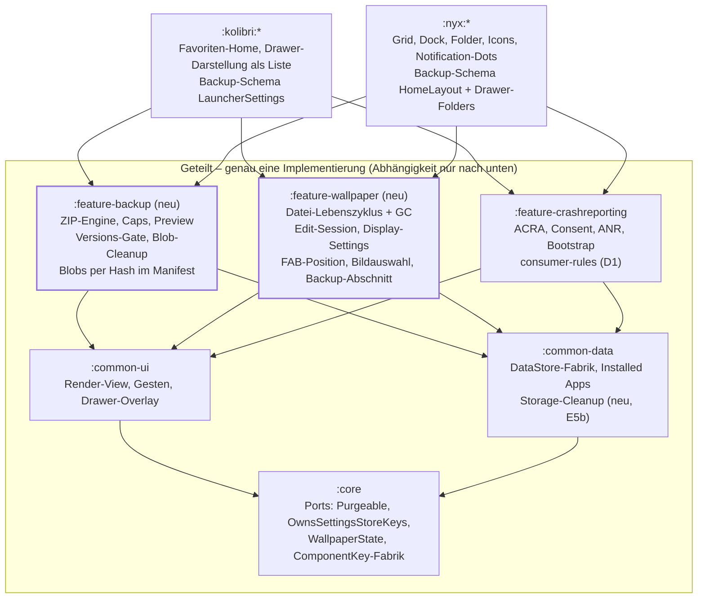

# Spec: Nyx-Rewrite – Anbindung an Kolibri

Stand: 03.10.2026 (Revision 114: 3b-6d – E3 für Nyx revidiert, Nyx bindet `WallpaperComposite.None`; 3b-6 ohne E3-Messung abgeschlossen; Ebenen-Cache für Nyx wesentlich.
Revision 113: 3b-6c – ein geteiltes Flatten-Theme in `:common-ui`, Qualifier und App-Provider entfallen; 15b-Begründung korrigiert.
Revision 112: 3b-6b – Hilt-Bindung `@WallpaperFlattenTheme` für Nyx; Lesehinweis „Composite beim nächsten Rendern“; DI-Regel.
Revision 111: 3b-6 – Nyx-Anzeige auf CachedWallpaperComposite (Ebenen-Cache bleibt im Editor), Speicherdruck, Vorher-APK.
Revision 110: 3b-5b – O2 auch auf dem Einhol-Weg (assignOwnFiles einmal über alle Ebenen).
Revision 109: 3b-5 – Nyx-Backup auf die geteilten Teile (Q1–Q3), H5 bewusst nicht (L7), Import bei offener Session als Einschränkung (Q5).
Revision 108: 3b-0 abgeschlossen – E3-Kriterien Flacker-Zähler und first_paint (change_paint informativ), Probelauf, SHA-256 des Nyx-Test-Backups, Python-Alternative.
Revision 107: 3b-0 – 12c, Ausgangslage vor dem Erhöhen melden (Kaltstart-Frame zählt mit); 13b freigegeben.
Revision 106: 3b-0 – Zähler bei jedem Mehr-Ebenen-Frame (12b), Auswertung je Prozess (13b), SHA-256 des Nyx-Test-Backups.
Revision 105: 3b-0 Patch C – Messskript und Perfetto-Konfiguration; offener Punkt lintRelease NotificationPermission.
Revision 104: 3b-0 – `WallpaperPaintTrace` geteilt, Nyx-Messpunkte, Flacker-Zähler, profileable.
Revision 103: 3b-4 – Nyx auf den geteilten Bildpicker; Nachweis der drei Wege (Code-Lesen plus Contract-Invariante).
Revision 102: Formatierung – reiner Reflow (satzweise Zeilen, eine Revision je Stand-Zeile), Absatz „Formatierung“.
Revision 101: 3b-3 abgeschlossen – korrigierte Kill-Erwartung, Transform-Verlust akzeptiert (gemeinsames Verhalten), GC-Schonfrist belegt, Coordinator-Test 12.
Revision 100: 3b-3c – Nyx auf die geteilte Session (NyxWallpaperEditing), drei Nutzersichtbare Zeilen, Nebeneffekt erledigt.
Revision 99: 3b-3b-b – maßgebliche Prüfung unter der Sperre.
Revision 98: 3b-3b – Entfernen bei offener Session abgelehnt.
Revision 97: 3b-2 abgeschlossen; 3b-3-Entscheidungen M1–M7; 3b-3a `WallpaperComposite.None`; Nyx-Backdrop-Umschalter als offener Punkt.
Revision 96: 3b-2b – Nyx auf die geteilten Display- und FAB-Stores.
Revision 95: D5 entschieden (A), O6 neu, O4 (e); 3b-2a – Typ-Schutz im Display-Store.
Revision 94: 3b-1 abgeschlossen (03b-Guard defensiv); Apostroph-Detektor; D5-Audit als Vorlage.
Revision 93: 3b-1b-c – Apostroph im Nyx-String; Detektor vorgemerkt.
Revision 92: 3b-1b-b – Hintergrund wählen bei offener Session ohne Löschen, Markierung `@Volatile`, Nebeneffekt für 3b-3 notiert.
Revision 91: 3b-02 geteilter Fake, 3b-1b Nyx-Lücken über den Store geschlossen.
Revision 90: 3b-Zuschnitt und Entscheidungen, Reihenfolge; 3b-1a – Nyx-Lauf des Store-Contracts.
Revision 89: Phase 3a abgeschlossen – 3a-9-Messung (Reihenfolge-Drift) und fokussierte Geräteprüfung, O5 Landscape-Deckung, offene Punkte für 3b gesammelt.
Revision 88: 3a-9d – gemerkter Backdrop-Wert folgt jedem Schreiber; 14c freigegeben.
Revision 87: 3a-9c – Test-Bug im start-Fall von `WallpaperOperationsTest` (Patch 14c).
Revision 86: 3a-9b – Backdrop-Umschalter im Store (Patch 14b).
Revision 85: 3a-9 – Patch 14 (WallpaperOperations), Befund zum Backdrop-Umschalter für 14b.
Revision 84: P90-Flag geklärt, neue Referenz aus dem A/B-Vergleich, Messmethode ab 3b abwechselnd; 3a-8 abgeschlossen.
Revision 83: Nachher-Messung 3a-8 mit P90-Flag, Vorgehen festgelegt; künftige Messungen je dreimal in derselben Sitzung.
Revision 82: 3a-8b – Kompilierfehler und Test korrigiert; 3a-9-Entscheidungen K1–K10.
Revision 81: Trace-Beleg zu `wallpaper_change_paint`; 3a-8 geliefert.
Revision 80: 3a-8 – Entscheidungen J1–J7, J2 mit `isCurrent` statt Session.
Revision 79: was `wallpaper_change_paint` misst; Kriterien für die Nachher-Messung festgelegt.
Revision 78: F4-Vorher-Werte eingetragen, Benchmarks eingefroren.
Revision 77: 3a-8a-d – Home und Einwilligungsdialog in einer Schleife.
Revision 76: 3a-8a-c – Composite-Benchmark auf dem festen Test-Wallpaper, 10 Durchläufe, Ablauf mit `pm clear` + `am instrument` je Klasse.
Revision 75: 3a-8a-b – Einwilligungsdialog ereignisbasiert im Setup; Messaufbau vollständig.
Revision 74: 3a-8a – Messpunkte und Benchmark für F4, Test-Wallpaper festgelegt.
Revision 73: 3a-7 verifiziert und abgeschlossen; Messmethode für 3a-8 festgelegt.
Revision 72: 3a-7 – Backup-Teil im Modul ohne Kante zu `:feature-backup`, O2 an einer Stelle, Import-Aufräumen über den Store.
Revision 71: 3a-6 verifiziert, Geräteprüfung bestanden, abgeschlossen.
Revision 70: 3a-6 – Nachweis zur Bildauswahl, Picker als reiner Umzug mit Test; sichtbare Umstellung für Nyx in 3b.
Revision 69: 3a-5 verifiziert, Geräteprüfung bestanden, abgeschlossen.
Revision 68: 3a-5 freigegeben; Aufräum-Kandidat gemeinsamer DataStore-Fake.
Revision 67: 3a-5 – FAB-Position geteilt (Schnittstelle und Tripel in `:core`, Store im Modul).
Revision 66: 3a-4 verifiziert, Geräteprüfung bestanden, abgeschlossen.
Revision 65: 08c – Contract-Fälle für identischen Bildinhalt (16 Fälle).
Revision 64: 3a-4 – Display-Settings-Store, `@SettingsStore`, D5 abgelehnt und für 3b vorgemerkt.
Revision 63: 2b/29 verifiziert und auf dem Gerät bestätigt.
Revision 62: 2b/29 – Kolibri sät nach einem Reset die kuratierten Default-Favoriten.
Revision 61: 3a-3 verifiziert und Geräteprüfung bestanden.
Revision 60: 3a-3b – Entfernen unter `persistLock`, Sperr-Reihenfolge festgehalten.
Revision 59: 3a-3 – `WallpaperEditSession`, E1–E5, Re-Sync nach Session-Ende.
Revision 58: Geräteprüfung 3a-2 bestanden, 3a-2 abgeschlossen.
Revision 57: 3a-2d – „Wallpaper entfernen“: Zustand zuerst, Dateien nur gegen leeres Persistiertes.
Revision 56: 3a-2c – Store liest das Persistierte selbst und schließt bei Fehler; neue Lesefunktion mit Fehlermeldung.
Revision 55: 3a-2b – `WallpaperImageStore` im Modul, sofortiges Löschen beim Ersetzen mit drei Sicherungen und Rollback-Schutz.
Revision 54: 3a-2a – `WallpaperImageStoreContract` gegen den heutigen Code; Befund und Sicherungen zum sofortigen Löschen beim Ersetzen.
Revision 53: 3a-1 – `WallpaperFileManager` mit injiziertem Dispatcher, A13 36 → 35.
Revision 52: Phase 3a – Zuschnitt und Entscheidungen F1–F6 mit Bedingungen; 3a-0 Modul `:feature-wallpaper`.
Revision 51: 2b/28 – `purgeAll` in `:core`, `SHARED_RULE11_FILES`; Hinweis zu DEBUG und Release für die Meldung „unvollständig“.
Revision 50: Geräteprüfung bestanden, Phase 2b abgeschlossen; Aufräum-Patch 2b/27.
Revision 49: README – Repo-Commits der Ketten-Patches, schärfere Prüfung und dokumentierte Ausnahme im Abgleich, `LC_ALL=C`.
Revision 48: Abgleich Repo ↔ Kette – vier Handkorrekturen bzw. lokal erzeugte Dateien als Patches nur für die Kette nachgetragen (1b/05b, 1b/05c, 1b/08b, 1c/02b); Regel „keine Handkorrekturen außerhalb von Patches“.
Revision 47: 2b-4c-4-b – Spiegel-Kommentar ohne gelöschte Klasse, A8 −1.
Revision 46: 2b-4c-4 – Gates `naming` und `purge` in Nyx auf RUN; Geräteprüfung steht aus.
Revision 45: 2b-4c-3-b – `@StringRes` auf einer suspend-Funktion entfernt (Lint).
Revision 44: 2b-4c-3 – Nyx auf `Purgeable`, `ResetRepository`, Meldung „unvollständig“, Säen nach jedem Reset; R2 geändert, O4 (c) neu.
Revision 43: 2b-4c-2-b – lokaler `FakeDataStore` in `WallpaperRepositoryImplTest` nachgezogen; Aufräum-Kandidat vermerkt.
Revision 42: 2b-4c-2 – F1, Teilfehler beim Zurücksetzen werden sichtbar, in beiden Apps.
Revision 41: 2b-4c-1 überarbeitet – Befund des Contracts in Kolibri behoben.
Revision 40: 2b-4c-1 – `ResetCompletenessContract` mit beiden Subklassen gegen die heutigen Resets; Inventur, F1 und Reihenfolge für 2b-4c eingetragen.
Revision 39: 2b-4b – `NyxBackupManager` heißt `BackupRepositoryImpl`.
Revision 38: 2b-4a – `SafDocuments` in `:common-data`, D1–D3; Arbeitsweise und Entscheidungen R1–R4 für den Reset in 2b-4c; O4 um den Repository-Vertrag ergänzt.
Revision 37: 2b-3b-c – Vorschau-Timeout auf `await()`; 2b-3c-b – Kolibris Speicherpfad-Test, Zusammenstellen innerhalb von `writeOrDiscard`; 2b-3c-c – sechs vom `BackupFormatContract` abgedeckte Tests entfernt.
Revision 36: 2b-3c – `BackupFormatContract` (Ablehnungen je App, Vorschau = Import), O3-Fälle im Rundlauf-Contract, Golden-Fall `kolibri-in-nyx` entfernt.
Revision 35: 2b-3b-b – Sammler-Job aus `recordEmissions` in den ViewModel-Tests gekündigt.
Revision 34: 2b-3b – Nyx-Backup-UI mit Vorschau, Optionen und eigener Meldung je Ergebnis.
Revision 33: 2a-7b – Kolibris Vorschau nennt den Grund einer Ablehnung; Backup-Screen zeigt die Meldungen aus 2a-7 sofort.
Revision 32: 2b-3a-b – Tippfehler im Test aus 2b-3a, ein Aufruf von `BlobSource`.
Revision 31: Reihenfolge 2b-3b → 2b-3c → 2b-4 im Phasenplan klargestellt.
Revision 30: 2b-4 um den Zusammenzug der SAF-Helfer nach `:common-data` ergänzt.
Revision 29: 2b-3a – Nyx-`BackupRepository` mit SAF-Pfad, `ImportResult` in Kolibris Form, eigener Hidden-Apps-Schalter, Nyx-`WriteOrDiscard` entfernt; 2b-5 erledigt; O3 entschieden (Zusammenführen bleibt), O4 neu (gemeinsames `ImportResult`, Manifest-Vorschau).
Revision 28: 2b-2c-Fix – Kolibris Rundlauf-Subklasse setzt die Sortierung über `setSortOrderForTest`.
Revision 27: 2b-2c – geteilte Contracts `BackupRoundTripContract` und `ImportKeepsMissingAppsContract` mit je einer Subklasse pro App; E2 wandert in der Contract-Tabelle zum Rundlauf; O3 (Ersetzen oder Zusammenführen bei Custom Names und leeren Swipe-Slots) offen.
Revision 26: 2b-2b – Nicht-endliche Zahlen machen ein Nyx-Backup ungültig, wie bei Kolibri; der NaN-Test aus 2b-2 ist ersetzt.
Revision 25: 2b-2 – Nyx-Import nach E1, E2, B11, B13, B14, U4.
Revision 24: Fix zu 2a-5 – Kolibri gibt jedem wiederhergestellten Layer eine eigene Datei, O2 für Kolibri erledigt.
Revision 23: 2b-1 – Nyx schreibt und liest den E5a-Container über die Engine, Abschnitt `nyx.backup`; offene Frage O2 (geteilte Wallpaper-Dateien nach Import in Kolibri).
Revision 22: 2b-0 – Rahmen um die Engine nach `:feature-backup` (`writeOrDiscard`, `readStaged` mit Staging und Größenprüfung), Kolibri umgestellt; Nyx gleicht sein Backup-Verhalten an Kolibri an, ein Abschnitt `nyx.backup`.
Revision 21: 2a-7 – eigene Meldungen für fremde App und ältere Version; Phase 2a vollständig.
Revision 20: 2a-4 bis 2a-6 umgesetzt, Legacy-Modul mit Sunset.
Revision 19: Offene Designfrage O1 (verwaiste Custom-Names); 2a-4/2a-5 auf dem Gerät bestätigt.
Revision 18: `BackupEngine` (2a-3); Befund E1/U4/B13 in Kolibri für 2a-4.
Revision 17: `:feature-backup` mit Container-Format (2a-2).
Revision 16: B14 umgesetzt (2a-1).
Revision 15: Phase 1c umgesetzt (gemeinsamer Bootstrap, Health für Nyx).
Revision 14: D1 auf dem Gerät belegt (Nyx).
Revision 13: `AnrReporter` in `:feature-crashreporting`, Watermark im eigenen Store.
Revision 12: Phase 1b umgesetzt, A10 als Gate.
Revision 11: 1b – Kolibris Build-Stand für beide Apps (Lint, Orchestrator, MockK-Flag, JaCoCo, Discovery-Tasks).
Revision 10: A13 gegen hart verdrahtete Dispatcher, in beiden Apps.
Revision 9: Flow-Beobachtung über `recordEmissions` (Gesamtheit) oder Turbine (einzeln).
Revision 8: `assertIs` als zweite A12-Ausnahme, nur mit genutztem Smart-Cast.
Revision 7: Flows in Tests nur mit Turbine, Unconfined nur als Eager-Guard.
Revision 6: eine Assertion-Bibliothek (Truth) mit Detektor A12.
Revision 5: Nyx ohne Lese-Pfad für alte Backups, Kolibris Lese-Pfad als abschaltbares Modul mit Sunset-Warnung.
Revision 4: Import ungezippter Legacy-JSON-Dateien entfällt.
Revision 3: A7 an `TESTING_CONVENTIONS.kt` angeglichen, D1-Endform AGP-9-fest, Golden-Set um App-fremde Backups ergänzt.
Revision 2: in Spec + Roadmap geteilt, Widersprüche aus dem Review bereinigt)

**Formatierung (Konvention seit Revision 102):**
Prosa steht im Quelltext mit einem Satz bzw. rund 100 Zeichen je Zeile (semantic line breaks);
Markdown fasst die Zeilen eines Absatzes beim Rendern zusammen, die Darstellung ist dieselbe,
aber jeder Diff zeigt genau die geänderte Stelle.
Die Stand-Zeile führt eine Revision je Zeile, die neueste oben.
Tabellenzeilen und Überschriften bleiben einzeilig.
Nicht umbrochen wird vor Zeichen, die einen Markdown-Block beginnen (`-`, `+`, `*`, `#`, `>`, `|`, `1.`);
Folgezeilen eines Listenpunkts sind eingerückt.

## Ziel & Kontext

Nyx wird auf seinen Produktkern reduziert (Icon, Grid, Folder, Dock).
Backup, Reset, Wallpaper und Storage-Cleanup laufen über **eine** gemeinsame Implementierung mit Kolibri, und ein Build-Gate macht erneuten Drift unmöglich.
Wo Nyx heute besser löst, wandert das zuerst in diese gemeinsame Implementierung und damit in Kolibri.

**Warum jetzt.** Backup/Restore existiert zweimal:
Kolibri mit 1.894 Zeilen in drei Klassen (`BackupRepositoryImpl`, `BackupSerializer`, `BackupDataAssembler`), Nyx mit 417 Zeilen (`NyxBackupManager` + Schema + Serializer).
Härtungen werden per Hand gespiegelt – der Code sagt es selbst:
„port of nyx §Audit-3 A3-05“, „kolibri parity“, „nyx parity“.
Beim Wallpaper nennt sich `NyxWallpaperEditCoordinator` im KDoc einen „faithful port“ von Kolibris 1.171-Zeilen-`WallpaperDelegate`.
Jede Korrektur muss also zweimal gemacht und zweimal auditiert werden.

**Dieses Spec und die Roadmap.** Dieses Spec deckt Phase 0–5 ab:
Hotfix, Regel-Fundament, Backup, Wallpaper, Storage-Cleanup und deren Verriegelung.
Alle übrigen Angleichungen (Lazy-Verify, App-Start, Suche, Event-Indikatoren, Settings-Bausteine, Paket-Events u.
a.) stehen in `ROADMAP_NYX_ANGLEICHUNG.md`.
Sie bauen auf dem Fundament aus Phase 1 auf, blockieren dieses Spec aber nicht.

**Verhältnis zu bestehenden Specs.** Dieses Spec ersetzt die nie umgesetzten Phasen C/D von `BACKUP_SCHEMA_PORT_SPEC` und `WALLPAPER_RESTORE_SPEC` sowie WV5 von `WALLPAPER_SHARE_SPEC`.
Die Doktrin bleibt: geteilt wird die Mechanik, nicht das Schema (MRG-INV-8).

**Nicht-Ziele.** Kein Merge der Home-Modelle.
Keine In-Code-Datenmigration (Rule 5) – Kolibri liest seine heutigen Backup-Dateien für eine Übergangszeit weiter, über ein abschaltbares Lese-Modul statt über Migrationscode;
Nyx hat keine Backups im Umlauf (siehe E5a).

**Ist die Aufgabe klar?** Ja. Alle Entscheidungen E1–E5 sind gefallen – siehe letzter Abschnitt.

## Scope

Nyx behält sein Home-Modell und alles, was Icons zeichnet;
rund 1.500 Zeilen Backup-, Reset- und Wallpaper-Code verschwinden aus `nyx/` ersatzlos in geteilte Module.

| Bereich | Heutige Nyx-Dateien | Verbleib |
| --- | --- | --- |
| Grid & Home-Layout | `home/model/*` (Grid, HomeLayout, Invarianten, Queries), `transition/*` (Reconciler, Regridder, Transition), `HomeGrid*`, `HomePagerAdapter`, `HomeLayoutRepository` + DTOs | bleibt in Nyx |
| Drag-Engine | `home/drag/*`, `EdgeAdvanceController`, `DragPayload` | bleibt in Nyx |
| Folder | `FolderOverlayController`, `FolderMemberAdapter`, `FolderTitle`, `DrawerFolders*`, `FolderMembership` | bleibt in Nyx |
| Dock | `DockAdapter`, Dock-Teile von `HomeLayout` | bleibt in Nyx |
| Icon | `data/icon/*` (Loader, Rasterizer, Disk-Cache, `FolderIconRenderer`), `IconStyle`, `IconBinding` | bleibt in Nyx |
| Backup/Restore | `NyxBackup`, `NyxBackupManager`, `NyxBackupSerializer`, `ImportResult` | wird gelöscht; Nyx liefert nur noch seine Schema-Abschnitte |
| Reset | `NyxResetManager` | wird gelöscht; Reset über die `Purgeable`-Liste wie Kolibri |
| Wallpaper | `home/wallpaper/*` (Edit-Controller, Coordinator, Bitmap-Cache, `LaunchSafe`), `NyxWallpaperImageSetter`, `NyxWallpaperDisplaySettings`, `NyxFabPositionStore` | wird gelöscht; nur die Einbettung in `MainActivity` bleibt |
| Storage-Cleanup | – (fehlt in Nyx) | wird eingeführt (E5b) |
| Übriges | Usage, Hidden Apps, `PreferencesRepository`, Drawer-Suche, Launch, Shortcuts, Event-Indikatoren, `NyxApplication`/Pump/`PackageEventCoordinator`, Settings-UI | **nicht in diesem Spec** – Befunde und Ziele in `ROADMAP_NYX_ANGLEICHUNG.md` |

`MainActivity` (1.873 Zeilen) bleibt Nyx-eigen.
Dieses Spec entfernt daraus Backup- und Wallpaper-Logik (Rule 10);
die weitere Reduktion auf Glue ist Teil der Roadmap.

## Ist-Analyse: Drift-Befunde

19 Unterschiede im Code, davon 7 zugunsten Nyx, 10 zugunsten Kolibri und 2 gemischt.
Keiner ist heute ein akuter Datenverlust, aber jeder zweite ist eine Härtung, die nur eine App hat.

### Backup/Restore

| # | Aspekt | Kolibri | Nyx | Besser |
| --- | --- | --- | --- | --- |
| B1 | Engine-Schnitt | 3 Klassen, an `Uri`/`ContentResolver` gebunden, `Dispatchers.IO` hart codiert | 1 Klasse, Streams kommen vom Aufrufer, `@IoDispatcher` injiziert | Nyx |
| B2 | Manifest-Lesen | `readBytes()` ohne eigenes Limit; Preview-Pfad `readJsonFromZip` ganz ohne `CappedInputStream` | `readNBytes` mit 5-MiB-Cap | Nyx |
| B3 | Abgebrochener Export | halbe ZIP bleibt liegen | `writeOrDiscard` löscht das Dokument (A3-06) | Nyx |
| B4 | Schreibreihenfolge Import | Favoriten zuerst (10 Phasen) | Home-Layout zuletzt: bei Teilfehler bleibt der wertvollste Stand intakt | Nyx |
| B5 | Nicht installierte Apps beim Import | Favoriten, Order, Hidden, CustomNames, Swipe werden gefiltert; Import wartet auf Installed-Prime, Timeout = Fehler | alle Referenzen bleiben (lazy-slot) | Nyx (E1: behalten) |
| B6 | Blob-Dedup beim Export | `entryByPath`: geteilte Datei nur einmal im ZIP | ein Blob pro Layer | Kolibri |
| B7 | Layer ohne Blob (Legacy-URI) | Zugriff geprüft, nach intern kopiert | URI ungeprüft übernommen – auf dem Zielgerät oft tot | Kolibri |
| B8 | Backup ohne Wallpaper | aktuelles Wallpaper bleibt | Wallpaper wird auf `NONE` gesetzt | Kolibri (E2: stehen lassen) |
| B9 | Ergebnis-Typ | `Success` mit Zählern, fehlenden Apps, verworfenen Layern; `UnsupportedVersion`; `LimitExceeded` | nur `Success` / `InvalidData` | Kolibri |
| B10 | Versions-Gate, Preview, selektive Optionen | vorhanden | `schemaVersion` wird geschrieben, nie geprüft; keine Preview; UI nutzt immer `NyxBackupOptions()` | Kolibri |
| B11 | Clamping importierter Werte | `coerceInSafe` pro Wert | keins (z. B. Scrim-Alpha) | Kolibri |
| B12 | Abbruch im UI-Aufrufer | – | `runCatching { withContext(IO) }` in `SettingsFragment` verschluckt `CancellationException` | Kolibri (Regelverstoß in Nyx) |
| B13 | Hidden-Apps beim Import | ergänzt (`componentsToShow = emptySet()`) – anders als Kolibris eigene Favoriten, die ersetzt werden | ersetzt | Nyx (bestätigt 29.09.: ein Backup ist ein Schnappschuss) |
| B14 | Component-Normalisierung | Regel „`.Main` → `pkg.Main`“ steckt nur in `AppInfo`; gespeicherte Strings aus Backups laufen ungeprüft durch | `ComponentKeyDto.toDomain()` normalisiert nicht | keiner – Normalisierung in einer `ComponentKey`-Fabrik, Konstruktor privat; sonst konserviert E1 eine Kurzform als „fehlend“, obwohl die App installiert ist |

### Wallpaper & Reset

| # | Aspekt | Kolibri | Nyx | Besser |
| --- | --- | --- | --- | --- |
| W1 | Datei-Lebenszyklus (setzen, ersetzen, löschen, Orphan-GC) | im `WallpaperDelegate` (App-Schicht); GC wartet, bis keine Edit-Session läuft | `NyxWallpaperImageSetter` in `:data`, löscht die alte Datei sofort; GC ohne Edit-Guard | Ort Nyx, Guard Kolibri |
| W2 | Edit-Session | im 1.171-Zeilen-Delegate verwoben | eigene Klasse: pure `Mutation` + ein synchroner `applyState`, Dispatcher injiziert | Nyx |
| W3 | Display-Settings (Scrim, Backdrop, Surface) | Teil der fetten `SettingsRepository` | schlanker Adapter, Enums defensiv geparst | Nyx |
| W4 | FAB-Position | `FabPositionRepository` + Contract-Triple | `NyxFabPositionStore`, konkret, ohne Interface | Kolibri |
| W5 | Bitmap-Cache | `WallpaperCompositeCache`, ein Eintrag | `WallpaperLayerBitmapCache`, LRU pro Layer, gegen Lösch-Flackern | Kolibri (E3, mit Messpunkt) |
| W6 | Factory-Reset | `Purgeable`-Liste; `WallpaperRepository.purgeRepository()` löscht auch die Dateien | `dataStore.clear()` + `fileManager.clearAll()` separat – umgeht den geteilten Purge | Kolibri |
| W7 | Dispatcher in Wallpaper-I/O | Delegate nutzt injizierte Scopes | `NyxWallpaperImageSetter` hart `Dispatchers.IO`; ebenso `WallpaperFileManager` in `:common-data` | keiner |
| W8 | Bildauswahl | `WallpaperImagePicker` legt `GetContent()` für alle Wege fest; im KDoc begründet: `PickVisualMedia()` erreicht keine Downloads, das Nebeneinander war „historical drift, not deliberate design“ | „Wallpaper wählen“ (Settings, Customization-Sheet) über `PickVisualMedia()`, „Layer hinzufügen“ über `GetContent()` – genau das in Kolibri behobene Nebeneinander | Kolibri; der nie umgesetzte `READ_MEDIA_IMAGES`-Entscheid aus `WALLPAPER_SHARE_SPEC` §9 gilt als ersetzt (bestätigt 29.09.) |

## Übernahmen: was Nyx besser löst

Acht Nyx-Lösungen gehen in die gemeinsame Implementierung und damit in Kolibri.
Umgekehrt bringt die gemeinsame Implementierung Kolibris Stärken automatisch nach Nyx – dafür ist kein eigener Arbeitsschritt nötig.

**Nyx → gemeinsam (Kolibri profitiert):**

| ID | Übernahme | Quelle | Wirkung in Kolibri |
| --- | --- | --- | --- |
| Ü1 | Engine arbeitet auf `InputStream`/`OutputStream`, Dispatcher injiziert; SAF-Öffnen bleibt beim Aufrufer | B1 | Backup-Engine JVM-testbar ohne Robolectric; erfüllt die Ein-Dispatcher-Testregel |
| Ü2 | Manifest-Cap (`readNBytes`, 5 MiB) auch im Preview-Pfad | B2 | schließt die ungebremste Lesestelle in `readJsonFromZip` |
| Ü3 | `writeOrDiscard`: abgebrochener Export löscht das SAF-Dokument | B3 | keine halben, nicht importierbaren ZIPs mehr |
| Ü4 | Regel „wertvollster Store zuletzt“ als Engine-Vertrag (Schema legt Reihenfolge fest) | B4 | Favoriten + Order werden zuletzt geschrieben |
| Ü5 | Wallpaper-Datei-Lebenszyklus als eigene Klasse in der Daten-Schicht, mit Kolibris Edit-Session-Guard | W1 | `WallpaperDelegate` verliert Datei- und GC-Logik |
| Ü6 | Edit-Session als pure `Mutation` + ein synchroner Übergang | W2 | Delegate schrumpft auf Orchestrierung; Übergänge ohne Coroutine testbar |
| Ü7 | `WallpaperDisplaySettings` als eigener, schlanker Store | W3 | Wallpaper-Keys raus aus der fetten `SettingsRepository` |
| Ü8 | Import behält nicht installierte Apps (E1) | B5 | siehe unten |

**Ü8 (aus E1):** Der Import behält nicht installierte Apps in Favoriten, Order, Hidden, CustomNames und Swipe-Slots – wie das lazy-slot-Modell im Laufbetrieb.
Sie erscheinen nur als Info; die `MissingAppsFormatter`-Anzeige bleibt.
Damit entfällt auch das Warten auf den Installed-Prime samt Timeout-Fehler.
Voraussetzung ist B14 (Normalisierung), sonst bleibt eine Kurzform als „fehlend“ stehen.

**Aus E2:** Nyx übernimmt Kolibris Verhalten – ein Backup ohne Wallpaper lässt das aktuelle stehen.
Wer es löschen will, nutzt den Wallpaper-Schalter der Import-Optionen.

**Kolibri → gemeinsam (Nyx profitiert, ohne Extra-Arbeit):** Blob-Dedup (B6), Legacy-URI-Kopie (B7),
reichhaltiges `ImportResult` (B9), Versions-Gate, Preview und selektive Optionen (B10), Clamping (B11),
Repository-Form für FAB-Position (W4), Reset über `Purgeable` (W6), einheitliche Bildauswahl (W8).
Kolibris org.json-Strict-Recovery für eine beschädigte `backup.json` im ZIP bleibt schema-spezifisch in Kolibri;
der Import ungezippter Legacy-JSON-Dateien entfällt.

## Nutzersichtbare Änderungen

Beide Apps ändern ihr Verhalten, Kolibri nicht weniger als Nyx.
Diese Liste ist die Grundlage für die Golden-Soll-Zustände und für die Release-Notes.

| App | Änderung | Quelle |
| --- | --- | --- |
| Kolibri | Import behält nicht installierte Apps (grau statt gefiltert); kein Timeout-Fehler mehr, wenn die App-Liste beim Import noch lädt | E1 |
| Kolibri | Hidden-Apps werden beim Import ersetzt statt ergänzt | B13 |
| Kolibri | Favoriten + Order werden als Letztes geschrieben; bei Teilfehler bleiben die bisherigen erhalten | Ü4 |
| Kolibri | Abgebrochener Export hinterlässt keine Datei mehr – seit 2b-3c-b auch, wenn schon das Lesen der Daten scheitert (vorher blieb dann eine leere Datei) | Ü3 |
| beide | Neue Backups nutzen das Container-Format (E5a). **Ältere App-Versionen lesen sie nicht** und melden „ungültiges Backup“; alte Kolibri-Backups bleiben bis zum Sunset lesbar (3 Monate nach dem Release von 2a), danach Meldung „Backup einer älteren Version – nicht mehr unterstützt“ | E5a |
| beide | Gespeicherte Kurzformen (`.Main`) werden beim Import normalisiert | B14 |
| Nyx | Backup ohne Wallpaper lässt das aktuelle stehen (heute: Wallpaper wird entfernt) | E2 |
| Nyx | Importierte Werte außerhalb des gültigen Bereichs werden begrenzt | B11 |
| Nyx | Backup-UI mit Preview, selektiven Optionen und ausführlichem Ergebnis | B9, B10 |
| Nyx | Wallpaper-Auswahl erreicht überall auch Downloads | W8 |
| Nyx | Im Anzeigemodus ein geflattetes Wallpaper; im Edit-Modus kann Löschen kurz flackern (Messpunkt vor 3b) | E3 |
| Kolibri | Ungezippte Legacy-JSON-Backups werden nicht mehr importiert; gültige Backups sind heute alle gezippt | E5a |
| Nyx | Backups aus Versionen vor 2b werden nicht gelesen (Meldung „ältere Version“); es gibt keine Nyx-Nutzer mit Backups | E5a |
| Kolibri | Nach dem Update werden ANRs, die Android noch in der Exit-Historie hält, einmal erneut an ACRA gemeldet (der Watermark startet im neuen Store bei null) – nur im ACRA-Backend sichtbar | 1c-1 |
| Nyx | Harte ANRs werden beim nächsten Start gemeldet (vorher No-op-Drainer, keine ANR-Reports) | 1c-1 |
| Nyx | Beim Wiederherstellen sind versteckte Apps ein eigener Schalter (nur angeboten, wenn das Backup mindestens eine enthält); an: die Menge wird ersetzt, ein Backup ohne das Feld lässt sie stehen | 2b-3b, B13 |
| Nyx | Abgelehnte Backup-Dateien melden ihren Grund sofort (andere App, ältere Version, nicht unterstützte Version, ungültig); ein Wiederherstellen meldet verworfene Wallpaper-Ebenen | 2b-3b |
| Nyx | Beim Wiederherstellen eines Backups meldet Nyx auch Ebenen als nicht verfügbar, deren Bild nicht im Backup lag und auf dem Gerät fehlt, statt sie still wegzulassen (keine Referenz auf eine fehlende Datei mehr) | 3b-5 |
| Nyx | Beim Wählen eines Hintergrunds in den Einstellungen und im Anpassen-Sheet öffnet sich die Dateiauswahl des Systems statt des reinen Foto-Pickers; Downloads, Dateimanager und Cloud-Anbieter werden erreichbar | 3b-4 |
| Nyx | Ein Bild, das im Wallpaper-Editor kurz vor „Speichern“ als Ebene gewählt wurde und noch kopiert wird, erscheint nach dem Speichern (bisher wurde es verworfen); nur „Abbrechen“ verwirft es (wie Kolibri, E2) | 3b-3 |
| Nyx | Wird der Hintergrund von außen (Einstellungen, Anpassen-Sheet) gewählt, während der Editor offen ist, bleibt das nach dem Speichern erhalten (bisher überschrieb der Editor es wieder); „Abbrechen“ macht es rückgängig | 3b-3 |
| Nyx | Wird Nyx beendet, während der Wallpaper-Editor offen ist, gilt das wie „Editor ohne Speichern verlassen“: die Zwischenstände werden auf den Stand vor dem Editor zurückgesetzt | 3b-3 |
| Nyx | Scheitert beim Wiederherstellen eines Backups nur das Speichern eines Anzeige-Werts (Scrim, Backdrop, Stil), meldet Nyx den Import nicht mehr als fehlgeschlagen; der Wert bleibt dann beim alten (wie Kolibri seit jeher; O4 (e)) | 3b-2 |
| Nyx | Scheitert „Hintergrund entfernen“, meldet Nyx das jetzt („Hintergrund konnte nicht entfernt werden“), statt „entfernt“ zu sagen; das Wallpaper bleibt dann, der Dialog bleibt offen | 3b-1b |
| Kolibri | Nach einem Zurücksetzen auf Werkszustand zeigt Kolibri wieder die kuratierten Default-Favoriten (Telefon, SMS, E-Mail, Browser, Kamera) statt der ersten installierten Apps | 2b/29 |
| Kolibri | Scheitert beim Zurücksetzen auf Werkszustand ein Store, meldet Kolibri „Zurücksetzen fehlgeschlagen“ statt Erfolg (`PartialFailure` ist erstmals erreichbar); nur im Fehlerfall sichtbar | 2b-4c, F1 |
| Nyx | Scheitert beim Zurücksetzen das Löschen der Nutzungsdaten, meldet Nyx den Fehlschlag statt Erfolg; nur im Fehlerfall sichtbar | 2b-4c, F1 |
| Nyx | Ein unvollständiges Zurücksetzen meldet „Zurücksetzen unvollständig – einige Daten konnten nicht gelöscht werden“ statt „fehlgeschlagen“, kehrt wie ein vollständiges zum Home-Bildschirm zurück und sät Dock und Ordner neu, wo sie geleert wurden; nur im Fehlerfall sichtbar | 2b-4c, S3/S4 |
| Kolibri | Der Backup-Screen zeigt bei abgelehnten Dateien (andere App, ältere Version, nicht unterstützte Version, ungültig, zu groß) sofort die passende Meldung statt nach einem Timeout „Fehler“ | 2a-7b |

## Akute Befunde (vor und in Phase 1)

| # | Falle | Befund | Ziel |
| --- | --- | --- | --- |
| D1 | ACRA-Keep-Regeln | Nyx' `proguard-rules.pro` hat nur die zwei `-dontwarn`-Zeilen, Kolibris 12 Regeln. Es fehlen die No-Arg-Konstruktoren für `RetryPolicy`/`KeyStoreFactory`/`AttachmentUriProvider`, der `BuildConfig`-Keep (ACRA liest `buildConfigClass` per Reflection) und `LineNumberTable`. Genau diese Lücke hat Kolibri am 03.09. gefunden: „every send failed“. Nyx-Release läuft mit `isMinifyEnabled = true` | **Hotfix (Phase 0):** Kolibris Regeln mit Nyx-Paketnamen in `nyx/app/proguard-rules.pro` kopieren, Release-Crash auf dem Gerät prüfen. **Endform (Phase 1b):** siehe unten |
| D2 | Crash-Pipeline halb übernommen | Nyx: `NoOpAnrDrainer` (keine ANR-Post-Mortems), kein Health-Monitor und keine Backlog-Probe in den Settings, kein StrictMode; `NyxApplication` weicht vom Rule-7-Muster ab (`Log.e` statt `reportToAcra`, `silentError` in `onTrimMemory`) | ein gemeinsamer Application-Bootstrap in `:feature-crashreporting`; `AnrReporter` mit eigenem Watermark-Store dorthin; Health-Eintrag als geteilter Settings-Baustein (Phase 1c) |

**D1-Endform.** Die Regeln teilen sich in drei Arten, und nur eine kann ein Library-Modul tragen:

- **ACRA-generisch** (No-Arg-Konstruktoren der ACRA-Interfaces, `org.acra.**`-Konstruktoren, `ACRA`-keepnames, die beiden `-dontwarn`):
  als `consumerProguardFiles` in `:feature-crashreporting`.
  Jede App, die das Modul einbindet, erbt sie.
- **Global** (`-keepattributes SourceFile,LineNumberTable`, `-renamesourcefileattribute`):
  gehören nicht in Library-Consumer-Rules – AGP 9 (Projekt:
  9.4.1) lässt globale Optionen dort standardmäßig nicht mehr zu;
  im Build zu bestätigen. Sie kommen in die generierte App-Regeldatei (nächster Punkt).
- **App-paketgebunden und global** (`<namespace>.BuildConfig`-Keep, `Throwable`-keepnames, Enum-Namen, dazu die globalen Optionen von oben):
  erzeugt das Convention-Plugin `launcher.android.application` aus `android.namespace` als generierte Regeldatei.
  So braucht keine App eigene Kopien, und `**.BuildConfig`-Wildcards (die auch Library-`BuildConfig`s behalten würden) entfallen.

Danach enthalten die App-`proguard-rules.pro` nur noch wirklich produkt-eigene Regeln;
A10 verbietet, dass Apps `proguardFiles` selbst setzen.

## Zielarchitektur & Anti-Drift

Zwei neue Feature-Module nach dem Vorbild von `:feature-crashreporting` tragen Backup und Wallpaper;
die Apps liefern nur noch ihr Schema und ihre Darstellung.
Nyx und Kolibri hängen nie voneinander ab – beide hängen an denselben Modulen darunter.



Keine Abhängigkeit zwischen `:kolibri:*` und `:nyx:*`.
Gates in beiden Apps: Forbidden-Imports · Paritäts-Config · Contract-Tests · jscpd.

Die Engine kennt kein Produkt-Schema (MRG-INV-8):
jede App liefert ihr Backup-Schema, der Wallpaper-Abschnitt aus `:feature-wallpaper` stellt Blob-Einsammeln und -Zurückbinden bereit, und beide Schemata betten ihn ein.

**Warum Drift danach nicht mehr passieren kann** – jeder Mechanismus schließt einen konkreten Weg, auf dem er heute passiert:

| ID | Mechanismus | Schließt | Ab |
| --- | --- | --- | --- |
| A1 | Forbidden-Import-Detektor: in `kolibri/` und `nyx/` verboten sind `java.util.zip`, `WallpaperFileManager` und die Wallpaper-DataStore-Keys | eine zweite Backup- oder Wallpaper-Implementierung neben der geteilten | Phase 5 scharf |
| A2 | Geteilte Contract-Tests in den `testFixtures` der Feature-Module, je App eine Subklasse | Verhalten, das nur in einer App getestet ist | Phase 2 |
| A3 | Ein Orchestrator `tools/check-conventions.sh --app <n>` mit Config pro App; Paritäts-Gate: jeder Detektor in `tools/` braucht in jeder Config RUN oder SKIP mit Begründung, sonst Exit 2 | Regeln, die in Nyx still fehlen | Phase 1a |
| A4 | Produktneutraler Regeltext im Root-`CLAUDE.md`, Testkonventionen in einem geteilten Fixture-Modul | Regeltext, der nur in `kolibri/` geladen wird | Phase 1a |
| A5 | jscpd-Gate in CI über `kolibri/` ↔ `nyx/` mit kleiner, begründeter Allowlist | Copy-Paste mit Kommentar „mirrors kolibri“ | Phase 5 für die Bereiche dieses Specs |
| A6 | `ARCHITECTURAL_DIFFERENCES.md` deckt Backup und Wallpaper ab; jede Asymmetrie braucht einen Eintrag | undokumentierte Abweichungen | Phase 5 |
| A7 | Test-Dispatcher-Detektor (Regel siehe „Rules“) | zweite Dispatcher/Scheduler in Tests | Phase 1a |
| A8 | Spiegel-Detektor: ein **neuer** Kommentar mit „mirrors/parity/port of“ + „kolibri“ bzw. „nyx“ in App-Code bricht den Build; bestehende Stellen stehen in einer Allowlist | neue, unmarkierte Handkopien | Phase 1a |
| A10 | Build-Parität: App-`build.gradle.kts` dürfen `compileSdk`, `minSdk`, `lint`, `testOptions`, `proguardFiles` nicht selbst setzen – nur die Convention-Plugins | D1, D4 | Phase 1b |
| A11 | Kein Zahl-Literal in `WhileSubscribed(` in App-Code; Konstante statt `5_000` | Magic Numbers in geteilten Flow-Mustern | Phase 1a |
| A12 | Assertion-Detektor: Test-Code nutzt nur Truth; Ausnahmen sind `kotlin.test.assertFailsWith` und `kotlin.test.assertIs` – `assertIs` nur, wo eine spätere Zeile den Smart-Cast braucht (entschieden 29.09.); Typprüfungen sonst mit Truth `isInstanceOf`, dem etablierten Idiom (298 Stellen). JUnit-`Assert`, die übrigen `kotlin.test`-Assertions und `@Test(expected = …)` sind verboten; bestehende Dateien stehen in einer schrumpfenden Allowlist | drei Assertion-Stile, vertauschtes Erwartet/Ist, unterschiedliche Position der Fehlermeldung | Phase 1a (Allowlist leer bis Ende Phase 1) |
| A13 | Kein hart verdrahteter Dispatcher (`Dispatchers.IO/Default/Main/Unconfined`) in Produktionscode beider Apps und der geteilten Module; `DispatcherModule` als Provider ausgenommen. Bestehende 43 Stellen in einer zählenden Ratsche (`tools/dispatcher-allowlist.txt`), gemeinsam mit A8 über `tools/check-ratchet.sh` | neue harte Dispatcher, die Tests auf einen zweiten Scheduler zwingen | Phase 1a (entschieden 29.09.); Abbau der Liste in Roadmap D12/R10 |

**Was A8 kann und was nicht.** A8 misst Kommentare, nicht Nachbauten:
es verhindert, dass neue Spiegel-Stellen dazukommen, und liefert mit der Allowlist eine Arbeitsliste.
Es beweist nicht, dass ein Nachbau weg ist – wer einen Kommentar löscht, ohne den Code zu ersetzen, täuscht das Gate.
Deshalb gilt: ein Allowlist-Eintrag darf nur entfernt werden, wenn er auf den Contract-Test oder die A1-Regel verweist, die den Ersatz prüfbar macht.
Die eigentlichen Beweise sind A1 und A2.

A9 („geteilt heißt benutzt“) wird in der Roadmap eingeführt, weil es vor allem D3 fängt.

## Rules: Kolibri-Regeln in Nyx

Nach dem Rewrite gilt in Nyx derselbe Regelsatz mit denselben Detektoren wie in Kolibri.
Ein Skip ist nur noch erlaubt, wenn das betroffene Feature in Nyx nicht existiert, und steht dann mit Begründung in einer geprüften Config.

| Regel | Nyx heute | Maßnahme |
| --- | --- | --- |
| Rule 1 – Repository-Interface | `NyxBackupManager`, `NyxResetManager`, `NyxWallpaperImageSetter`, `NyxFabPositionStore` konkret, ohne Interface | entfallen durch die geteilten Module; neue Nyx-Stores nur mit Interface |
| Rule 2 – Contract-Triple | Detektor läuft | neue geteilte Repos bekommen Triple in `testFixtures` des Feature-Moduls |
| Rule 5 – Purge-Vollständigkeit | übersprungen („kein `purgeRepository()`“) | Nyx-Stores werden `Purgeable`, Detektor an (Phase 2b) |
| Manager-Naming in `data/` | bewusst übersprungen | die `*Manager`-Klassen verschwinden, Detektor an, Ausnahme aus `nyx/CLAUDE.md` streichen |
| Stale-Replay-Point-Read | „deferred“ | Detektor an, Nyx-Whitelist anlegen (Phase 1a) |
| Settings-Keep-List | übersprungen (kein Storage-Cleanup in Nyx) | Storage-Cleanup kommt nach Nyx (E5b): alle drei Gates an – Owner-Vollständigkeit, Straggler-Guard, Binding-Parität (Phase 4b) |
| Rule 10 – Logik raus aus Android-Klassen | Backup-I/O in `SettingsFragment`; `MainActivity` 1.873 Zeilen | Backup-Aufruf über ViewModel/Use-Case (2b); Wallpaper-Logik raus aus `MainActivity` (3b) |
| Rule 11 + Cancellation-Rethrow | Rule-11-Liste leer; 23 `runCatching` in Nyx-Main (Kolibri: 1); B12 verschluckt Cancellation | alle 23 Stellen reviewen, Dateien in die Positivlisten (Phase 1a); B12 entfällt mit 2b |
| Exception-Breadth | nur geteilte Liste | Nyx-Allokationsgrenzen aufnehmen (`IconRasterizer`, `FolderIconRenderer`) |
| Injizierte Dispatcher | 12 harte `Dispatchers.IO/Default` in Nyx-Main (`SettingsFragment`, `MainActivity`, `FirstRunSeeder`, `NyxApplication`, `NyxWallpaperImageSetter`), dazu `WallpaperFileManager` | injizieren; die Backup- und Wallpaper-Stellen verschwinden mit 2b/3b, die übrigen in Phase 1a |
| Test-Dispatcher-Regel | Nyx: `TestScope()` als Adapter-Scope in `HomeGridAdapterTest`, `DockAdapterTest`, `FolderMemberAdapterTest`; `UnconfinedTestDispatcher()` als Konstruktor-Argument in `FolderIconRendererTest`; Property heißt `dispatcher` statt `testDispatcher`. **Kolibri ebenso:** `private val testDispatcher = StandardTestDispatcher()` in `BackupRepositoryImplStrictTest` und `BackupRepositoryImplMalformedTest`; `UnconfinedTestDispatcher()` als Konstruktor-Argument in `ComponentLabelResolverImplTest` und `WallpaperRepositoryImplContractTest` | fixen; neuer Detektor A7 (Regel unten); die drei `MainDispatcherRule`-Subklassen (Kolibri, Nyx, `:common-ui`) fallen zu einer zusammen – die Basis `MainDispatcherRuleBase` liegt schon in `:core`-`testFixtures` |
| Test-Assertions | Nyx: 91 Testdateien Truth, 3 JUnit. Kolibri: 102 JUnit, 52 Truth, 21 `kotlin.test`, 16 gemischt in einer Datei. Geteilte Module: 46 JUnit, 5 gemischt. Rund 3.000 Aufrufe im JUnit-Stil gegen 2.200 Truth-Aufrufe; 341 Asserts mit Meldung, deren Position zwischen JUnit und `kotlin.test` wechselt | Truth als einzige Assertion-Bibliothek (entschieden 29.09.), Ausnahmen `assertFailsWith` und `assertIs` (nur mit genutztem Smart-Cast); Konvention in `TESTING_CONVENTIONS.kt`; Detektor A12; Migration der rund 180 Dateien in 1a |
| Flow-Beobachtung in Tests | Zwei Werkzeuge für dasselbe Problem: Kolibri nutzt den `launch(UnconfinedTestDispatcher())`-Collector (9 Dateien) und Turbine (26), Nyx nur Turbine (6) bzw. direktes `.first()`/`.value`. Unconfined hat in der Historie Fehler verdeckt (fehlende `advanceUntilIdle` nach dem Umstieg der Rule) und Init-Events verschluckt; nützlich war es nur als Reproduzent des `FolderIconRenderer`-Init-Races | Umgesetzt in 1a-4d (entschieden 29.09., Variante B): `recordEmissions(flow, into = liste)` aus den `:core`-Testfixtures, wenn die Gesamtheit der Emissions geprüft wird; Turbine, wenn Emissions einzeln nacheinander erwartet werden. `UnconfinedTestDispatcher` steht nur noch in `recordEmissions` und in den Eager-Guards (Ausnahme 3); A7 verbietet eigene Collector |

**A7 – die Test-Dispatcher-Regel, präzise.** Sie folgt `TESTING_CONVENTIONS.kt` und erlaubt weder mehr noch weniger als dort steht:

- **Verboten:** `TestScope(` überall außer in `MainDispatcherRuleBase`;
  parameterloses `StandardTestDispatcher()` oder `UnconfinedTestDispatcher()` als Property, in `@Before` oder als Konstruktor-Argument eines Testobjekts; `Dispatchers.setMain(` außerhalb der Rule.
- **Flows beobachten (Konvention §5/§6):** `recordEmissions(flow, into = liste)` aus den `:core`-Testfixtures, wenn die Gesamtheit der Emissions geprüft wird;
  Turbine, wenn Emissions einzeln nacheinander erwartet werden.
  Ein eigener `launch(UnconfinedTestDispatcher())`-Collector ist seit 1a-4d verboten; `UnconfinedTestDispatcher(testScheduler)` darf nur in `RecordEmissions.kt` stehen.
- **Erlaubt (Ausnahme-Abschnitt):** `StandardTestDispatcher(testScheduler)` innerhalb von `runTest`, für die beiden dort genannten Fälle (DelegateScope-Test, Init-Events).
  Dazu Ausnahme 3 (seit 1a-2 in den Konventionen): `UnconfinedTestDispatcher(mainDispatcherRule.testDispatcher.scheduler)` für Tests,
  deren Zweck eager Ausführung ist – Referenz `FolderIconRendererTest`, der einen Init-Order-Race nachstellt.
  Jede weitere Form ergänzt zuerst die Konventionen, dann den Detektor.
- **Ersatz für die verbotenen Fälle:** Produktionscode, der einen Dispatcher braucht, bekommt im Test `mainDispatcherRule.testDispatcher`.
  Ein Scope für Adapter oder Delegates ist `CoroutineScope(mainDispatcherRule.testDispatcher + SupervisorJob())` (Konvention Regel 4)
  – nicht `backgroundScope` und nicht `this` aus `runTest`, damit `advanceUntilIdle()` alle Kind-Coroutinen erreicht.

**Regeltext an einem Ort.** Die produktneutralen Regeln aus `kolibri/CLAUDE.md` wandern in ein Root-`CLAUDE.md`,
das für beide Apps automatisch geladen wird. `TESTING_CONVENTIONS.kt` und die `MainDispatcherRule` ziehen in ein geteiltes JVM-Testfixture-Modul. `kolibri/CLAUDE.md` und `nyx/CLAUDE.md` enthalten danach nur noch Produktspezifisches.

## Phasenplan

Kolibri führt, Nyx zieht **pro Baustein** sofort nach:
jedes Modul wird aus Kolibri extrahiert (a), Kolibri stellt um, dann dockt Nyx an genau dieses Modul an (b) – erst danach beginnt das nächste a.
Jeder Schritt endet grün (Tests, `checkConventions` beider Apps, Device-Smoke).

**Spielregeln für jedes Paar a/b:**

- **API-Review gegen Nyx ist Merge-Bedingung von a:** „Kann Nyx das so benutzen?“ wird beantwortet, bevor Kolibri umstellt – keine Kolibri-förmige API, kein Port ohne zweiten Nutzer (Lehre aus WV5).
- **Nyx-Freeze** für den betroffenen Bereich ab Start von a bis b fertig: nur kritische Fixes, keine Features.
- **b folgt direkt auf a.** Ein offenes b blockiert das nächste a.

0. **Hotfix & Baseline.** D1-Hotfix in Nyx mit Geräteprüfung eines Release-Crashs.
   jscpd-Zahl über `kolibri/` ↔ `nyx/` messen (29.09.:
   203 Klon-Zeilen, 12 Klone). Kolibri-Golden-Set einchecken (`kolibri-voll` liegt vor, anonymisiert;
   die übrigen Fälle werden daraus abgeleitet).
   Device-Beobachtung „Layer im Edit-Modus löschen“ und Wallpaper-Speicherbedarf auf dem A17 in beiden Apps als Referenz für E3 festhalten.
1. **Regel-Fundament – beide Apps, in drei Schritten.** Jeder Schritt endet grün; 1a ändert kein Laufzeitverhalten.
    - **1a Gates & Regeltext:** Root-`CLAUDE.md`;
      geteiltes Testfixture-Modul mit einer `MainDispatcherRule`;
      Test-Verstöße beider Apps fixen; Detektor A7;
      Orchestrator `tools/check-conventions.sh --app <n>` mit Config pro App und Paritäts-Gate (A3);
      Spiegel-Detektor A8 mit Allowlist; A11; Stale-Replay- und Rule-11-Detektoren für Nyx an, die 23 `runCatching` reviewt;
      übrige harte Dispatcher in Nyx injiziert.
      Assertions: Truth-Konvention und A12 mit Allowlist, danach die mechanische Migration der rund 180 Dateien (Meldungen über `assertWithMessage`,
      Toleranzvergleiche über `isWithin(…).of(…)`) – am besten, sobald Tests in der Arbeitsumgebung laufen.
      Im selben Schritt (1a-4) wechseln die 64 handgebauten Collector in 10 Dateien auf `recordEmissions`;
      §5/§6 der Konventionen sind neu geschrieben, A7 verbietet eigene Collector.
    - **1b Build-Logic:** Convention-Plugins in `build-logic/` (`launcher.android.application`, `…library`, `…jvm`):
      SDK, JVM, Lint, Test-Optionen, ACRA-Felder, Konventions-Tasks;
      D1-Endform (consumer-rules + generierte App-Regeln inkl.
      globaler Optionen); A10. Prüfung: Release-Crash aus beiden Apps kommt an, mit Zeilennummern im zurückübersetzten Stacktrace (bestätigt, dass die globalen Optionen greifen).
      Entschieden 29.09.: Wo die Apps sich unterscheiden, gilt Kolibris Stand für beide – strenges Lint (Nyx mit eigener `lint-baseline.xml`),
      Test-Orchestrator mit `clearPackageData` (in Nyx bisher ohne Orchestrator wirkungslos), MockK-Agent-Flag,
      JaCoCo und die Discovery-Tasks.
      D1 belegt am 29.09.: minifizierter Nyx-Release auf dem A17, Test-Crash versendet, vom ACRA-Server quittiert, Zeilennummer im Stacktrace erhalten (die generierten globalen Optionen greifen);
      Kolibri-Gegenprobe steht aus. Umgesetzt in 1b-1 bis 1b-4 (`launcher.jvm.library`, `…android.library`, `…android.test`, `…android.application`);
      A10 als Gate in 1b-5. Dabei gefunden: Nyx fehlte der JDK-21-Zwang für Hilt-generierte `JavaCompile`-Tasks (lief nur, weil das System-JDK zufällig 21 ist) – jetzt im Plugin für alle Android-Module;
      Kolibris `jacocoTestReport` war seit dem Merge wegen veralteter Task-Pfade nicht lauffähig – mit 1b-4b-2 behoben.
    - **1c Crash-Bootstrap:** gemeinsamer Application-Bootstrap (D2) samt ANR-Reporter und Health-Eintrag.
      Ändert Nyx-Laufzeitverhalten – daher getrennt und mit Geräteprüfung (Test-Crash, ANR-Post-Mortem).
      Entschieden 29.09. (1c-1): `AnrReporter` zieht nach `:feature-crashreporting`, sein Watermark in dessen eigenen Store (`acra_consent`:
      gerätelokal, nicht im Auto-Backup, von keinem Reset berührt) statt in den Settings-Store einer App;
      die Keep-List-Bindung in Kolibri entfällt, Nyx meldet erstmals ANRs.
      1c-2: gemeinsamer `LauncherAppBootstrap` in `:feature-crashreporting` (ACRA-Init mit Log-Fallback, Timber,
      StrictMode in DEBUG, Crash-Bootstrap samt ANR-Drain, `guard` für Lifecycle-Callbacks, jeweils Rule-7-abgesichert)
      – beseitigt Nyx' Abweichungen (Timber ungeschützt, `Log.e` statt `reportToAcra`, `silentError` in `onTrimMemory`,
      kein `onTerminate`); `applicationScope` in beiden Apps mit injiziertem IO-Dispatcher (A13:
      43 → 41). 1c-3: Nyx bekommt den Health-Eintrag (ehrliche Zusammenfassung inkl.
      „funktioniert nicht“ in den Einstellungen, Benachrichtigung bei BROKEN);
      der „funktioniert nicht“-Text liegt jetzt einmal in `:feature-crashreporting`.
2. **Backup.**
    - **2a Kolibri:** zuerst B14 (`ComponentKey`-Fabrik mit Normalisierung, Konstruktor privat, in `:core`;
      umgesetzt in 2a-1: `ComponentKey.of` normalisiert `.Cls` → `pkg.Cls`, `parse` läuft darüber, `AppInfo` teilt dieselbe Regel, `copy()` ist ebenfalls privat – der Compiler erzwingt es;
      2a-2: `:feature-backup` als reines JVM-Modul mit der Container-Schicht von E5a – Writer in zwei Durchgängen,
      Reader mit Manifest-zuerst, Caps, Staging mit Hash-/Größenprüfung, Aufräumen bei jedem Fehler und Abbruch;
      die Container-Schicht kennt kein JSON, der Codec liegt daneben;
      2a-3: `BackupEngine` – versionierte Abschnitte mit Blob-Referenzen per Hash, Herkunftsprüfung (fremde App wird abgelehnt,
      nichts bleibt gestaged), unbekannte Abschnitte gemeldet, `StagedBlobs` mit claim/close, Port `LegacyFormatReader` als Hilt-Set mit leerem Default;
      offen für 2a-4: Kolibri verletzt heute E1 (filtert fehlende Apps, bricht bei Timeout ab), U4 (Favoriten zuerst) und B13 (Hidden nur ergänzt) – umgesetzt in 2a-4/2a-4b;
      2a-5/2a-5b: Kolibri schreibt den Container – ein Abschnitt `kolibri.backup`, Wallpaper als Blobs –, `writeOrDiscard` (U3), ungezippte Legacy-JSON entfällt;
      2a-6: `:kolibri:backup-legacy` wandelt alte Archive in denselben Abschnitt plus Blobs um (ein Importpfad),
      Sunset-Datum in `kolibri/backup-legacy/SUNSET` mit Warnung in `checkConventions`, Golden-Set zieht ins Modul und prüft dort das Blob-Binding;
      auf dem A17 am 30.09. bestätigt: alter Import, E1 sichtbar, Export im neuen Format;
      2a-6b: Archiv-Deckel auch beim Überspringen eines Eintrags;
      2a-7: eigene Meldungen für „Backup einer anderen App“ (`ImportResult.ForeignBackup`) und „ältere Version“ (`ImportResult.OutdatedBackup`) in Backup-Screen und Onboarding,
      DE/EN – Phase 2a damit vollständig).
      Dann `:feature-backup` extrahieren, Engine nach Ü1–Ü4, neues Container-Format (E5a), heutiges Format als Lese-Modul `:kolibri:backup-legacy` hinter dem Port `LegacyFormatReader`,
      mit Sunset-Datum (Release + 3 Monate, Warnung in `checkConventions`);
      Hidden-Import ersetzt statt ergänzt (B13);
      Kolibri umstellen; Kolibri-Golden-Set ergibt seinen Soll-Zustand.
    - **2b Nyx:** Entschieden 30.09.: Wo Nyx und Kolibri sich im Backup-Verhalten unterscheiden, gilt Kolibris Stand (nach 2a enthält er Nyx' Übernahmen U1–U4 und B13).
      Daraus folgt der Zuschnitt: **ein** Abschnitt `nyx.backup` wie `kolibri.backup`, mit den heutigen Teilen (`layout`, `prefs`, `drawerFolders`, `hiddenApps`, `wallpaperLayers`); `timestamp`, `appVersion` und `schemaVersion` stehen im Manifest;
      das Altfeld `monochromeIcons` entfällt, der Icon-Stil bleibt über `iconStyle` (Tri-State) vollständig erhalten.
      Ein unlesbarer Abschnitt ist „ungültiges Backup“, die Abschnittsversion wird wie bei Kolibri nicht geprüft.
      Vorab 2b-0: der app-neutrale Rahmen um die Engine liegt in `:feature-backup`, damit Nyx ihn benutzt statt kopiert – `writeOrDiscard` (U3;
      reines JVM, Öffnen und Löschen des Dokuments reicht die App als Lambdas herein) und `BackupEngine.readStaged` (frisches Staging unter `java.io.tmpdir`,
      auf jedem Weg gelöscht, `StagedBlobs` danach geschlossen;
      eine gemeldete Dokumentgröße über dem Archiv-Deckel ist `TooLarge`, ohne ein Byte zu lesen);
      Kolibri ist umgestellt, seine Meldungen bleiben wörtlich.
      Das Umsetzen von `BackupRead` in das `ImportResult` bleibt je App, solange es keinen gemeinsamen Ergebnistyp gibt.
      Freigegeben 30.09.: Nyx' eigenes `writeOrDiscard` samt `WriteOrDiscardTest` wird in 2b-3 gelöscht statt angepasst – seine Fälle prüft `:feature-backup`.
      2b-1: Nyx schreibt und liest den Container über die Engine (`NyxBackupSchema`, `NyxBackupManager` bis zur Auflösung in 2b-4);
      die Caps sind die der Engine, jedes nicht lesbare Ergebnis bleibt bis 2b-3 `InvalidData`;
      ein Größen- oder Hashfehler eines Blobs verwirft nur dessen Layer (vorher:
      ganzes Backup ungültig); jeder Layer bekommt beim Import eine eigene Datei, auch wenn zwei Layer denselben Blob nutzen (siehe O2);
      die Import-Semantik selbst (E2 u. a.) ist unverändert und folgt in 2b-2.
      2b-2: E2 – ein Backup ohne Layer lässt das Wallpaper stehen (vorher `WallpaperState.NONE`);
      B11 – Scrim mit `coerceInSafe` auf Kolibris Grenzen, FAB-Position auf `[0, 1]` (Bereich laut `FabPosition`);
      NaN und Infinity erreichen das Clamping nie:
      der Serializer kann sie nicht schreiben (`allowSpecialFloatingPointValues` aus), ein Backup mit solchem Wert ist beim Dekodieren als Ganzes ungültig,
      wie bei Kolibri – der nicht-endliche Zweig von `coerceInSafe` ist Tiefenverteidigung (2b-2b);
      E1, B13, B14 und U4 erfüllte Nyx schon (kein Filter nach Installiertem, Hidden ersetzt, Normalisierung über `ComponentKey.of`, Home-Layout zuletzt) – jetzt je mit Test festgeschrieben;
      Layer entstehen wie bei Kolibri über `toLayerState()`.
      2b-2c (A2, eigener Patch vor 2b-3): `testFixtures` in `:feature-backup` mit `BackupRoundTripContract` und `ImportKeepsMissingAppsContract`, je eine Subklasse in `:kolibri:data` und `:nyx:data`;
      die in 2b-2 handgeschriebenen Nyx-Fälle zu Rundlauf, E1/B14, U4 und E2 sind dort aufgegangen und aus `NyxBackupManagerTest` entfernt;
      Kolibris eigene Pins bleiben vorerst, ihre Übernahme folgt Test für Test.
      „Leere Stores“ ist eine Harness-Operation (frische Fakes), nicht der Produkt-Reset. `ResetCompletenessContract` kommt mit 2b-4 (Reset über `Purgeable`), `StorageCleanupContract` mit 4b.
      2b-3a: `BackupRepository` in `:nyx:domain` (Speichern, Laden, Vorschau über URI-Strings wie Kolibri),
      bis 2b-4 von `NyxBackupManager` implementiert – er öffnet das SAF-Dokument selbst, nutzt das gemeinsame `writeOrDiscard` (ein Fehlschlag wirft im write,
      nie `false`;
      geprüft von `NyxBackupSavePathTest`) und die Größenprüfung; `ImportResult` in Kolibris Form, Engine-Ergebnisse 1:1 wie bei Kolibri abgebildet (Contract dazu in 2b-3c); `ImportOptions` mit eigenem Schalter für versteckte Apps (B13 bei an,
      fehlendes Feld lässt die Menge stehen);
      Vorschau wie Kolibri über das ganze Archiv;
      Nyx' eigenes `WriteOrDiscard` samt Test entfernt, nachdem sein fünfter Fall im Speicherpfad-Test steckt;
      die beiden `Dispatchers.IO` in `SettingsFragment` entfallen, damit ist **2b-5 hier erledigt (A13:
      41 → 39)**. Nyx' `Success` hat bewusst kein `missingApps`:
      Nyx zeigt fehlende Apps gedimmt im Raster, eine Meldung wäre doppelt.
      Bis 2b-3b laufen fremde App, ältere Version und nicht unterstützte Version noch unter der Sammelmeldung „ungültig“;
      2b-3b gibt jedem Fall seine eigene. Weitere Reihenfolge (vereinbart 30.09.):
      **2a-7b** (Kolibri zuerst, Nachtrag zu 2a-7) – die Vorschau nennt den Grund einer Ablehnung: `PreviewResult` mit `Readable(preview)` und `Refused(result: ImportResult)` (nie `Success` oder `LimitExceeded`;
      eine Ausnahme beim Lesen wird `Refused(Error)`, `null` gibt es nicht mehr);
      eine private Abbildung `refusalOf` in `BackupRepositoryImpl` dient Vorschau und Import, damit beide nie auseinanderlaufen;
      das ViewModel meldet eine Ablehnung sofort über `backupState`, das Fragment öffnet den Dialog nur für `Readable`,
      sein Timeout schützt nur noch gegen einen hängenden Provider; `BackupRepositoryImpl` bekommt seinen I/O-Dispatcher injiziert (sonst hätte die geänderte Signatur einen neuen A13-Eintrag verlangt;
      A13: 39 → 36). **2b-3b** (geliefert) – in derselben Form wie 2a-7b: `PreviewResult` auch in Nyx, eine Abbildung `refusalOf` für Vorschau und Import; `NyxBackupViewModel` meldet über einmalige Ereignisse (Ablehnung → Meldung,
      lesbar → Dialog);
      der Vorschau-Timeout (`BACKUP_PREVIEW_TIMEOUT_MS`) sitzt im ViewModel, weil das Fragment auf kein Ergebnis wartet,
      und schützt nur gegen einen hängenden Provider – seit 2b-3b-c auf `await()` einer per `async` gestarteten Vorschau,
      die bei Ablauf abgebrochen wird, sodass er auch gegen einen Provider greift, der in `read()` blockiert und nicht auf Abbruch reagiert (gemessen vorher 2028 statt 207 ms);
      Backup-UI mit Vorschau und Optionen über ein ViewModel (Dialog in den Einstellungen, Abbildung Vorschau → Optionen als reine,
      getestete Logik), eigene Meldung je Ergebnis (DE/EN), eigener Schalter für versteckte Apps sichtbar.
      **2b-3c** (geliefert; Nachträge: 2b-3c-b – Kolibris `KolibriBackupSavePathTest` nach Nyx' Muster, dabei läuft das Zusammenstellen des Backups jetzt innerhalb von `writeOrDiscard`,
      damit ein Fehler beim Lesen eines Stores das Dokument ebenfalls verwirft statt es leer liegen zu lassen;
      2b-3c-c – sechs Tests entfernt, die der `BackupFormatContract` vollständig abdeckt, `a backup written by another app is refused as ForeignBackup and copies nothing in` bleibt,
      weil er das Nicht-Kopieren prüft, nicht nur den Endzustand) – die app-sichtbaren Teile von `BackupFormatContract`/`BackupEngineContract` mit je einer Subklasse pro App (jede Ablehnung führt zum gleichen Ergebnis,
      schreibt nichts und lässt keine Datei zurück);
      der Fall „Import über bestehenden Zustand“ aus O3 im `BackupRoundTripContract`;
      „Vorschau und Import lehnen gleich ab“ für jeden Ablehnungsfall in beiden Apps; `kolibri-in-nyx.expected.json` entfällt, der Fall „altes Archiv“ verweist auf ihn, das Golden-README auf den Contract.
      **2b-4a** (geliefert) – `SafDocuments` in `:common-data` (`documentUri`, `openInput`, `openOutput`, `discard`, `declaredSize`), Kolibri und Nyx stellen um;
      die Unterschiede beider Fassungen wurden vorher aufgelistet und entschieden:
      D1 – alle drei Operationen beider Apps nehmen nur `content`/`file`, auch Kolibris Laden, und lehnen andere Orte ab, bevor der Resolver gefragt wird;
      D2 – ein ungültiger Ort ist eine eigene Ausnahme mit Grund (leer, fehlerhaft, Schema), Kolibri behält je Operation seine sichtbaren Texte;
      D3 – fehlt der Ausgabestream, behält Kolibri „Cannot write to selected location“, Nyx bleibt bei `false`. `SafDocuments.UNKNOWN_SIZE` ist per Test an das `UNKNOWN_SIZE` der Engine gebunden.
      **2b-4b** (geliefert) – `NyxBackupManager` wird zu `BackupRepositoryImpl` (Datei, Klasse, Test `BackupRepositoryImplTest`,
      Hilt-Bindung, Pfad in `nyx.conf`, Verweise in Kommentaren); `[naming]` bleibt SKIP, bis auch `NyxResetManager` weg ist (lokal geprüft:
      nur er schlägt noch an); `NyxBackupSchema`, `NyxBackupSerializer` und `NyxBackup` bleiben (Gegenstücke zu `KolibriBackupSchema`/`BackupSerializer`;
      das frühere „`NyxBackup*` löschen“ meinte das Format vor 2b-1).
      **2b-4c** – Reset über `Purgeable`, verbindliche Arbeitsweise (30.09.):
      zuerst der `ResetCompletenessContract`, seine Nyx-Subklasse läuft grün gegen den heutigen `NyxResetManager` (`clear()`), erst dann die Umstellung, gegen die derselbe Contract grün bleibt;
      vorher eine Inventur jeder Nebenwirkung von `NyxResetManager` mit neuem Besitzer (Kandidat: `WallpaperLayerBitmapCache`);
      R1 – ein Knopf, intern `purgeAll` mit Fehler-Isolation je Store, Umfang exakt wie heute (Nutzerdaten, Einstellungen, Nutzungsdaten;
      die Einwilligung zu Absturzberichten in `acra_consent` bleibt unberührt);
      R2 (geändert 30.09.) – nach jedem Reset säen;
      sicher, weil jeder Datenschlüssel und sein Seed-Flag im selben Edit entfernt werden;
      R3 – einzelne Schlüssel statt `clear()`, `monochrome_icons` ausdrücklich mit Test;
      ein Teilfehler wird nicht verschwiegen, die UI meldet „Zurücksetzen unvollständig“, mit Test;
      R4 – Bilddateien über `WallpaperRepositoryImpl.purgeRepository()` samt Cache;
      Gates `naming` und `purge` lokal schon zu Beginn von 2b-4c an; `NyxWallpaperDisplaySettings` und `NyxFabPositionStore` sind keine Repositories und liegen außerhalb des Gates `purge` (es prüft nur `*RepositoryImpl.kt`)
      – sie sind allein vom `ResetCompletenessContract` abgedeckt, wer später eine solche Klasse hinzufügt,
      ist vom Gate nicht geschützt.
      Inventur (30.09., angenommen): jeder Schlüssel des `home_layout`-Stores hat seinen Besitzer (`HomeLayoutRepositoryImpl`, `DrawerFoldersRepositoryImpl`, `HiddenAppsRepositoryImpl`, `PreferencesRepositoryImpl` samt `monochrome_icons`, `NyxWallpaperDisplaySettings`, `NyxFabPositionStore`, `WallpaperRepositoryImpl`), `nyx_usage` bleibt bei `AppUsageRepositoryImpl`,
      die Bilddateien gehen mit `WallpaperRepositoryImpl.purgeRepository()`, das Neusäen bleibt im `SettingsFragment`; `WallpaperLayerBitmapCache` braucht keinen neuen Besitzer (`MainActivity` leert ihn bei `NONE`,
      Schlüssel sind URIs gelöschter Dateien), die Geräteprüfung belegt es, auch nach Home und zurück.
      F1 (entschieden): Teilfehler werden sichtbar – `safePurge` protokolliert und wirft danach erneut, `WallpaperFileManager.clearAll()` liefert die Zahl nicht gelöschter Dateien, `WallpaperRepositoryImpl.purgeRepository()` wirft bei unvollständigem Löschen,
      andere Aufrufer ignorieren das Ergebnis vorerst;
      vorher alle Aufrufer von `safePurge` und `clearAll()` in beiden Apps auflisten, Tests, die das Verschlucken festschreiben,
      umstellen, je App ein Test für `PartialFailure` bei scheiterndem Store (übrige Stores geleert, Abbruch läuft durch).
      Befund von 2b-4c-1: Der Contract gegen den heutigen Reset fand, dass Kolibris Purges für Favoriten und versteckte Apps ihre Schlüssel stehen ließen (leere Menge statt Entfernen)
      – als einzige zwei von vierzehn `purgeRepository()`-Implementierungen;
      behoben (`preferences.remove`), keine sichtbare Änderung, beide Leser behandeln „fehlt“ wie „leer“.
      2b-4c-2 (F1, geliefert): `safePurge` protokolliert und wirft erneut; `clearAll()` liefert `Boolean` (true = Verzeichnis danach leer,
      false auch wenn es sich nicht auflisten lässt); `WallpaperRepositoryImpl.purgeRepository()` führt jeden unabhängigen Schritt aus und meldet erst dann (erster Fehler geworfen,
      zweiter per `addSuppressed`);
      Kolibris `CustomNamesRepositoryImpl` wirft aus dem eigenen Catch erneut, `SettingsRepositoryImpl` purgt über ein eigenes `edit` (Setter und `safeEdit` unverändert).
      Aufrufer außerhalb des Resets: keiner für `safePurge`;
      für `clearAll()` nur Kolibris „Wallpaper entfernen“, der das Ergebnis ignoriert.
      Kolibris Reset: ein Dialog in den Einstellungen mit Haken „Nutzungsdaten einschließen“ → `SettingsViewModel.onFactoryResetConfirmed` → `FactoryResetUseCase` → `purgeAll`;
      das Zurücksetzen der Sortierung einer einzelnen App im Drawer nutzt `removeUsageDataForPackage`, keinen Purge.
      Nyx bis Schritt 3: `NyxResetManager` fängt je Schritt, ein scheiternder Nutzungs-Purge ergibt `false` und die Fehlermeldung, die übrigen Schritte laufen (Test).
      2b-4c-3 (Schritt 3, geliefert): S1 – `HomeLayoutRepository`, `DrawerFoldersRepository`, `HiddenAppsRepository` und `PreferencesRepository` erweitern `Purgeable` wie Kolibris Repositories, `NyxWallpaperDisplaySettings` und `NyxFabPositionStore` implementieren es direkt (`WallpaperDisplaySettings` in `:core` bleibt unverändert);
      jeder Store entfernt nur seine Schlüssel, Layout und Ordner jeweils samt Seed-Flag in einem Edit;
      S2 – `ResetRepository` (`factoryReset(): Boolean`) mit `ResetRepositoryImpl` (`purgeAll` über die acht Stores,
      Umfang wie vorher) statt `NyxResetManager`, Contract-Tripel nur gegen den Fake; `NyxResetManagerTest` zu `ResetRepositoryImplTest` umgestellt,
      kein Fall entfallen; `NyxResetCompletenessTest` läuft mit derselben `inventory` gegen die neue Klasse;
      S3 – „Zurücksetzen unvollständig – einige Daten konnten nicht gelöscht werden“ (DE/EN) statt „fehlgeschlagen“, Abbildung als reine Funktion mit Test, in beiden Fällen zurück nach Home;
      S4 – nach jedem Reset säen (siehe R2), zwei Tests:
      scheitert der Ordner-Purge, wird das Dock neu gesät und die Ordner bleiben;
      scheitert der Layout-Purge, bleibt das alte Layout und das Säen überschreibt es nicht.
      Gates `naming` und `purge` lokal auf RUN grün (Gegenprobe:
      fehlt `monochrome_icons` im Purge, schlägt `purge` an).
      2b-4c-4 (Schritt 4, geliefert): `[naming]` und `[purge]` auf RUN, `ResetRepositoryImpl` in den Listen für Rule 11 und Abbruch.
      Geräteprüfung am 02.10.2026 bestanden, mit vollem Zyklus:
      Einrichten, Backup, Zurücksetzen, Wiederherstellen.
      **Phase 2b ist damit abgeschlossen (02.10.2026).** Nachtrag 2b/29 (Befund der Geräteprüfung am 03.10., entschieden vom Senior):
      Kolibri setzte die kuratierten Default-Favoriten nur im Onboarding, `ONBOARDING_COMPLETED` überlebt den Reset bewusst
      – nach einem Reset blieben die Favoriten leer, und Home zeigte den Ersatz (die ersten installierten Apps);
      kein Rückschritt, schon im Repo vom 29.09.
      so. Kolibri übernimmt Nyx' Grundsatz aus R2 mit drei Bedingungen:
      nur säen, wenn die Favoriten nach dem Reset leer sind (die Bedingung übernimmt die Rolle von Nyx' Seed-Flags);
      außerhalb von `FactoryResetUseCase` als eigener Schritt, nach `Success` und `PartialFailure`;
      eine Quelle für das Set (`GetDefaultFavoriteComponentsUseCase`) und derselbe Speicherweg wie das Onboarding. `ONBOARDING_COMPLETED` bleibt ausgenommen, ein Reset erzwingt kein erneutes Onboarding.
      Verifiziert am 03.10.2026 (Tests, Lint, Gates grün) und auf dem Gerät bestätigt:
      nach dem Reset erscheint das kuratierte Default-Set.
      Vor Phase 3 noch zwei Aufräum-Patches: der geteilte `FakeDataStore` in `WallpaperRepositoryImplTest` (2b/27) und `purgeAll` an einem gemeinsamen Ort in `:core` (2b/28),
      mit dem `ResetCompletenessContract` als Sicherheitsnetz;
      der Rule-11-Schutz wandert mit (neue Liste `SHARED_RULE11_FILES`).
      **Hinweis für Geräteprüfungen:** `purgeAll` protokolliert einen gescheiterten Store mit `TimberWrapper.silentError`,
      das nach der Hausregel in DEBUG wirft – im DEBUG-Build bricht der erste scheiternde Store aus.
      Fehler-Isolation, Kolibris `PartialFailure` und Nyx' „Zurücksetzen unvollständig“ gelten nur im Release-Build (und in Unit-Tests).
      Wer „unvollständig“ auf einem Gerät provozieren will, braucht einen Release-Build.
      Reihenfolge (verbindlich): 1. Contract gegen die heutigen Resets (2b-4c-1), 2.
      F1 in `:common-data`, 3. Nyx auf `Purgeable`, 4.
      Gates auf RUN, dann Geräteprüfung; vor dem Merge von 2b-4c ist eine Geräteprüfung Pflicht (einrichten, zurücksetzen:
      Werkszustand mit frisch gesätem Dock und Ordnern, keine alten Wallpaper-Ebenen, Einwilligung unverändert).
      **2b-5** ist mit 2b-3a erledigt. Schon geliefert:
      Nyx startet direkt im neuen Format ohne Legacy-Leser (2b-1), Rundlauf über den `BackupRoundTripContract` (2b-2c).
3. **Wallpaper.**
    - **3a Kolibri:** `:feature-wallpaper` extrahieren – Datei-Lebenszyklus (Ü5), Edit-Session (Ü6), Display-Settings-Store (Ü7),
      FAB-Position-Repository, Bildauswahl (`WallpaperImagePicker`, `GetContent()` für alle Wege, W8), Backup-Abschnitt; `WallpaperDelegate` auf Orchestrierung; `WallpaperFileManager` mit injiziertem Dispatcher.
      Zuschnitt und Entscheidungen (02.10., freigegeben):
      3a-0 Modul · 3a-1 `WallpaperFileManager` mit injiziertem Dispatcher (berührt Nyx trotz Einfrieren nur über Hilt und Tests,
      A13 schrumpft) · 3a-2 Datei-Lebenszyklus mit Edit-Guard · 3a-3 Edit-Session · 3a-4 Display-Settings-Store ·
      3a-5 FAB-Position · 3a-6 Bildauswahl · 3a-7 Backup-Teil (Blobs einsammeln und zurückbinden, O2) · 3a-8 Composite-Pfad hinter einer Schnittstelle ·
      3a-9 Delegate auf Orchestrierung.
      F1 Android-Library. F2 keine Datenmigration, mit zwei Bedingungen:
      (1) jeder umziehende Schlüssel braucht einen Besitzer mit `OwnsSettingsStoreKeys`, in Kolibri per `@IntoSet` gebunden,
      und `:feature-wallpaper` steht in `KEEPLIST_ROOTS` von `kolibri.conf` – Gegenprobe:
      ohne Bindung schlägt das Keep-List-Gate an;
      (2) neuer Qualifier `@SettingsStore` in `:core`, jede App bindet ihren bisherigen unqualifizierten Settings-Store (`settings` bzw. `home_layout`) mit einer `@Binds`-Zeile daran,
      die Stores im Modul nutzen nur ihn.
      F3 Wallpaper-Layer bleiben in den Abschnitten der Apps (keine Formatänderung);
      Sicherheitsnetz für 3a-7: `BackupRoundTripContract` und der Golden-Test zur Blob-Bindung im Legacy-Modul.
      F4 Composite in 3a hinter einer Schnittstelle, mit Messung in Kolibri vor und nach 3a-8 (Zeit bis zum ersten gezeichneten Wallpaper beim Kaltstart und nach einer Änderung, Bezug:
      E3-Referenz aus Phase 0); langsamer gilt nicht als verhaltensneutral.
      F5 `WallpaperImageStoreContract` mit Kolibris Subklasse, zuerst gegen den heutigen Code geschrieben, Pflichtfälle:
      GC löscht nie eine von einem gespeicherten Layer referenzierte Datei, nie eine Datei einer offenen Edit-Session,
      entfernt eine verwaiste Datei, und eine Kopie ohne anschließendes Speichern hinterlässt höchstens eine Waise,
      nie eine hängende Referenz.
      F6 `WallpaperEditController` und die Speed-Dial-Ansicht bleiben, Entscheidung nach 3b.
      3a-6: vor dem Umstellen auf `GetContent()` belegen, dass jede gewählte URI sofort in den internen Speicher kopiert und nie als URI gespeichert wird (keine dauerhafte Berechtigung);
      Zeile unter „Nutzersichtbare Änderungen“.
      Geräteprüfungen: kurz nach 3a-2 (mehrere Ebenen, Editor öffnen, abbrechen, App neu starten:
      alle Ebenen da), vollständig nach 3a-9. Nyx bleibt bis 3b eingefroren.
      3a-2 (entschieden 02.10.): Befund – Kolibri löscht beim Ersetzen die alte Datei heute nicht (sie bleibt bis zum nächsten Kaltstart-GC);
      3a-2 bringt Nyx' sofortiges Löschen (W1) als **Verhaltensänderung für Kolibri:
      Speicher wird beim Ersetzen außerhalb einer Edit-Session sofort frei** (unsichtbar, keine Zeile unter „Nutzersichtbare Änderungen“), mit drei Sicherungen:
      (1) Reihenfolge kopieren → speichern → löschen, bei Prozess-Tod bleibt höchstens eine Waise;
      (2) gelöscht wird nur, was kein verbleibender Layer des gespeicherten Zustands mehr referenziert (Schutz, falls O2 je bricht);
      (3) der Anzeigepfad verträgt eine fehlende Datei (ein noch laufendes Nachfüllen des Composite-Caches darf höchstens das Zeichnen des veralteten Zustands verfehlen,
      nie abstürzen) – ist dort etwas nicht robust, kommt es mit 3a-2, nicht 3a-8.
      Ersetzen während einer Edit-Session behält die alte Datei bis zum Übernehmen, beim Abbrechen ganz;
      die neu kopierte Datei wird dann zur Waise, die der GC entfernt.
      Vorgehen: zuerst der `WallpaperImageStoreContract` gegen den heutigen Code (3a-2a, geliefert), die Fälle der neuen Semantik sichtbar übersprungen (`assumeTrue`),
      dann 3a-2b (geliefert): `WallpaperImageStore` in `:feature-wallpaper`, alle Fälle für Kolibri eingeschaltet;
      Sicherung 3 geprüft (Nachfüllen nur für Mehrebenen-Zustände, `WallpaperFlattener` liefert bei Dekodierfehler `null`, in `launchSafe`);
      zusätzlich Rollback-Schutz beim Ersetzen (ein Abbrechen während Kopie oder Speichern löscht nichts).
      3a-2c (Nachbesserung, geliefert): Befund – `saveWallpaperState` verschluckt im Release-Build jeden Speicherfehler,
      ein Löschen gegen einen vom Aufrufer gebauten Zustand hätte dann die Dateien des noch gespeicherten alten Zustands gelöscht (Wallpaper nach Neustart verloren).
      Regel seitdem: **Der Store liest die persistierten Referenzen selbst (`WallpaperRepository.readPersistedImageUris()`,
      null bei Fehler, nie Rückfall auf `NONE`) und schließt bei Fehler – nichts löschen, kein GC.** 3a-2d (geliefert):
      „Wallpaper entfernen“ leert zuerst den Zustand und löscht die Dateien nur, wenn das Persistierte nichts mehr referenziert;
      sonst bleiben Dateien und Wallpaper, und Kolibri meldet einen Fehler.
      Der Reset ist bewusst nicht betroffen (F1).
      Kurze Geräteprüfung am 02.10.2026 bestanden (Samsung A17, SM-A176B;
      Stand `refactor/wallpaper-3a` mit 3a-2b/2c/2d;
      Dateisystem-Beleg per `run-as … ls files/wallpapers` im Debug-Build desselben Commits):
      (1) mehrere Ebenen aus einem Backup, im Editor hinzugefügt, entfernt, abgebrochen – Dateistand unverändert, nach Neustart alle vier Ebenen sichtbar, Dateien bytegleich;
      (2) Ersetzen außerhalb einer Session – alte Ebenen-Dateien sofort weg, genau eine neue Datei, stabil auch nach Home, Drawer, Drehung und App-Wechsel, kein altes Bild aufgeblitzt;
      (3) im Editor ersetzen und abbrechen bzw.
      übernehmen – wie erwartet; (4) entfernen – Verzeichnis leer, nach Neustart kein Wallpaper und stabil, neues Bild ergibt genau eine Datei.
      Zusätzlich live belegt: Eine Waise aus einem früheren Ersetzen wurde beim Neustart eingesammelt, referenzierte Dateien blieben.
      **3a-2 ist damit abgeschlossen.** 3a-3 (geliefert, Entscheidungen 02.10.):
      Unterschiede der beiden Fassungen vorab aufgelistet (Übernehmen und Generation, erneutes Betreten, Emissionen während einer Session,
      Ersetzen, Scrim-Signal, Composite, Persistieren, Dateien, Backdrop). `WallpaperEditSession` rein und synchron,
      auf den Main-Thread beschränkt, Wirkungen als Daten (E1);
      Übernehmen zählt die Generation nicht hoch, eine noch laufende Kopie wird danach angewendet, Abbrechen verwirft sie (E2, Kolibris Fassung;
      für Nyx in 3b eine Zeile unter „Nutzersichtbare Änderungen“);
      erneutes Betreten wird ignoriert (E3, Nyx' Fassung);
      Emissionen während einer Session werden ignoriert, mit zwei Zusätzen:
      die Annahme „während einer Session schreibt niemand sonst den Wallpaper-Zustand“ steht in der KDoc, und nach jedem Session-Ende wendet der Delegate den neuesten persistierten Zustand an (Re-Sync nach allen Schreibvorgängen der Session;
      bis dahin bleiben Emissionen ebenfalls ignoriert, damit eine verspätete den alten Zustand nicht kurz zeigt);
      Ersetzen ist eine Session-Änderung, der Rollback-Schutz bleibt (E4);
      Composite, Backdrop, Persistieren und Dateien bleiben bei den Aufrufern (E5).
      Die beiden Zusätze des Juniors sind freigegeben (`persistLock` für die Reihenfolge der Saves;
      Emissionen bis zum Re-Sync ignoriert, Ende im `finally`).
      3a-3b (Nachbesserung): auch „Wallpaper entfernen“ läuft unter `persistLock`;
      Sperr-Reihenfolge `compositeRegenLock` vor `persistLock`, nie umgekehrt.
      Verifiziert (Repo-Session, 07 und 07b zusammen): `checkConventions` und `checkRule13` beider Apps grün,
      alle Unit-Tests grün; `WallpaperEditSessionTest` 15 Tests, `KolibriWallpaperImageStoreTest` 12 Tests,
      je 0 übersprungen.
      Geräteprüfung am 02.10.2026 bestanden (Samsung A17), alle vier Punkte:
      (1) Ändern und Abbrechen bzw. Übernehmen wie erwartet, Dateisatz unverändert (Transformationen liegen im DataStore);
      (2) neues Wallpaper in der Session erscheint sofort, Abbrechen verwirft die neue Ebene samt Datei, Übernehmen behält genau eine neue;
      (3) entfernte und sofort übernommene Ebene samt Datei weg, kommt nicht zurück, auch nicht nach Home und zurück;
      (4) ändern, übernehmen, sofort entfernen, Neustart:
      Verzeichnis leer, App stabil, neues Wallpaper danach normal (eine Datei) – der Pfad von 3a-3b.
      **3a-3 ist damit abgeschlossen** (vorbehaltlich Review).
      3a-4 (Entscheidungen 03.10., geliefert):
      Unterschiede der beiden Fassungen vorab aufgelistet (Schlüssel für Surface:
      Kolibri `app_drawer_mode`, Nyx `wallpaper_surface_mode`;
      Lesefehler: Kolibri fängt jede `Exception` mit `silentError`, Nyx nur `IOException` mit `Timber.w`;
      Schreibfehler: Kolibri verschluckt, Nyx wirft).
      D1 `WallpaperDisplaySettingsStore` als `@Singleton` (Bindung und Delegation teilen eine Instanz);
      D2 `SettingsRepositoryImpl` delegiert, alle Nutzer und der Backup-Assembler bleiben unverändert (`BackupRoundTripContract` muss grün bleiben);
      D3 Schlüsselnamen je App über `WallpaperDisplayKeys`, keine Migration;
      D4 Setter verschlucken wie in Kolibri; **D5 abgelehnt – das Lesen bleibt in 3a-4 verhaltensneutral wie in Kolibri** (breit fangen, `silentError`,
      in Release Defaults), weil eine durchlaufende Nicht-`IOException` auf dem Home-Bildschirm eine Absturzschleife auslösen kann;
      D6 Keep-Liste mit zwei Gegenproben, Schlüssel-Properties in GROSSBUCHSTABEN, damit das Gate jede einzeln prüft (bekannte Grenze:
      die Namen selbst stehen nicht als Literal im Store, ein Unit-Test pinnt sie);
      D7 `@SettingsStore` in `:core` (Nyx bindet `home_layout` in 3b);
      D8 Abweichung vom Vorschlag: der Store kommt nicht zusätzlich in Kolibris `ResetRepositoryImpl`, sondern `SettingsRepositoryImpl.purgeRepository()` purgt ihn mit
      – sonst hätte sich die Erwartung des `SettingsRepositoryContract` („Purge setzt Scrim zurück“) geändert; `ResetRepositoryImpl` und `KolibriResetCompletenessTest` bleiben unverändert in ihren Erwartungen.
      (Review: freigegeben; die Asymmetrie steht in der KDoc des Stores – Kolibri purgt ihn über `SettingsRepositoryImpl`,
      Nyx in 3b direkt im `ResetRepositoryImpl`, nie beides.) **Offen für 3b:** das Lesen beider Apps unter dem Hausstandard `readFlowFailOpen` vereinheitlichen
      – vorher die Typgeschichte aller drei Schlüssel in beiden Apps prüfen (besonders `app_drawer_mode`) und wie die Sammler mit einer Exception umgehen;
      außerdem, ob Nyx' Setter weiter werfen. Hinweis zum Lesen in Kolibri:
      Der Fang sitzt vor dem `map`, eine `ClassCastException` beim Auslesen eines Werts fremden Typs fällt also schon heute nicht auf die Defaults zurück – das gehört zur Prüfung in 3b.
      Geräteprüfung nach 3a-4: Scrim, Backdrop und Surface ändern, neu starten – Werte bleiben;
      Speicher bereinigen, neu starten – Werte bleiben (Keep-List-Pfad);
      Backup mit geänderten Werten anlegen, zurücksetzen, wiederherstellen – die drei Werte sind zurück (Backup-Assembler-Pfad).
      08c (Tests, 03.10.): identischer Bildinhalt teilt nie eine Datei – vier Fälle im `WallpaperImageStoreContract` (jetzt 16;
      in 3b kommt der positive Fall „Entfernen löscht die Dateien“ aus 3a-2d hinzu, dann 17), grün gegen den heutigen Code.
      Zusatz zur Geräteprüfung von 3a-4: dasselbe Bild auf zwei Ebenen setzen, eine entfernen, mit `run-as … ls files/wallpapers` bestätigen, dass die Datei der anderen bleibt.
      Verifiziert am 03.10.2026: Tests, Lint und Gates grün (Zahlen in der README), Geräteprüfung auf dem Samsung A17 in allen vier Punkten bestanden.
      **3a-4 ist damit abgeschlossen.** 3a-5 (Entscheidungen 03.10., geliefert):
      Unterschiede vorab aufgelistet (gleiche Schlüssel in beiden Apps;
      fehlt ein Wert: Kolibri je Koordinate, Nyx „beide oder Default“;
      Schreiben: Kolibri protokolliert und wirft, Nyx wirft;
      Backup: nur Nyx sichert die FAB-Position).
      F1 Aufteilung nach Erreichbarkeit statt „Tripel ins Modul“:
      Schnittstelle in `:core`, Contract und Fake in den `testFixtures` von `:core` (rein), Implementierung `FabPositionStore` in `:feature-wallpaper`
      – Kolibris Domain ist reines JVM und kann keine Android-Library nutzen;
      W4 bleibt erfüllt. F2 verhaltensneutral wie in Kolibri.
      F3 Purge genau einmal, in beiden Apps über `ResetRepositoryImpl`.
      F4 beide Contract-Läufe ziehen mit unveränderten Fällen um (`git mv`).
      Grenze: das Gate `purge` prüft nur `*RepositoryImpl.kt`, `FabPositionStore` deckt wie die Display-Settings der `ResetCompletenessContract` ab.
      **Offen für 3b:** Regel bei fehlendem Wert (je Koordinate oder „beide oder Default“);
      Nyx sichert die FAB-Position im Backup, Kolibri nicht – beide oder keine, bis dahin behält jede App ihr Verhalten.
      Review 03.10.: freigegeben (Umzüge als Umbenennungen mit 62–93 % Ähnlichkeit, `:core` bleibt rein).
      Aufräum-Kandidat für 3b: ein gemeinsamer In-Memory-DataStore-Fake statt zweier.
      Geräteprüfung nach 3a-5: FAB im Editor verschieben, neu starten – Position bleibt;
      „Speicher aufräumen“, neu starten – Position bleibt;
      zurücksetzen – Position auf dem Default.
      Verifiziert am 03.10.2026 (Contract-Läufe je 7 Fälle, Gates grün), Geräteprüfung auf dem Samsung A17 in allen drei Punkten bestanden.
      **3a-5 ist damit abgeschlossen.** 3a-6 (03.10., geliefert):
      Nachweis vorab für Kolibris zwei Wege – jede gewählte URI wird sofort über `WallpaperImageStore.copyIn` kopiert, gespeichert wird nur die interne `file://`-Kopie;
      kein `takePersistableUriPermission`, die URI lebt nur bis zur Kopie;
      zusätzlich verwirft `parseWallpaperState` jede Ebene mit Nicht-`file`-URI (stilles Sicherheitsnetz),
      und der `WallpaperImageStoreContract` prüft nach jedem Fall, dass jede Referenz eine Datei im Wallpaper-Verzeichnis ist.
      Befund: Kolibri nutzt schon auf beiden Wegen `GetContent()` (die Annahme im Plan war veraltet) – 3a-6 ist deshalb ein reiner Umzug des Pickers nach `:feature-wallpaper` (G1,
      G2) mit einem Test, der W8 festschreibt (G3);
      keine Zeile unter „Nutzersichtbare Änderungen“ für Kolibri.
      **Für 3b (G4):** erst derselbe Nachweis für Nyx' drei Wege, dann die Umstellung von `SettingsFragment` und `NyxCustomizationDialog` von `PickVisualMedia` auf den geteilten Picker samt Zeile unter „Nutzersichtbare Änderungen“ (Downloads und Dateimanager werden erreichbar).
      Geräteprüfung nach 3a-6: Hintergrund wählen, einmal aus „Downloads“ oder einem Dateimanager;
      eine Ebene hinzufügen; ist ein Cloud-Anbieter installiert (Google Fotos, Drive), ein Bild von dort;
      App neu starten – alle Bilder da. Verifiziert am 03.10.2026 (Tests, Lint, Gates grün) und auf dem Samsung A17 bestätigt, einschließlich eines Bildes aus Google Fotos.
      **3a-6 ist damit abgeschlossen.** 3a-7 (Entscheidungen 03.10., geliefert):
      Unterschiede vorab aufgelistet (Extraktion:
      Kolibri eine Datei je Hash plus O2 beim Wiederherstellen, Nyx eine Datei je Ebene;
      Aufräumen in **beiden** Apps direkt über `deleteFile` – die Lücke aus 3a-2c, deren Suche nur `kolibri/app` umfasste;
      B9: Kolibri zählt fehlende Blobs und beim Wiederherstellen gescheiterte Ebenen, Nyx nur fehlende Blobs und lässt eine Ebene mit totem `imageUri` still verschwinden).
      H1 keine Formatänderung; H2 O2 an genau einer Stelle (`WallpaperBackupBlobs.assignOwnFiles`), Ende-zu-Ende-Test bleibt bei Kolibri, Unit-Test im Modul;
      H3 Löschen beim Import über den Store unter `NonCancellable` – nur unbeanspruchte Kopien (beanspruchte fehlen nach einem still gescheiterten Speichern im Persistierten und würden sonst gelöscht),
      der Abbruch läuft danach weiter;
      H4 B9 unverändert; H5 Löschen des alten Wallpapers nach einem Import in 3b für beide Apps;
      H6 Sicherheitsnetz grün, keine Erwartung geändert.
      Modulgrenze (Senior): `:feature-wallpaper` hängt **nicht** an `:feature-backup` – das Modul arbeitet mit Dateien, Hashes und Funktionen, die Apps setzen Wallpaper und Backup zusammen.
      **Offen für 3b:** Nyx' Import-Aufräumen über `release`;
      Nyx stellt auf `extract` + `assignOwnFiles` um;
      Nyx' still verschwindende Ebenen mit totem `imageUri` (die gewichtigere Hälfte des B9-Unterschieds);
      Löschen des alten Wallpapers nach einem Import.
      Geräteprüfung nach 3a-7: in Kolibri ein Backup mit mehreren Ebenen, zwei davon mit identischem Bild, zurücksetzen, wiederherstellen;
      mit `run-as … ls files/wallpapers` bestätigen – jede Ebene ihre eigene Datei, alle Ebenen sichtbar, keine Waise.
      Verifiziert am 03.10.2026 (Tests und Gates grün, Golden zur Blob-Bindung unverändert) und auf dem Samsung A17 bestätigt (4 Dateien für 4 Ebenen, identisches Paar als zwei Dateien, keine Waise).
      **3a-7 ist damit abgeschlossen.** Messmethode für 3a-8 (F4, Senior 03.10.):
      gemessen nur im `benchmark`-Build-Type (nicht debuggable, R8);
      Sektionen über `LaunchTrace` nach dem Muster von `favorites_first_paint`;
      die Änderung ohne System-Picker – im Editor zwei Ebenen tauschen und übernehmen;
      jeder Durchlauf misst dasselbe, der Ausgangszustand wird nach jedem Durchlauf ungemessen wiederhergestellt;
      das Wallpaper mit mehreren Ebenen ist festgelegt und kommt aus demselben Backup;
      je 10 Durchläufe, verglichen werden die Mediane, ein Median mehr als 10 % schlechter gilt als Rückschritt, Minimum und Maximum kommen mit ins Spec.
      Vorher-Messung auf dem Stand mit 3a-7, nach dem Messpunkt-Patch 3a-8a.
      3a-8a (geliefert): Sektionen `wallpaper_first_paint` (Kaltstart: `MainActivity.onCreate` bis zum ersten Frame,
      in dem ein Wallpaper gezeichnet ist) und `wallpaper_change_paint` (Speichern-Tipp im Editor bis zum ersten Frame nach dem nächsten angewendeten Zustand),
      Benchmark `WallpaperPaintBenchmark`.
      **Test-Wallpaper:** zwei Ebenen mit verschiedenen Bildern (mit zwei Ebenen schaltet ein Tausch die Reihenfolge um,
      das macht das Wiederherstellen im Setup eindeutig), als Backup `kolibri-benchmark-wallpaper.zip`, einmal mit `adb push … /sdcard/Download/` aufs Gerät;
      der Benchmark stellt es auf der frischen Installation über „Backup wiederherstellen“ im Onboarding her.
      Kaltstart-Messung nur mit einem anderen Launcher als Standard (PERF-BENCHMARK-SETUP.md), die Änderungs-Messung mit Kolibri als Standard.
      **Messaufbau (vollständig, damit die Nachher-Messung identisch läuft):** Signatur – der funktionierende Weg der Repo-Session:
      Release-Build und Benchmark-Test-APK family-signiert installiert;
      die Nachher-Messung installiert genauso, sonst würden zwei verschiedene Builds verglichen.
      Test-Wallpaper – zwei Ebenen, Fotos in 4000×3000 und 3000×4000 (MPO), aus `kolibri-benchmark-wallpaper.zip` in `/sdcard/Download/`.
      Gerätezustand – Samsung A17, Display wach (`stayon`), Kolibri als Standard-Launcher für die Änderungsmessung, ein anderer Launcher für den Kaltstart.
      Einwilligungsdialog – im ungemessenen Setup immer abgelehnt;
      weil er über Home erscheint und `wallpaper_view` für UiAutomator verdeckt, werden Home und Dialog in einer Schleife abgefragt (3a-8a-d, Korrektur der Vorgabe aus 3a-8a-b);
      ein hängender Dialog und ein fehlendes Home werden getrennt gemeldet.
      Gemessen werden `wallpaperChangePaint`, `wallpaperFirstPaintColdStart` und `WallpaperCompositeBenchmark`, je 10 Durchläufe;
      alle drei auf demselben Test-Wallpaper, das sie im ungemessenen Setup über einen gemeinsamen Helfer selbst herstellen (3a-8a-c).
      **Ablauf je Messung:** jede Benchmark-Klasse bzw.
      Methode als eigener Aufruf nach dem Leeren der App, damit ein frischer Prozess die Wiederherstellungs-Sperre zurücksetzt und ein frisches Onboarding den Wiederherstellen-Knopf zeigt
      – `adb shell pm clear com.github.reygnn.kolibri_launcher`, dann `adb shell am instrument -w -e class com.github.reygnn.kolibri_launcher.macrobenchmark.<Klasse>[#<Methode>] com.github.reygnn.kolibri_launcher.macrobenchmark/androidx.test.runner.AndroidJUnitRunner`.
      Die Nachher-Messung läuft exakt genauso. `WallpaperCompositeBenchmark` lief früher mit 15 Durchläufen und einem beliebigen Wallpaper;
      solche älteren Werte sind mit den neuen nicht vergleichbar, für F4 zählt nur der neue Vorher/Nachher-Vergleich.
      **Einfrieren:** Sobald die Vorher-Messung vorliegt, ändert sich an den Benchmarks nichts mehr bis zur Nachher-Messung.
      **Messmethode, gültig ab 3b:** Vorher und Nachher je drei Läufe in derselben Sitzung, am besten abwechselnd (A,
      B, A, B, A, B) – robuster gegen eine Drift während der Sitzung als ein Block AAA gefolgt von BBB.
      Ein einzelner Vorher-Lauf als Referenz hat sich bei 3a-8 als zu dünn erwiesen.
      **Vorher-Werte (03.10.2026, Samsung A17, benchmark-Build, family-signiert, Stand 3a-7 + Messinfrastruktur 12–12d;
      jeder Lauf frisch: `pm clear` → Standard-Home → Wiederherstellung → Messung;
      je 10 Durchläufe):**

| Sektion | Minimum | Median | Maximum |
| --- | --- | --- | --- |
| `wallpaper_change_paint` (Kolibri als Home) | 4,40 ms | 15,16 ms | 19,87 ms |
| `wallpaper_first_paint`, Kaltstart (Samsung als Home) | 362,96 ms | 406,68 ms | 466,76 ms |
| `compositeFlattenOnRotate` · `wallpaper_flatten` (Summe) | 341,91 ms | 387,85 ms | 530,86 ms |
| `compositeFlattenOnRotate` · `wallpaper_warm` (Summe) | 372,67 ms | 417,94 ms | 564,25 ms |

`compositeReattachWarm` misst Frame-Zeiten (Perzentile).
**Ersetzt:** Der ursprüngliche Einzelwert (`frame_duration_cpu` P50 9,49 / P90 13,03 / P99 21,93 ms; `frame_overrun` P50 −2,85 / P90 0,83 / P99 15,31 ms) stammte aus nur einem Lauf unter anderen Gerätebedingungen und hat bei der Nachher-Messung ein scheinbares +40 % bei P90 erzeugt.
**Gültige Referenz** ist der kontrollierte Vergleich vom 03.10.2026 in einer Sitzung (A17, Akku stabil 79 %, 25,2–26,5 °C, keine Updates dazwischen), `frame_duration_cpu` P50 / P90 / P99 je Lauf:

| Stand | Lauf 1 | Lauf 2 | Lauf 3 | P90-Median |
| --- | --- | --- | --- | --- |
| Vorher (`b908f4af` = 3a-7 + 12–12e) | 8,58 / 15,01 / 24,95 | 8,14 / 17,89 / 31,29 | 6,83 / 18,40 / 25,15 | 17,9 ms |
| Nachher (13 + 13b) | 7,80 / 16,05 / 24,01 | 10,10 / 16,85 / 25,83 | 9,07 / 14,62 / 23,38 | 16,1 ms |

Nachher ist gleich bis leicht besser; P50 und P99 liegen im selben Bereich.
Die frühere Abweichung war Basis-Varianz, kein Code.

**Was `wallpaper_change_paint` misst** (Präzisierung nach der Messung):
Die Sektion endet beim ersten angewendeten Zustand nach dem Übernehmen, also beim ersten Frame mit der neuen Reihenfolge
– nicht am Composite-Anschluss, wie die KDoc aus 3a-8a zunächst sagte (Median 15 ms gegenüber rund 390 ms für ein Flatten).
Der Composite wird danach im Hintergrund gebaut.
Die Zahl misst damit, was der Nutzer sieht:
wie schnell nach dem Übernehmen das Wallpaper neu gezeichnet ist.
Den Composite-Pfad, den 3a-8 umbaut, decken `wallpaper_flatten` und `wallpaper_warm` ab.
Die Ausreißer nach unten (Minimum 4,4 ms) gehören wahrscheinlich in dasselbe Bild:
Dort war schon ein Frame unterwegs. Benchmark-Code unverändert;
nur Spec und KDoc korrigiert (3a-8a-e). **Trace-Beleg** (frisch erzeugter Lauf iter005, A17): `wallpaper_change_paint` 7,46 ms; `wallpaper_warm` (159,8 ms) und `wallpaper_flatten` (139,5 ms) beginnen 1,5 ms nach dem Ende der Sektion
– der Composite gehört nicht zur Sektion.
Wichtig für die Deutung: Diese Einzelwerte sind **nicht** mit den Vorher-Werten von `wallpaper_warm`/`wallpaper_flatten` (Summen,
rund 418 und 388 ms) vergleichbar – die stammen aus `compositeFlattenOnRotate`, wo beim Drehen für eine andere Auflösung gerendert und alle Sektionen eines Durchlaufs aufsummiert werden.
Für F4 zählt nur der Vergleich desselben Benchmarks vorher und nachher;
der Trace-Beleg erklärt die Sektion, er liefert keinen Messwert.

**Kriterien für die Nachher-Messung** (festgelegt vor der Messung):
für die vier Sektionen der Median; für `compositeReattachWarm` P50 und P90 von `frame_duration_cpu`.
Jeweils gilt mehr als 10 % schlechter als Rückschritt.
P99 und `frame_overrun` nur zur Information – bei 10 Durchläufen streuen sie zu stark, um als Kriterium zu taugen.
**Bei einem Rückschritt:** zuerst wiederholen;
bleibt es dabei, wird die Ursache gesucht, bevor gemergt wird.
Ab hier sind die Benchmarks eingefroren;
nach 3a-8 laufen dieselben Messungen unverändert auf dem A17.
**3a-8 – Entscheidungen (03.10.):** J1 Schnittstelle `WallpaperComposite` in `:feature-wallpaper`, Implementierung als `@Singleton` (Lese- und Schreibseite teilen den Cache).
J2 **nicht** die Session als Quelle: die Session ist seit 3a-3 auf den Main-Thread beschränkt, das Aufwärmen flattet auf IO
– stattdessen `refill(target, isCurrent: (WallpaperState) -> Boolean, …)` plus Edit-Modus als Argument oder zweite Funktion;
die KDoc legt fest, dass `isCurrent` **immer auf Main** aufgerufen wird, die Implementierung stellt das sicher;
Kolibri übergibt `{ it == session.state.value }`, Nyx in 3b dasselbe;
testbar ohne Session. J3 die Sperre zieht in die Implementierung, `onClearWallpaper` nimmt sie über `composite.exclusive { persistLock.withLock { … } }`;
die Regel „Composite-Sperre vor Persist-Sperre, nie umgekehrt, nichts nimmt eine Sperre darin erneut“ steht in der KDoc von `persistLock` und von `exclusive`.
J4 Debug-Toast über einen Rückruf. J5 die Trace-Sektionen `wallpaper_warm` und `wallpaper_flatten` ziehen mit unveränderten Namen und exakt denselben Grenzen um
– der wichtigste Punkt des Patches, im Review per Diff der Schritte zwischen `begin` und `end` geprüft.
J6 `WallpaperDelegateTest` unverändert in den Erwartungen, eigener Test im Modul, dazu ein Test für J2:
meldet `isCurrent` nach dem Flatten „nicht mehr aktuell“, wird nichts veröffentlicht.
J7 Nyx eingefroren, die Schnittstelle passt zu Nyx' Anzeigepfad;
E3 und der Messpunkt vor 3b bleiben. Danach:
Gates, Nachher-Messung mit dem eingefrorenen Benchmark nach Aufbau und Ablauf oben, Geräteprüfung (drehen, Drawer → Home, im Editor übernehmen und abbrechen, Wallpaper entfernen).
3a-8 (geliefert): `WallpaperComposite` + `CachedWallpaperComposite` (`@Singleton`) in `:feature-wallpaper`;
Kolibris `refillCache`/`warmComposite`, Single-Flight-Flag und Sperre ziehen dorthin, der Delegate hält nur noch einen `Host` aus Main-Funktionen (`currentState`, `isEditing`, `displaySize`, `launch`, `onCompositeFilled` für den Debug-Toast);
die Leseseite in `MainActivity` geht über `cachedKeyFor`/`cachedBitmap`/`invalidate`.
Abweichung zu J2 im Detail: statt `isCurrent: (WallpaperState) -> Boolean` liefert der Host `currentState()`
– die Implementierung vergleicht wie bisher die **Schlüssel** (nicht die Zustände) und braucht den Zustand auch für das Nachfassen nach dem Aufwärmen;
Main-Thread-Regel unverändert. J5 mechanisch belegt:
der Rumpf des Aufwärmens unterscheidet sich vorher/nachher nur in Namen und Host-Aufrufen, `beginAsync`/`endAsync` beider Sektionen stehen an denselben Stellen.
Nebenbei: `WallpaperDelegate` und `LauncherViewModel` brauchen keinen IO-Dispatcher mehr (der einzige Nutzer war das Aufwärmen).
3a-8b (Nachbesserung, Befund der Repo-Session):
ein Kompilierfehler im Debug-Toast-Rückruf (nicht-suspend Rückruf rief `sendEvent` auf) – behoben mit einer eigenen Coroutine;
und ein falscher Test – der Composite-Schlüssel berücksichtigt die Reihenfolge der Ebenen, die Implementierung verwirft den veralteten Lauf korrekt und fasst für den neuen Zustand nach;
der Test schreibt jetzt beides fest. **3a-9 – Entscheidungen K1–K10 (03.10., Code erst nach grünem 3a-8 und vorliegender Nachher-Messung):** K1 `WallpaperOperations` je Host (kein Singleton) mit Port `WallpaperPersistence`,
Session nur auf Main, Sperr-Regel an allen drei Stellen;
K2 Ersetzen über `save(effect.persist)`, `SetWallpaperImageUseCase` als Aufräum-Kandidat;
K3 `toggleBackdrop()` in den Display-Settings-Store, Fehlerverhalten aus 3a-4 unverändert;
K4 FAB bleibt Durchreichen; K5 Maßstab „jede Funktion im Delegate übersetzt eine Absicht und bildet ein Ergebnis ab“;
K6 verhaltensneutral; K7 `WallpaperDelegateTest` unverändert plus `WallpaperOperationsTest`;
K8 Klassen-KDoc kürzen; K9 Nyx eingefroren;
K10 volle Geräteprüfung am Ende von 3a samt den Einzelprüfungen aus 3a-3, 3a-3b, 08c, 3a-4, 3a-5 und `ls files/wallpapers`.
3a-9 ändert keine Trace-Sektionen und keinen Benchmark.
**Schnitt (Senior 03.10.):** 14 = K1, K2, K4–K8, verhaltensneutral, mit genau den vier freigegebenen K2-Testerwartungen;
**14b = K3** (Backdrop-Umschalter in den Display-Settings-Store) als eigener Patch, weil er bewusst Verhalten ändert.
**Befund zu 14b:** Die Wiederholungsregel des Umschalters („`lastWrittenBackdrop` rückt nur nach erfolgreichem Schreiben vor“) setzte seit jeher ein Werfen beim Schreiben voraus,
das es in Produktion nie gab – Kolibris Setter haben schon vor 3a-4 über `safeEdit` verschluckt (D4);
gesehen hat es niemand, weil der Test den Use-Case mockt.
14b: der öffentliche Setter bleibt (verschlucken mit `silentError`), der Umschalter schreibt intern über einen Weg,
der den Erfolg kennt, und liest `lastWritten ?: wallpaperBackdropFlow.first()` statt des `stateIn`-Werts.
3a-9/14 geliefert: `WallpaperOperations` + `WallpaperPersistence`, Delegate auf Orchestrierung.
14 freigegeben (normalisierter Vergleich:
nur Port-Aufrufe und `launch` statt `scope.launchSafe` verschieden).
14b geliefert: `toggleBackdrop()` im Display-Settings-Store wie oben beschrieben;
Prüfung, ob ohne Abonnent umgeschaltet wird:
nein – der Schalter sitzt im Editor-Befehlspanel, also nur bei gestarteter Activity, und `MainActivity` sammelt `wallpaperBackdrop` lebenszyklusgebunden (`collectOnStarted`);
daher keine Zeile unter „Nutzersichtbare Änderungen“, ein reiner Robustheits-Fix.
14c (Nachbesserung zu 14): ein Test-Bug – `advanceUntilIdle()` hält an, sobald nur noch Arbeit in `backgroundScope` aussteht;
ein dort gestarteter Sammler läuft so nie.
Der Test treibt ihn jetzt mit `runCurrent()`;
Regel für künftige Tests: Arbeit in `backgroundScope` mit `runCurrent()`/`advanceTimeBy()` antreiben, nicht mit `advanceUntilIdle()`.
14c freigegeben. 14d (Ergänzung zu 14b):
Der gemerkte Backdrop-Wert des Umschalters wird von jedem Schreiber im Store mitgeführt – der Setter setzt ihn nach einem gelandeten Schreiben auf den Wert, nach einem gescheiterten auf „unbekannt“;
der Purge vergisst ihn (auch wenn er wirft); `backdropToggleLock` wird nie mit einer anderen Sperre genommen.
Zusätzlicher Punkt für die volle 3a-Geräteprüfung (K10):
im Editor umschalten, in den Einstellungen den anderen Backdrop wählen, zurück in den Editor, umschalten – der Backdrop wechselt sichtbar beim ersten Tipp.
**3a-9 Messung (A17, je 3 Läufe vorher = `49c3118e` / nachher = 14–14d, eine Sitzung, je 10 Iterationen):** Mediane der vier Sektionen nachher gegen vorher
– `change_paint` 10,70 → 7,59 ms (−29 %), `first_paint` 394,55 → 394,60 ms (±0 %), `flatten` 382,51 → 374,61 ms (−2 %), `warm` 414,35 → 407,14 ms (−2 %). `compositeReattachWarm`, `frame_duration_cpu` P50/P90/P99 je Lauf
– Durchgang 1 (A, B, A, B, A, B):
vorher 9,67/14,62/23,39 · 8,29/16,16/29,20 · 6,64/15,14/22,18 (Median P50 8,29, P90 15,14), nachher 9,95/17,80/25,18 ·
9,63/16,90/23,90 · 9,16/16,70/25,56 (P50 9,63, P90 16,70) – nachher scheinbar +16 %/+10 %;
Durchgang 2 (B, A, B, A, B, A, nachher zuerst):
nachher 8,98/14,13/15,35 · 8,23/17,39/23,68 · 9,48/18,34/26,04 (P50 8,98, P90 17,39), vorher 10,22/19,64/26,61 · 11,89/19,30/25,54 · 9,29/17,87/22,39 (P50 10,22, P90 19,30) – jetzt vorher +14 %/+11 %.
**Deutung (Senior): Reihenfolge-Drift** – in beiden Durchgängen verliert die jeweils zweitgemessene Phase (später, wärmer);
3a-9 fasst den Zeichenpfad nicht an; kein Rückschritt, kein 14e.
**Messmethode ab 3b:** Reihenfolge auch zwischen den Runden wechseln (A, B / B, A / A, B …), nicht nur innerhalb einer Runde.
**3a-9 Geräteprüfung (A17, Debug-Build, fokussierte Variante, vom User gewählt):** Begründung – 3a-9 ist nachweislich verhaltensneutral (Kernpfade normalisiert identisch, `WallpaperDelegateTest` mit unveränderten Erwartungen,
Contracts zu Store 16 und Operations 8 grün), die nicht erneut gefahrenen Pfade sind in den Phasenprüfungen 3a-2 bis 3a-5 und 08c bestanden.
Belegt: zwei Ebenen → genau zwei Dateien, keine Waise;
Abbrechen erhält beide Dateien; Entfernen → Verzeichnis leer, App stabil;
Neustart danach stabil ohne Wallpaper; Drehen und Drawer → Home ohne Absturz (die Querformat-Lücke tritt auf, O5, bekannt).
Backdrop: auf dem Gerät belegt ist der Setter-Pfad samt Verdrahtung (nach einem Restore mit SYSTEM_WALLPAPER wirkt BLACK über die Einstellungen sofort und sichtbar
– `SettingsFragment` → `SettingsRepository` → Store per Delegation);
unit-belegt ist „Umschalten im Editor direkt nach einem Setter-Schreiben“ (Store-Test „umschalten, Setter SYSTEM, umschalten → BLACK“);
zusammen deckt das den Backdrop-Punkt aus K10;
der Umschalter auf dem Gerät bleibt optional (eine Ebene herauszoomen, damit der Backdrop sichtbar wird).
**3a-9 ist damit abgeschlossen (14–14d gepusht).**

**Phase 3a ist abgeschlossen (03.10.2026, Urteil des Seniors).** Kolibris Wallpaper-Funktion liegt in `:feature-wallpaper`:
Bildspeicher (`WallpaperImageStore`), Edit-Session (`WallpaperEditSession`), ausführender Teil (`WallpaperOperations`),
Display-Settings (`WallpaperDisplaySettingsStore`), FAB-Position (`FabPositionStore`, Schnittstelle und Tripel in `:core`),
Bildauswahl (`WallpaperImagePicker`), Backup-Teil (`WallpaperBackupBlobs`), Composite (`WallpaperComposite`);
der Delegate orchestriert nur noch. F4 erfüllt (3a-8 und 3a-9 neutral bis besser).

**3b – Zuschnitt und Entscheidungen (Urteil Senior 03.10.):** Unterschiedstabelle Nyx ↔ Modul mit 13 Zeilen;
die Zeilen 2–4 (Hintergrund wählen, Entfernen, Waisen-GC) sind Datenverlust-Lücken in Nyx' heutiger Produktion (dieselbe Klasse wie 3a-2c/2d, der GC sogar bei einem einzigen Lesefehler).
**Reihenfolge:** 3b-1 (Lücken 2–4 NUR über den `WallpaperImageStore`, direkt an Nyx' heutigen Stellen;
kein Adapter auf Operations, damit es keine zwei Wahrheiten gibt), 3b-0 (Messpunkte, parallel möglich), 3b-2 (Display-Settings, Backdrop, FAB;
zuerst der Typgeschichte-Audit für D5), 3b-3 (Edit-Session:
Coordinator auf Session + Operations; die Store-Aufrufe aus 3b-1 werden Operations-Aufrufe), 3b-4 (Bildauswahl,
zuerst der Nachweis), 3b-5 (Backup), **dann die E3-Vorher-Messung auf dem Stand mit 3b-1 bis 3b-5**,
3b-6 (Composite statt Ebenen-Cache), Nachher-Messung, 3b-7 (Geräteprüfung Nyx).
L2 Setter verschlucken (vorher prüfen, ob Nyx beim Speichern einen Fehler-Toast zeigt → dann Zeile);
L3 D5 erst nach dem Audit (eigene Vorlage);
L4 FAB je Koordinate, ohne Zeile; L5 FAB im Backup unverändert (offener Punkt);
L6 B9 breiter für Nyx, mit Zeile; L7 H5 – bewusst nicht umgesetzt (3b-5 Q4);
L8 Messpunkte (a) wie `WallpaperPaintTrace`, Flacker-Zähler als Trace-Counter, (b) Ablauf als Skript im Repo (`tools/nyx-flicker-measure.sh`:
adb-Eingaben, Perfetto-Konfiguration, Auswertung per trace_processor), (c) Bildschirmaufnahme;
kein Macrobenchmark-Modul; festes Test-Wallpaper über Backup;
L9 Anzeigepfad auf die Composite-Leseseite, Speicherdruck → `invalidate`;
L10 Kriterien vor der Messung, für den Flacker-Zähler:
nachher nicht mehr Flacker-Frames als vorher, ein einzelner zusätzlicher Frame gilt als Rauschen;
L11 Edit-UI bleibt app-eigen; L12 jede Zeile unter „Nutzersichtbare Änderungen“ mit ihrem Schritt.
Nyx' Einfrieren endet schrittweise: nur die Bereiche des jeweiligen Schritts ändern sich.
**3b-1a (Patch phase3b/01):** der Contract zuerst gegen den heutigen Nyx-Code;
die Lücken sind über zwei Schalter sichtbar übersprungen und werden mit ihrem Fix eingeschaltet;
Fall 17 „Entfernen löscht die Dateien“ neu (Contract jetzt 17 Fälle).
Lauf bei der Repo-Session: Nyx 17/7/0, Kolibri 17/0/0, kein Befund.
**3b-02:** geteilter `FakeWallpaperRepository` nach `:core`-testFixtures, mit dem Rückfall „unlesbar → `getWallpaperStateSync()` NONE“.
**3b-1b (Patch phase3b/03):** die Lücken 2–4 über den Store geschlossen (siehe README 3b/03);
weil Nyx' Edit-Session bis 3b-3 keine Sperren gegen ein gleichzeitiges Kopieren hat und „Entfernen“ auch aus den Einstellungen (eigene Activity) kommt, gilt bis dahin:
bei offener Session löscht „Entfernen“ keine Dateien (Waisen für den GC), der Edit-Zustand kommt über die prozessweite Markierung `NyxWallpaperEditState`,
die `MainActivity` aus dem Coordinator spiegelt.
**3b-1b-b (Patch phase3b/03b):** auch „Hintergrund wählen“ löscht bei offener Session nichts;
die Markierung ist `@Volatile`. **Der 03b-Guard ist defensiv** (Urteil Senior):
Über die heutige Oberfläche gibt es keinen Weg zu „Ersetzen oder Entfernen bei offener Session“ – im Edit-Modus nimmt der Editor die Gesten,
der Weg in Einstellungen oder Dialog führt nur über das Verlassen des Editors (Befund Repo-Session/User,
A17).
Der Code allein garantiert das nicht (die Session endet nicht bei `onPause`, `SettingsActivity` ist eine eigene Activity), deshalb bleibt der Guard;
unit-verifiziert; er fällt mit 3b-3 weg.
**Notiz für 3b-3 – bekannter Nebeneffekt bis dahin (heute über die UI nicht erreichbar) – erledigt mit 3b-3c (Patch phase3b/09,
Beleg-Test M5):** Ein Ersetzen oder Entfernen von außen (Einstellungen, Sheet), während eine Session offen ist,
wird beim Übernehmen oder Abbrechen der Session wieder überschrieben, weil die Session ihren Stand zurückschreibt.
Kein Datenverlust (die Dateien bleiben, Waisen für einen GC bei geschlossener Session);
mit 3b-3 (gemeinsame Session, Sperren, Re-Sync) löst es sich auf – dann prüfen, dass es weg ist.
Zusatz zur Nyx-Geräteprüfung nach 3b-1: im Editor eine Session offen lassen, in den Einstellungen einen anderen Hintergrund wählen,
zurück, übernehmen, neu starten – kein Absturz, keine hängende Referenz (`ls files/wallpapers` passt zum gespeicherten Zustand).
**3b-1b-c (Patch phase3b/03c):** unescapter Apostroph im neuen englischen String korrigiert (AAPT2-Fehler, den XML-Parser und kotlinc nicht sehen).
Detektor für diese Fehlerklasse: Patch phase3b/04 (`check-strings-apostrophe.awk`, beide Apps).
**3b-1 ist abgeschlossen (03.10.2026):** Gates grün, Nyx-Geräteprüfung bestanden, gepusht;
die drei Datenverlust-Lücken in Nyx sind geschlossen.
**3b-2, Schritt 1 (D5-Audit, Vorlage an den Senior):** Typgeschichte – alle drei Display-Schlüssel wurden in beiden Apps nur mit einem Typ geschrieben (Scrim Float,
Backdrop und Surface String-Enum-Name;
Kolibri unter `app_drawer_mode`), über typisierte Setter, auch beim Backup-Import;
keine SharedPreferences-Migration (beide `preferencesDataStore` ohne `produceMigrations`);
Kolibris ListPreference `app_drawer_mode` speichert ihren eigenen Wert in den Standard-SharedPreferences, in den DataStore nur über den typisierten Setter.
Grenze: der Repo-Stand beginnt am 29.09.
Die `ClassCastException`-Lücke ist nur mit einem fremden Typ erreichbar (gering, für Altinstallationen nicht null);
Kolibris `stateIn`-Sammler für Scrim und Backdrop laufen in `viewModelScope` ohne Handler – ein durchlaufender Fehler würde Home in eine Absturzschleife schicken.
**Entschieden (Senior 03.10.): Option A mit drei Präzisierungen** – (1) fremde Typen per sicherem Cast erkennen (`asMap()[key] as? T`), nicht über das Fangen einer `ClassCastException`;
ein vorhandener Wert falschen Typs wird einmal je Schlüssel mit `silentError` gemeldet (in DEBUG laut, bewusst) und als Default gelesen;
(2) eine benannte, eng begrenzte Ausnahme „Werte im Startpfad von Home“ in DATASTORE_READ_SPEC (§13), `readFlowFailOpen` bleibt sonst Standard;
(3) der Sammler-Befund wird die offene Designfrage O6.
D4 ebenfalls entschieden: Nyx' Setter verschlucken;
Zeile unter „Nutzersichtbare Änderungen“ (Import-Meldung), der Teilfehler-Punkt wandert nach O4.
**3b-2a (Patch phase3b/05):** der D5-Schutz im Store samt Modultests (fremde Typen mit Kolibris und Nyx' Schlüsseln,
Lesefehler außer `IOException`, gültiger Nachbar neben fremdem Typ) und §13 in DATASTORE_READ_SPEC;
für Kolibri im Normalfall verhaltensneutral.
Patch 05 grün und gepusht (`WallpaperDisplaySettingsStoreTest` 18/0/0).
**3b-2b (Patch phase3b/06):** der Nyx-Umzug – Nyx' Display-Settings und FAB-Position auf die geteilten Stores (`@SettingsStore` = `home_layout`, `NyxWallpaperDisplayKeys` mit unveränderten Namen), `NyxWallpaperDisplaySettings` und `NyxFabPositionStore` gehen im Modul auf,
der Coordinator schaltet den Backdrop über `toggleBackdrop()`, der Reset purgt die Modul-Stores genau einmal.
Gates grün, Nyx-Geräteprüfung grün: Schlüsselgleichheit beim In-place-Update auf dem Gerät belegt (`home_layout.preferences_pb` vorher/nachher byte-identisch), FAB nach Neustart, Reset purgt alles;
gepusht. **3b-2 ist abgeschlossen.** **3b-3 – Entscheidungen (Senior 03.10.):** M1 eine prozessweite Nyx-Komponente (`@Singleton`) mit genau einer Session und einer `WallpaperOperations`,
genutzt von Coordinator und Setter – mit zwei Korrekturen:
(1) kein neuer Scope, der vorhandene `@ApplicationScope` (Default-Dispatcher) wird genutzt und alles, was die Session berührt, ausdrücklich auf `@MainDispatcher` gestartet (Test prüft das);
(2) die Lebensdauer der Session bleibt an `MainActivity` gebunden:
endet sie (`onDestroy`), bricht die Komponente eine offene Session ab (Snapshot zurück, Re-Sync) – eigene Verhaltenszeile, mit Test.
M2 `WallpaperComposite.None` bis 3b-6 (echte `exclusive`-Sperre).
M3 Port direkt auf `WallpaperRepository`.
M4 der Setter wird dünne Fassade, `NyxWallpaperEditState` und der 03b-Guard entfallen.
M5 Beleg-Test „Ersetzen von außen in offener Session, dann Übernehmen – das neue Bild bleibt“;
die Nebeneffekt-Notiz wird „erledigt“. M6 Contract 17/0/0.
M7 Zeilen unter „Nutzersichtbare Änderungen“:
E2, Ersetzen/Entfernen von außen bleibt nach dem Übernehmen, Ende der Activity bricht eine offene Session ab.
Die zwei `reclaimOrphans`-Setter-Tests werden auf die Komponente umgezielt (nicht gelöscht).
**3b-3a (Patch phase3b/07):** `WallpaperComposite.None` im Modul, mit Test.
Gepusht. **3b-3b (Patch phase3b/08):** `WallpaperOperations.clear()` lehnt Entfernen bei offener Session ab (Befund des Seniors:
es hätte die Dateien der Session gelöscht, deren Übernehmen/Abbrechen sie zurückschreibt) – zuerst geprüft, vor jeder Sperre, Ergebnis false;
nicht „Session abbrechen, dann entfernen“ (würde die Bearbeitung still verwerfen) und keine neue Session-Operation „alles entfernen“ für einen Weg ohne Oberfläche.
Für Kolibri verhaltensneutral. **3b-3b-b (Patch phase3b/08b):** die Prüfung zusätzlich innerhalb von `persistLock` direkt vor dem Leeren
– sie ist maßgeblich (eine Session kann öffnen, während `clear()` auf die Sperre wartet), die äußere spart nur das Warten.
Danach 3b-3c (Patch 09), der Nyx-Umbau; dort wird der Setter-Fall zu `clear_during_an_open_edit_session_is_refused`.
08/08b gepusht (`WallpaperOperationsTest` 10/0/0).
**3b-3c (Patch phase3b/09):** Nyx auf die geteilte Session – neue `@Singleton`-Komponente `NyxWallpaperEditing` (eine `WallpaperEditSession`,
eine `WallpaperOperations`, Port direkt aufs `WallpaperRepository`, `WallpaperComposite.None`;
startet alles im vorhandenen `@ApplicationScope` ausdrücklich auf `@MainDispatcher`; `start()` einmal je Prozess; `onHostDestroyed()` bricht eine offene Session ab,
aufgerufen in `MainActivity.onDestroy`).
Der Coordinator wird Orchestrator (Einstiege → Session/Operations;
Backdrop unverändert), der Setter dünne Fassade (`replace`/`clear`), `NyxWallpaperEditState` und der 03b-Guard entfallen, `MainActivity` ruft den GC nicht mehr selbst (er läuft im Start der Komponente).
Contract für Nyx 17/0/0 erwartet. Ein veralteter Mirror-Allowlist-Eintrag des Coordinators entfällt.
**Verifikation (Repo-Session 03.10.):** Gates grün – `NyxWallpaperImageStoreTest` 17/0/0, `NyxWallpaperImageSetterTest` 13/0/0, `NyxWallpaperEditingTest` 4/0/0, `NyxWallpaperEditCoordinatorTest` **12/0/0** (vor und nach 09 je 12 Tests;
die „14“ einer früheren Nachricht war ein Zählfehler), Kolibri unverändert;
gepusht. **Geräteprüfung 3b-3 (A17, Debug-Build):** zwei Ebenen setzen und übernehmen (2 Dateien = 2 Referenzen);
Ebene hinzufügen und abbrechen (Datei gelöscht, keine Waise);
hinzufügen und übernehmen (3 = 3); Entfernen (Verzeichnis leer).
**Prüfauftrag „Kill bei offener Session“ – korrigierte Erwartung (Senior):** Das Schließen aus den letzten Apps beendet in der Regel den Prozess,
ohne dass `onDestroy` läuft; `onHostDestroyed` greift dann nicht.
Weil die Session jede strukturelle Änderung schon während der Bearbeitung speichert (`persistLater`,
wie Kolibri), steht nach dem Neustart der zuletzt gespeicherte Zwischenstand – nicht unbedingt der Stand vor dem Editor.
Erwartet: kein Absturz, ein konsistenter Stand (vor dem Editor oder letzter Zwischenstand), keine Waise, `ls files/wallpapers` passt, keine hängende Referenz.
Korrektur 2 (`onHostDestroyed`) greift beim echten Beenden der Activity mit laufendem Prozess – bei einem Launcher selten, unit-getestet.
**Ergebnis E (Prozess-Tod ohne `onDestroy`, per `am kill` reproduziert):** letzter Zwischenstand, konsistent (3 Dateien = 3 Referenzen).
Strukturelle Änderungen der Session sind persistiert, noch nicht übergebene Gesten-Transforms nicht (die neue Ebene steht mit Default-Transform).
**Bewusst akzeptiert (Senior):** Gesten-Transforms einer nicht übernommenen Session gehören nicht ins Persistierte;
dass strukturelle Änderungen schon während der Session geschrieben werden, ist eine Nebenwirkung des optimistischen Schreibens,
nicht dessen Zweck – je weniger Unübernommenes im Zwischenstand steckt, desto näher am letzten bewusst gespeicherten Stand;
aggressiveres Speichern während Gesten hieße mehr Schreibvorgänge je Wischbewegung und mehr persistierte, nicht übernommene Änderungen;
die Datenintegrität ist gewahrt. **Gemeinsames Verhalten beider Apps (per Code-Lesen bestätigt):** In Kolibri (`WallpaperEditController`) und Nyx (`NyxWallpaperEditController`) erreichen die Ansichts-Transforms die Session nur über `dispatchSaveAction`
– beim Übernehmen (Speichern-Knopf bzw. `commitEdit`, auch beim Zurück) und über `saveCurrentViewTransforms()` unmittelbar vor strukturellen Ebenen-Operationen (Hinzufügen,
Entfernen, Tauschen), nie laufend während einer Geste.
F (Bild in den Einstellungen bei offenem Editor ersetzen):
kein Weg über die Oberfläche, entfällt. **GC-Schonfrist auf dem Gerät belegt:** eine künstliche Waise mit frischer Änderungszeit bleibt,
eine gealterte (mtime 2020) geht beim nächsten Start, die referenzierten Dateien bleiben.
Keine FATAL-, SILENT_ERROR- oder ACRA-Einträge.
**3b-3 ist abgeschlossen.**

**3b-4 – Bildauswahl (Patch phase3b/10):**
Nachweis zuerst, wie bei Kolibri in 3a-6: Alle drei Wege, auf denen Nyx ein Bild wählt
(Einstellungen, Anpassen-Sheet, Ebene im Editor), kopieren als ersten Schritt per `copyIn`
in das eigene Wallpaper-Verzeichnis; gespeichert wird nur die interne file://-URI, nirgends eine Content-URI.
Beleg: Code-Lesen (Einstellungen → `setFromUri` → `operations.replace`, Sheet ebenso im Activity-Scope,
Ebene → `onAddLayer` → `operations.addLayer`) plus die Contract-Invariante:
Der `WallpaperImageStoreContract` prüft nach jedem seiner 17 Fälle, dass jede gespeicherte Referenz
eine Datei im Wallpaper-Verzeichnis ist – eine gespeicherte Content-URI fiele dort durch, seit 3b-1 auch für Nyx.
Ein eigener Test „nicht `content://`“ ist deshalb nicht nötig (Urteil Senior).
Umstellung: Alle drei Wege laufen über `WallpaperImagePicker.contract()` bzw. `launch()`
(GetContent, `"image/*"`) – eine Quelle, `PickVisualMedia` entfällt; die Rückwege (`setFromUri`, `onAddLayer`) bleiben.
Keine Berechtigungen (vorübergehendes Leserecht, sofort kopiert), keine geänderten Testerwartungen
(den Vertrag schreibt `WallpaperImagePickerTest` im Modul fest).
Zeile unter „Nutzersichtbare Änderungen“ (Nyx, 3b-4); wie die Auswahl genau aussieht, hängt von Android-Version und Gerät ab.
Geräteprüfung: in Einstellungen und Sheet je ein Bild aus Downloads und aus der Galerie bzw. einem Cloud-Anbieter
(dort verfallen die Rechte am schnellsten), dazu eine Ebene im Editor;
nach dem Neustart bleiben die Bilder, `ls files/wallpapers` passt zum gespeicherten Zustand.

Verifikation 3b-4: Gates grün, Nyx-Geräteprüfung grün (Picker erreicht Downloads und Google Fotos,
alle Bilder als file:// kopiert, kein content:// im gespeicherten Zustand, Neustart passt); gepusht.
**3b-4 ist abgeschlossen.**

**3b-0 – Messpunkte für Nyx (Urteil Senior: P1–P7 frei):**
Reine Instrumentierung, gemessen wird erst direkt vor und nach 3b-6.
P1 (Patch phase3b/11): `WallpaperPaintTrace` zieht per `git mv` unverändert von Kolibri nach `:common-ui`
(öffentlich, KDoc spricht von „der App“); Namen, Sektionen und Grenzen bleiben – Kolibris Benchmarks unberührt.
P2–P4 (Patch phase3b/12): Nyx ruft `beginFirstPaint()` am Anfang von `MainActivity.onCreate`,
`beginChangePaint()` in `NyxWallpaperEditController.commitEdit()` (Speichern und Zurück),
`onWallpaperApplied(...)` im `onRebuildComplete`-Rückruf des geteilten `WallpaperViewBinder` –
dieselbe Stelle und Bedeutung wie bei Kolibri: der erste Frame nach dem Anwenden eines Zustands auf die Ansicht.
Flacker-Zähler `wallpaper_layer_missing_frames` (`WallpaperFlickerTrace`, in der geteilten `ZoomableImageView.onDraw`):
ein **betroffener Frame** ist ein im Mehr-Ebenen-Modus gezeichneter Frame, in dem mindestens eine Ebene des angezeigten
Zustands keine zeichenbare Bitmap hat (nicht geladen oder recycelt) – einmal je Frame, nicht je fehlender Ebene.
Der Zähler ist ein monotoner Wert je Prozess, gemeldet per `Trace.setCounter` (das SETZT einen Wert);
ausgewertet wird die Differenz zwischen Anfang und Ende des Messfensters, nie eine Summe.
Nur bei `Trace.isEnabled()`, im Alltag ohne Kosten; für Kolibri reine Instrumentierung.
Nach 3b-6 zählen die Frames des Ebenen-Wegs, bis das Composite fertig ist – der Vergleich bleibt fair.
Nyx' Manifest bekommt `<profileable android:shell="true">` wie Kolibri (Perfetto-Sektionen im Release-Build).
Test der reinen Hilfsfunktion `hasLayerWithoutBitmap` (3 Fälle).
P5 (Patch phase3b/13): Messskript `tools/nyx-flicker-measure.sh`, Auswertung `tools/nyx-flicker-eval.py`,
Konfiguration `tools/perfetto/nyx-wallpaper.pbtx`; Voraussetzungen vollständig im Kopf des Skripts (perfetto==0.58.2, A17,
family-signierter Release-Build, einmalig angelegtes Nyx-Backup `nyx-benchmark-wallpaper.zip` mit den zwei Fotos aus 3a-8 –
Kolibris Benchmark-Backup kann Nyx nicht lesen). Je Lauf: Kaltstart (automatisch), Ebene entfernen und speichern,
Ebene hinzufügen und speichern, Drawer → Home (von Hand, das Skript fordert die Schritte an); Ausgabe je Lauf:
first_paint_ms, change_paint_ms (Median der Speichervorgänge), missing_frames (Differenz des Zählers je Prozess, siehe 13b) und
counter_track (present/absent, siehe 12b/13b).
`--summary` gibt Median, Minimum und Maximum je Stand aus; `--dry-run` ist der Probelauf ohne Bewertung (Abnahme von Patch C).
Ergänzung nach dem Urteil zu Patch C (zwei Lücken vor dem Probelauf):
12b (Patch phase3b/12b): Bei aktivem Tracing meldet `WallpaperFlickerTrace` den aktuellen Wert bei JEDEM Mehr-Ebenen-Frame,
erhöht wird nur bei betroffenen Frames – die Spur existiert, sobald im Mehr-Ebenen-Modus gezeichnet wird;
„absent“ heißt damit eindeutig „Instrumentierung fehlt bzw. kein Mehr-Ebenen-Frame“, nie „nichts geflackert“.
12c (Patch phase3b/12c, Befund des Seniors – Fehler um eins beim Kaltstart): Ein betroffener Frame meldet zuerst
den alten Wert, dann den erhöhten. Ohne das begänne die Spur eines frischen Prozesses bei 1 (der erste Mehr-Ebenen-Frame
nach dem Kaltstart ist meist betroffen, die Bitmaps laden noch), und `max − min` zählte genau das Kaltstart-Flackern
nicht mit, das E3 mit dem Composite beheben soll – der Vergleich wäre zugunsten von „vorher“ verzerrt.
Der erste gemeldete Wert jedes Prozesses ist damit immer die Ausgangslage; die Auswertung (13b) bleibt unverändert.
Python-Weg (Patch phase3b/13c, nur Kommentar im Skriptkopf): venv (`python3 -m venv build/venv`, `pip install perfetto==0.58.2`)
oder, wenn kein venv möglich ist (PEP 668 / ensurepip fehlt), `pip install --target build/pyenv perfetto==0.58.2` und Aufruf mit
`PYTHONPATH=build/pyenv`, `trace_processor_shell` aus dem lokalen Perfetto-Prebuilt-Cache – gleichwertig;
vorher und nachher nutzen denselben Weg.
**Abnahme von Patch C – Probelauf (A17, Release-Build, Stand mit 11–13b):** `probe,1,299.81,13848.76,0,present` –
alle drei Werte erscheinen (first_paint 299,81 ms, change_paint siehe P6, missing_frames 0, counter_track present).
**3b-0 ist abgeschlossen** (gepusht, 2c186963). Die E3-Vorher-Messung läuft direkt vor 3b-6, mit den Kriterien aus P6.

**3b-5 – Backup in Nyx (Urteil Senior: Q1–Q6 frei; Patch phase3b/14):**
Q1: Nyx packt die Blobs mit `WallpaperBackupBlobs.extract` aus und gibt mit `assignOwnFiles` jeder Ebene ihre eigene Datei (O2,
eine Stelle für beide Apps); die eigene Auspack-Schleife entfällt.
Q2: Nicht übernommene Kopien räumt `wallpaperBlobs.release` auf – über den Store, gegen das Persistierte, unter `NonCancellable`,
nur die unbeanspruchten. Damit ist die letzte direkte Löschstelle in Nyx' Wallpaper-Pfaden zu
(grep-Beleg: kein `deleteFile`/`clearAll`/`gcOrphans` in `nyx/*/src/main` außerhalb des Stores).
Q3 (L6): Eine Ebene ohne Blob, aber mit `imageUri` (eine Datei eines anderen Geräts, eine Content-URI) wird über den Store
eingeholt (`copyIn`, eigene Datei); gelingt das nicht, wird sie verworfen und zählt in `droppedWallpaperLayers` (B9 breiter) –
nie mehr eine gespeicherte Referenz auf eine fehlende Datei. Eine Ebene ganz ohne Bild wird wie bisher verworfen.
Q4 – H5 bewusst nicht umgesetzt (L7 zurückgenommen): Die Dateien des alten Wallpapers nach einem Import sammelt der GC beim nächsten
Start ein (fail-closed, Edit-Schutz, Schonfrist, auf dem Gerät belegt); ein sofortiges Löschen bräuchte das Wissen um eine offene
Session (deren Snapshot die alten Dateien noch referenzieren kann), das Kolibris Daten-Layer nicht hat – Gewinn: Speicher bis zum
nächsten Start, Risiko: eine hängende Referenz.
Q5 – bekannte Einschränkung beider Apps, heute über die Oberfläche nicht erreichbar: Der Import schreibt den Wallpaper-Zustand am
Session-Mechanismus vorbei; bei offener Session ignoriert sie die Emission (E4) und schreibt beim Übernehmen oder Abbrechen ihren
Stand zurück (kein Datenverlust, die Dateien bleiben als Waisen). Die KDoc der `WallpaperEditSession` („Single writer during a
session“) nennt das jetzt mit Verweis hierher. Lösung, falls der Import je erreichbar wird: den Wallpaper-Teil bei offener Session
ablehnen (analog `clear`).
Q6: Format unverändert (F3), FAB im Backup unverändert (L5).
Tests: keine bestehende Erwartung ändert ihren Wert; Aufbau: Konstruktoren mit den geteilten Teilen, der Haupttest unter Robolectric
(echte Datei-URIs), echte Stubs für `readPersistedImageUris` in den „nichts gelöscht“-Fällen; neu sechs Fälle – tote URI verworfen
und gezählt, lesbare URI eingeholt, Aufräumen fail-closed, zwei Ebenen eines Blobs mit eigenen Dateien, still scheiterndes
Speichern behält die übernommene Kopie, Abbruch nach dem Auspacken räumt die echte, nicht übernommene Kopie auf (Gegenprobe:
ohne `release` rot). Ein kombinierter Fall „still scheiterndes Speichern plus nicht übernommene Kopie“ entsteht in Nyx' Format
nicht natürlich (jede ausgepackte Kopie gehört zu einer überlebenden Ebene), daher die zwei Hälften.
3b-5b (Patch phase3b/14b, Befund des Seniors): O2 galt im Q3-Weg nicht – `copyIn` gibt eine Quelle, die schon im
Wallpaper-Verzeichnis liegt, unverändert zurück (früher Ausstieg von `copyToInternal`), und `assignOwnFiles` lief nur über die
Blob-Dateien; zwei Ebenen ohne Blob mit demselben internen `imageUri` hätten dieselbe Datei bekommen (kein Datenverlust, weil
`deleteUnreferenced` vor jedem Löschen die Referenzen prüft, aber gegen die Regel „eine Datei je Ebene“ an einer Stelle, H2).
Jetzt wird erst die Datei jeder Ebene bestimmt (Blob-Datei oder `copyIn`-Ergebnis), danach läuft `assignOwnFiles` einmal über
alle Ebenen – O2 gilt für beide Quellen wie bei Kolibri. `copies` kann dabei eine interne Quell-URI enthalten; sicher, weil
`release` über den Store gegen das Persistierte prüft. Neuer Test: zwei Ebenen ohne Blob auf derselben internen Datei →
zwei verschiedene Dateien, beide gespeichert, dropped 0.
Verifikation 3b-5: Gates grün (`BackupRepositoryImplTest` 33), Geräteprüfung grün (zwei Ebenen, zwei verschiedene Dateien;
die Waise des vorherigen Wallpapers räumt der GC beim Neustart); gepusht (6a348ff4). **3b-5 ist abgeschlossen.**
E3-Vorher-Build gesichert (nicht gemessen): `nyx-vorher-6a348ff4.apk`, SHA-256
`c7ecff427f5a4711ea68b091c4e52e917c5da1d1be9f81a3330fadd4db34b015` (family-signiert, außerhalb von build/).
Messung erst nach der Freigabe von 3b-6, in EINER Sitzung abwechselnd (vorher 1, nachher 1 / nachher 2, vorher 2 / vorher 3,
nachher 3), mit `adb install -r` zwischen den Läufen (gleiche Signatur, Daten und Test-Wallpaper bleiben).

**3b-6 – Nyx-Anzeige auf das Composite (Urteil Senior; Patch phase3b/15):**
R1 – genau EINE Änderung je Experiment: Nur der Anzeigepfad wechselt auf `CachedWallpaperComposite`; der Ebenen-Cache
`WallpaperLayerBitmapCache` bleibt mit Generations-Schutz für jedes andere Ziel (Editor, kein Treffer). Würden Composite-Einführung
und Wegfall des Caches zugleich gemessen, wäre ein Anstieg von missing_frames nicht zuzuordnen. E3 fragt nach der Render-Strategie
der Anzeige, nicht nach dem Ebenen-Cache. Erwartung: missing_frames gleich oder niedriger.
Die Leseseite liegt in `NyxWallpaperRenderSource` (ohne Gerät prüfbar): `displayTargetFor` (Anzeigemodus und Treffer → `composite://`,
im Editor nie) und `load` (composite:// aus dem Composite, alles andere über den Ebenen-Cache – Rumpf unverändert aus `MainActivity`).
R2 – Speicherdruck: `onTrimMemory ≥ TRIM_MEMORY_BACKGROUND` → `composite.invalidate(dropLuminance = false)` (der Ebenen-Cache wie bisher
ab UI_HIDDEN); `MainActivity.onStart` → `NyxWallpaperEditing.onHostStarted()` = `refillCurrent()` (bei Treffer folgenlos, nach
Invalidieren neu gewärmt). R3 – `onConfigurationChanged`: neu rendern und `refillCurrent()` (die Metriken des App-Kontexts folgen
dem Wechsel). R4 – Bindung `WallpaperComposite → CachedWallpaperComposite` in Nyx (Singleton); `NyxWallpaperEditing` bekommt
Composite und App-Kontext (Host-displaySize); `WallpaperComposite.None` ist jetzt Platzhalter für Tests und Hosts ohne Composite.
R6 – Skriptkopf auf die E3-Kriterien aus Revision 108; `tools:targetApi="29"` am `<profileable>` in Nyx entfernt (ObsoleteSdkInt);
Kolibri unverändert (Befund in dessen Baseline).
Tests: keine geänderte Erwartung (Aufbau: None und Kontext in vier Testklassen); neu drei Composite-Fälle in `NyxWallpaperEditingTest`
(gewärmt und gelesen, Neu-Wärmen nach Invalidieren, kein Flatten bei gültigem Cache) und `NyxWallpaperRenderSourceTest` (3, darunter
„im Editor nie ein Composite-Ziel“, das R1 festschreibt).
Offen (niedrige Priorität, seit 3b-6d neu gefasst): `WallpaperLayerBitmapCache` als geteilter Baustein auch für Kolibris Editor
(der heute live dekodiert)? Für Nyx ist er wesentlich – nicht mehr „teilen oder löschen“. Kolibris Asymmetrie bei Speicherdruck (das Composite bleibt resident,
kein Invalidieren) – angleichen oder bewusst so lassen.
Lesehinweis für die E3-Zahlen (Senior): Weder Kolibri noch Nyx rendern nach dem Wärmen eigens neu; das Composite wird beim
NÄCHSTEN Rendern genutzt (Zustandsemission, nach dem Editor, `onResume`, zurück aus dem Drawer, Drehen) – Nyx folgt damit 1:1
Kolibri; der Messschritt 4 (Drawer, zurück nach Home) erfasst genau so ein Rendern.
3b-6b (Patch phase3b/15b, Befund der Repo-Session, Gate 1 rot): Nyx' Hilt-Graph fehlte `@WallpaperFlattenTheme Int` – der
`WallpaperFlattener` setzt damit den losgelösten Ebenen-Views beim Flatten das App-Theme; Kolibri liefert ihn in `di/AppModule`,
Nyx bisher nicht, weil es vor 3b-6 nie geflattet hat. Ein Typfehler des Graphen, den nur Hilts Annotation-Processing sieht.
Jetzt `WallpaperFlattenThemeModule` (Nyx, object-Modul) mit `R.style.Theme_Nyx` – bewusst das Theme der `MainActivity`, die das
Wallpaper zeigt, nicht `Theme.Nyx.Settings`. **Korrigiert durch 3b-6c:** Die Begründung „dieselben Styles wie in der echten Ansicht“
war falsch – laut KDoc des `WallpaperFlattener` beeinflusst das Theme keine Pixel; 15b ist durch 3b-6c ersetzt.
**Regel für DI-Umzüge (ab jetzt):** Bindet eine App ein geteiltes `@Inject`-Objekt neu, nennt die Ankündigung alle qualifizierten
Abhängigkeiten seines Graphen (transitiv) und wo jede in DIESER App bereitgestellt wird.
3b-6c (Patch phase3b/15c, Vorschlag der Repo-Session, Urteil Senior: vor der Messung): Das Theme des Flatteners existiert nur
für AppCompats Theme-Prüfung der losgelösten Ansicht und beeinflusst keine Pixel – ein Theme je App war eine vermeidbare Naht.
Jetzt ein geteiltes `Theme.LauncherWallpaperFlatten` in `:common-ui` (parent `Theme.Material3.DayNight.NoActionBar`), der
`WallpaperFlattener` nutzt es selbst; der Qualifier `WallpaperFlattenTheme`, Kolibris Provider in `AppModule` und Nyx'
`WallpaperFlattenThemeModule` (15b) entfallen (Code, der durch das gemeinsame Theme ersetzt wird). Graph des Flatteners
danach: nur `@ApplicationContext` und `@MainDispatcher`, beide in beiden Apps vorhanden. Bleiben dürfen genau die zwei
legitimen Nähte: die Composite-`@Binds` und der Host-Adapter (`WallpaperDelegate` bzw. `NyxWallpaperEditing`).
Vor der Messung, weil „gemessen = ausgeliefert“: Das Nachher-APK wird neu gebaut, der Vorher-Build bleibt gültig.
**3b-6d – E3 für Nyx revidiert (Entscheidung des Users: Option A; Patch phase3b/15d):** Bei der Pfad-Analyse vor der Messung
(Repo-Session, am Code bestätigt durch den Senior) zeigte sich: Das Composite zahlt sich nur bei Hosts aus, die ihre Render-Fläche
neu aufbauen (Kolibris HomeFragment bei drawer → home). Nyx hostet das Wallpaper in einer dauerhaften Activity-View, rendert nur bei
Zustandsänderung, nach dem Editor und bei Konfigurationswechsel, und hatte den drawer → home-Flash nie; `onStart` wärmt, rendert aber
nicht. Mit dem Composite hätte Nyx bei jedem Kaltstart auf dem Main-Thread geflattet (genau im first_paint-Fenster) und ein
zusätzliches Vollbild-Bitmap gehalten, ohne dass das Composite praktisch je auf den Schirm kommt – E3 hätte nur diese Kosten
gemessen. Daher bindet Nyx `WallpaperComposite.None` (object-Modul, `@Provides @Singleton`): eine Bindung je App des geteilten
Interfaces, keine abweichende Logik; Schreib- und Leseseite bleiben wie in 3b-6 gebaut, die Anzeige macht der Ebenen-Cache wie
vor 3b-6. Die Stellen `invalidate` bei Speicherdruck, `onHostStarted` in `onStart` und `refillCurrent` in `onConfigurationChanged`
bleiben, mit None ohne Wirkung und ohne Kosten (je eine Zeile „with Nyx' WallpaperComposite.None a no-op (3b-6d)“); sie zu entfernen
hieße Tests löschen, für null Gewinn, und Nyx bleibt bereit, falls ein Host je seine Fläche neu aufbaut (dann ist die Bindung von
`CachedWallpaperComposite` die eine Änderung). `NyxWallpaperEditingTest` behält `CachedWallpaperComposite` als Test-Double – die
Tests prüfen die Verdrahtung der Komponente mit einem echten Composite, unabhängig von Nyx' Produktionsbindung.
**3b-6 wird OHNE E3-Messung abgeschlossen:** Mit None ist die Anzeige strukturell identisch zu 6a348ff4; die Messinfrastruktur
(Trace-Punkte, Flacker-Zähler, Skript) bleibt für spätere Fragen, das gesicherte Vorher-APK wird nicht mehr gebraucht.
Die Commits 15, 15b, 15c bleiben, 15d kommt darauf – die Historie erzählt, was passiert ist: gebaut, bei der Pfad-Analyse vor der
Messung erkannt, für Nyx zurückgestellt. Dank an die Repo-Session und den User für die Pfad-Analyse vor der investierten Gerätestunde.
13b (Patch phase3b/13b): Die Auswertung rechnet je Prozess (upid) `max(value) − min(value)` und summiert über die Prozesse
(jeder Lauf beendet den alten Prozess und startet einen neuen mit eigenem Zähler; eine Differenz über beide mischte sie);
`counter_track` = present, sobald mindestens ein Prozess die Spur hat; die Slices bleiben über die Prozesse
(atrace_apps zeichnet nur Nyx auf, die Sektionen entstehen nur im neu gestarteten Prozess).
Das einmal angelegte `nyx-benchmark-wallpaper.zip` wird hier mit SHA-256 festgehalten, damit vorher und nachher
nachweislich dieselbe Datei nutzen: `nyx-benchmark-wallpaper.zip` SHA-256 =
`5c7001ff26ac32ed2485eebb12c8f061fa21d5a1b1d9544a71ede35f0511383a`
(zwei Ebenen: quer 4000×3000, scale 1.56; hoch 3000×4000, scale 1.17; angelegt von der Repo-Session).
P6 – Kriterien für E3 (Urteil Senior nach dem Probelauf): E3 ist eine Frage des Flackerns; maßgeblich sind
(1) missing_frames (Differenz je Prozess, summiert): nachher nicht mehr als vorher, ein einzelner zusätzlicher Frame gilt als Rauschen;
(2) first_paint (Median): mehr als 10 % schlechter gilt als Rückschritt.
change_paint wird weiter aufgezeichnet, aber nur zur Information und nicht vergleichbar: Der Span schließt im ersten Frame,
nachdem der Binder einen NEUEN Zustand anwendet – in Nyx zeigt der Editor den übernommenen Stand schon an, und mit
`WallpaperComposite.None` baut nach dem Übernehmen nichts neu, also bleibt der Span offen bis zu einem späteren Neuaufbau
(Probelauf: ein Span, 13,8 s); nach 3b-6 endet er über den Composite-Anschluss schnell. Kein neuer Messcode dafür.

**Offene Punkte für 3b (Nyx zieht nach), gesammelt:**
- *Edit-Session/Operations:* `NyxWallpaperEditCoordinator` auf `WallpaperEditSession` + `WallpaperOperations` (Port aufs Repository);
  E2-Verhalten für Nyx (eine während des Übernehmens noch laufende Kopie wird angewendet) mit Zeile unter „Nutzersichtbare Änderungen“;
  E3/E4 wie in Kolibri.
- *Bildspeicher:* Nyx auf `WallpaperImageStore`; `deletesReplacedImageImmediately = true` von Anfang an;
  der positive Fall „Entfernen löscht die Dateien“ aus 3a-2d kommt in den Contract (dann 17 Fälle).
- *Display-Settings (3a-4):* Nyx bindet `home_layout` an `@SettingsStore`, eigene `WallpaperDisplayKeys` (`wallpaper_surface_mode`);
  Purge direkt im Nyx-`ResetRepositoryImpl` (nie zusätzlich anderswo);
  Entscheidung, ob Nyx' Setter weiter werfen oder verschlucken (D4);
  Lesen unter `readFlowFailOpen` vereinheitlichen erst nach Prüfung der Typgeschichte aller drei Schlüssel in beiden Apps (besonders `app_drawer_mode`) und der Sammler;
  dazu die `ClassCastException`-Lücke (der Fang sitzt vor dem `map`);
  Nyx' Backdrop-Umschalter auf `toggleBackdrop()`.
- *FAB (3a-5):* Nyx auf `FabPositionStore` (eigener Contract-Lauf oder gemeinsamer);
  Regel bei fehlendem Wert („je Koordinate“ oder „beide oder Default“);
  Backup-Asymmetrie (Nyx sichert die FAB-Position, Kolibri nicht – beide oder keine).
- *Bildauswahl (3a-6, G4):* zuerst der Nachweis für Nyx' drei Wege (sofort kopiert, nie als URI gespeichert),
  dann `SettingsFragment` und `NyxCustomizationDialog` von `PickVisualMedia` auf den geteilten Picker,
  mit Zeile unter „Nutzersichtbare Änderungen“ (Downloads und Dateimanager werden erreichbar).
- *Backup (3a-7):* Nyx' direkte Löschstellen beim Import über `release` (Lücke aus 3a-2c);
  Umstellung auf `extract` + `assignOwnFiles`;
  Nyx' still verschwindende Ebenen mit totem `imageUri` (B9, die gewichtigere Hälfte);
  H5 Löschen des alten Wallpapers nach einem Import, für beide Apps.
- *Composite (3a-8, E3):* Nyx bindet `WallpaperComposite.None` (3b-6d, E3 für Nyx revidiert); `WallpaperLayerBitmapCache` bleibt für Anzeige und Editor wesentlich;
  **Flacker-Messpunkt vor 3b**; O5-Prüfung für Nyx.
- *Messung:* je 3 Läufe vorher/nachher in einer Sitzung, Reihenfolge innerhalb und zwischen den Runden wechseln.
- *Außerhalb von 3b, Priorität niedrig, nicht blockierend (Befund Repo-Session, 3b-0):* `lintRelease` meldet
  `NotificationPermission` für `CrashReportingHealthNotifier` (`POST_NOTIFICATIONS`, `:feature-crashreporting`);
  nicht in der Release-Baseline, in `lintDebug` baseline-gefiltert, älter als 3b-0 (per Stash belegt), betrifft potenziell beide Apps.
  Zu klären: Ist das Berechtigungs-Handling für die Benachrichtigung bei kaputtem Crash-Reporting korrekt
  (Laufzeitanfrage ab Android 13, Verhalten bei Ablehnung), oder gehört der Eintrag begründet in die Baseline?
  Prüfen und entscheiden später, mit Vorlage. Lint-Gate bleibt `lintDebug`, außer ein Urteil verlangt `lintRelease`.
- *Nach 3b, Priorität niedrig (Entscheidung des Users 03.10.):* Nyx-Backdrop-Umschalter auffindbar machen, analog Kolibri.
  Heute ein reiner Icon-Button im CommandsPanel (Weg:
  Speed-Dial → Befehle → `btnBackdropToggle`, nur contentDescription).
  Ausgangspunkt Kolibri: derselbe Icon-Button im CommandsPanel des Editors (Icon wechselt mit dem Backdrop),
  zusätzlich eine `ListPreference` in den Einstellungen, Titel „Behind the wallpaper“ / „Hinter dem Wallpaper“ (`wallpaper_backdrop_title`,
  Einträge `wallpaper_backdrop_entries`, Werte = Enum-Namen) – Nyx hat diesen Einstellungs-Eintrag nicht.
  Code erst, wenn der User den Punkt aufruft.
- *Aufräumen (nur mit dem Wort des Users):* gemeinsamer In-Memory-DataStore-Fake; `SetWallpaperImageUseCase` und `SetWallpaperBackdropUseCase` samt toten Parametern in Kolibri; `androidx.activity` in `:feature-wallpaper` auf `api`; `gradle/gradle-daemon-jvm.properties` beobachten.
  **Nachher-Messung 3a-8 (13 + 13b, 03.10.):** Gates grün, Geräteprüfung bestanden;
  Mediane besser (`change_paint` 11,68 ms −23 %, `first_paint` 385,66 ms −5 %, `flatten` 369,23 ms −5 %, `warm` 403,06 ms −4 %); `frame_duration_cpu` P50 ≈ 9,1 ms (flach),
  **P90 ≈ 18,3 ms gegen 13,03 ms vorher (+~40 %), in drei Läufen bestätigt** – kein Merge, bevor geklärt.
  Die Leseseite in `MainActivity` ist vorher und nachher Aufruf für Aufruf gleich (nur ein Aufruf mehr über die Schnittstelle);
  der Vorher-Wert stammt aus einem einzelnen Lauf.
  Vorgehen (Senior): Vorher-Wert auf `b908f4af` (= Stand der Vorher-Messung) dreimal neu messen, direkt danach 13 + 13b dreimal, in derselben Sitzung;
  liegt P90 vorher heute ebenfalls bei 17–19 ms, ist es eine Verschiebung des Geräts und der neue Vorher-Wert kommt ins Spec;
  bleibt es bei 13 gegen 17–19 ms, folgt 13c mit Ursachensuche (Kandidaten:
  Leseseite, ein `refill` beim Zurückkehren nach Home, auf den Main-Thread gewanderte Arbeit).
  Bis dahin kein Code für 3a-9. **Geklärt (Urteil Senior, 03.10.):** Im kontrollierten Vergleich liegt P90 vorher heute bei 15–18 ms (Median 17,9),
  nachher bei 14,6–16,9 ms (Median 16,1) – Verschiebung des Geräts, kein Rückschritt (Tabelle bei den Vorher-Werten).
  Alle vier Trace-Sektionen besser, der Frame-Tail gleich bis besser:
  **3a-8 ist verhaltensneutral bis besser, F4 erfüllt, 3a-8 abgeschlossen** (13 und 13b je als eigener Commit).
  3a-9 beginnt.
    - **3b Nyx:** Anzeige über Kolibris Composite-Pfad (E3); `home/wallpaper/*`, `NyxWallpaperImageSetter`, `NyxWallpaperDisplaySettings`, `NyxFabPositionStore` löschen; `WallpaperLayerBitmapCache` bleibt (für Nyx wesentlich, 3b-6d).
      E3-Messpunkt gegen die Referenz aus Phase 0.
4. **Storage-Cleanup.**
    - **4a Kolibri:** `DataStoreMaintenanceRepositoryImpl` (115 Zeilen, hängt nur an `:core`) nach `:common-data`, Kolibri umstellen.
      Dazu eine DataStore-Fabrik für alle Stores:
      keiner der fünf Stores hat heute einen Korruptions-Handler – die heutige Strategie (lesen fail-open, nichts überschreiben) wird dort einmal festgeschrieben.
    - **4b Nyx:** jeder Store im `home_layout`-DataStore implementiert `OwnsSettingsStoreKeys` mit `@IntoSet`-Binding;
      Nyx-Stores über die Fabrik; alle drei Gates an.
5. **Verriegeln (Bereiche dieses Specs).** A1 scharf;
   jscpd-Gate (A5) für Backup, Wallpaper, Reset, Storage-Cleanup; `BACKUP_SCHEMA_PORT_SPEC`, `WALLPAPER_RESTORE_SPEC` und WV5 von `WALLPAPER_SHARE_SPEC` als „ersetzt durch dieses Spec“ markieren; `ARCHITECTURAL_DIFFERENCES.md` um Backup und Wallpaper erweitern (A6).
   Danach beginnt die Roadmap.

## Tests & Akzeptanz

Das Spec ist erfüllt, wenn Nyx keinen eigenen Backup-, Reset-, Wallpaper- oder Storage-Code mehr hat und Kolibri seine heutigen Backup-Dateien ohne Migrationscode liest (bis zum Sunset)
– mit dem Ergebnis, das die neue Semantik vorschreibt.
Alle Kriterien sind prüfbar, keines ist Ermessen.

### Golden-Set

Das Golden-Set prüft Kolibris alten Lese-Pfad in `:kolibri:backup-legacy` und liegt in dessen Test-Ressourcen – es verschwindet mit dem Modul beim Sunset.
Ein Golden-Backup allein kann „identisch zum heutigen Stand“ nicht prüfen, weil E1, E2, B11, B13 und B14 das Import-Ergebnis bewusst ändern.
Deshalb besteht jeder Fall aus zwei Dateien:
dem heute erzeugten Backup (`kolibri-<fall>.zip`) und dem Soll-Zustand nach Import unter der neuen Semantik (`kolibri-<fall>.expected.json`).
Jede Abweichung vom heutigen Import-Ergebnis verweist auf eine Zeile in „Nutzersichtbare Änderungen“.
Echte Backups werden vor dem Einchecken anonymisiert (`tools/golden/anonymize_kolibri_backup.py`) – das Repo ist öffentlich.

Nyx hat kein Golden-Set: Es gibt keine Nyx-Backups im Umlauf.
Nyx-Rundläufe im neuen Format prüft der `BackupRoundTripContract`.

| Fall | Quelle | Pinnt |
| --- | --- | --- |
| `kolibri-voll`: 4-Layer-Wallpaper, 7 Favoriten, 20 Hidden-Apps, 10 Namen, beide Swipe-Slots | echtes Backup, Kolibri 1.0.0-rc3, 29.09., anonymisiert (liegt vor) | Rundlauf, Blob-Rückbindung |
| enthält nicht installierte Apps | abgeleitet aus `kolibri-voll` | E1 |
| ohne Wallpaper-Layer | abgeleitet | E2 |
| Hidden-Apps gesetzt, Ziel hat andere Hidden-Apps | abgeleitet | B13 |
| enthält Component-Kurzform `.Main` | abgeleitet | B14 |
| Werte außerhalb des Bereichs (z. B. Scrim-Alpha) | abgeleitet | B11 |
| altes Kolibri-Backup in Nyx | abgeleitet | Meldung „ältere Version – nicht unterstützt“; Nyx bindet keinen Legacy-Leser |
| App-fremdes Backup im neuen Format, beide Richtungen | erzeugt nach 2a/2b | klare Meldung über `producer` statt Teilimport |

### Akzeptanzkriterien

- [ ] Jeder Golden-Fall importiert exakt in seinen Soll-Zustand.
  Ohne gebundenen Legacy-Leser meldet die Engine ein altes Backup gezielt als „ältere Version“;
  die Sunset-Warnung greift ab dem Datum (Test mit gesetztem Datum).
- [ ] Nyx-eigener Code für Backup, Reset, Wallpaper:
  von rund 1.500 Zeilen auf 0; `MainActivity` enthält keine Backup- oder Wallpaper-Logik mehr, nur die Einbettung.
- [ ] jscpd zwischen `kolibri/` und `nyx/` (`src/main`, ≥ 8 Zeilen / 50 Tokens):
  kein Klon in Backup, Wallpaper, Reset, Storage-Cleanup.
- [ ] `checkConventions` beider Apps grün mit identischem Detektorsatz;
  jeder Skip steht mit Begründung in der App-Config.
- [ ] Detektor A7 läuft in beiden Apps und in den geteilten Modulen grün;
  er erlaubt genau die Muster aus `TESTING_CONVENTIONS.kt`, nicht mehr.
  A12 läuft mit leerer Allowlist: nur Truth, Ausnahmen `assertFailsWith` und `assertIs`.
  Flows werden mit `recordEmissions` oder Turbine beobachtet; `UnconfinedTestDispatcher` kommt nur noch in `recordEmissions` und als Eager-Guard (Ausnahme 3) vor.
- [ ] Keine harten `Dispatchers.IO/Default` in den neuen Feature-Modulen und in Nyx.
- [ ] Device-Rundlauf auf beiden Apps: Export → Factory-Reset → Import über TAPL-lite.
- [ ] Ein Test-Crash aus dem Release-Build beider Apps kommt beim ACRA-Server an, mit Zeilennummern im zurückübersetzten Stacktrace – nach 0 (Hotfix) und nach 1b (Endform).
- [ ] E3-Messpunkt nach 3b dokumentiert: Lösch-Flackern im Edit-Modus und Wallpaper-Speicher auf dem A17 im Vergleich zur Referenz aus Phase 0.

### Geteilte Contract-Tests (je App eine Subklasse, Muster `NoAutoPruneContract`)

| Contract | Pinnt |
| --- | --- |
| `BackupEngineContract` (kein eigener Contract; entschieden 30.09.) | Die Engine hat eine Implementierung und wird in `:feature-backup` geprüft: Caps, unbeanspruchte Blobs, Staging, `CancellationException` (`BackupEngineTest`, `BackupEngineReadStagedTest`, `ContainerFormatTest`), halber Export (`WriteOrDiscardTest`); Nyx' Speicherpfad zusätzlich in `NyxBackupSavePathTest`. Was davon Apps betrifft – eine Ablehnung über die Größe –, prüft der `BackupFormatContract` |
| `BackupFormatContract` (seit 2b-3c, app-sichtbarer Teil; Format-Interna in `:feature-backup`) | Jede Ablehnung – fremde App, Archiv vor dem Container-Format (früher Golden-Fall `kolibri-in-nyx`), neueres Format, kein ZIP, unlesbarer Abschnitt, gemeldete Größe über dem Deckel – führt in beiden Apps zum gleichen Ergebnis, bei Vorschau und Import zum selben, schreibt nichts und lässt weder Bild noch Staging-Verzeichnis zurück. Subklassen `KolibriBackupFormatTest`, `NyxBackupFormatTest` |
| `BackupRoundTripContract` | Export → Import auf leere Stores ergibt denselben Zustand; Import über bestehenden Zustand führt dort zusammen, wo es vereinbart ist (O3, `mergeCases`: Kolibris Custom Names, leerer Swipe-Slot); Abschnitte ohne Option bleiben unangetastet, ersetzende Abschnitte (vereinbarte Semantik, kein O3-Teil) übernehmen den Backup-Wert; wertvollster Store wird zuletzt geschrieben (U4); Backup ohne Layer lässt das Wallpaper stehen (E2). Seit 2b-2c, Subklassen `KolibriBackupRoundTripTest`, `NyxBackupRoundTripTest` |
| `ImportKeepsMissingAppsContract` | nicht installierte Referenzen überleben den Import (E1); Kurzformen werden normalisiert (B14). Seit 2b-2c, Subklassen `KolibriImportKeepsMissingAppsTest`, `NyxImportKeepsMissingAppsTest` |
| `WallpaperImageStoreContract` | Ersetzen löscht die alte Datei; GC läuft nicht während einer Edit-Session; Export liest keine Datei, die gerade eine Edit-Session ändert. Nur diese drei Zeilen; E2 ist Import-Semantik und gehört zum `BackupRoundTripContract`. Kommt mit 3a in `:feature-wallpaper` |
| `ResetCompletenessContract` | nach Factory-Reset ist jeder DataStore leer bis auf `purge-exempt`-Keys, das Wallpaper-Verzeichnis ist leer. Seit 2b-4c-1 in den `testFixtures` von `:core`, mit echten, dateibasierten DataStores; Subklassen `KolibriResetCompletenessTest` (`FactoryResetUseCase(includeUsageData = true)`, `ONBOARDING_COMPLETED` ausgenommen) und `NyxResetCompletenessTest` (zuerst gegen den heutigen `NyxResetManager`, keine Ausnahme; die Inventur steht als `inventory` im Test) |
| `StorageCleanupContract` | kein Live-Key wird als verwaist gelöscht; leere Keep-Liste führt zu `Failed`, nie zum Löschen |

## Offene Designfragen

Fragen, die keine Phase blockieren und bewusst später entschieden werden.

**O1 – Verwaiste Custom-Names.** Nach E1 bleiben Custom-Names auch für nicht installierte Apps erhalten;
sie hängen am Paket, nicht am Favoriten, gelten auch in der App-Liste und greifen wieder, sobald die App zurückkommt (auf dem A17 am 30.09.
bestätigt). Entfernt man den Favoriten oder deinstalliert die App endgültig, bleibt der Name in der Map.
Offen: ob und wann solche Namen aufgeräumt werden.
Aufräumen müsste an „App endgültig weg“ hängen, nicht an „Favorit entfernt“ – Kandidaten sind Kolibris Keep-List-Bereinigung und Nyx' Speicher-Aufräumen in Phase 4b.
Bis dahin: bewusst behalten, kein Bug.

**O3 – Import über bestehenden Zustand (Kolibri).
Entschieden 30.09.: Zusammenführen bleibt.** Custom Names werden zusammengeführt:
Sie hängen am Paket und sind reine Beschriftung;
sie beim Import zu ersetzen, würde Namen still löschen, auch für Apps, die gar nicht im Backup stehen – das widerspräche dem Gedanken von E1.
Ein leerer Swipe-Slot im Backup lässt den aktuellen Slot stehen: `null` bedeutet im Modell sowohl „nicht gesetzt“ als auch „Feld fehlt in einem älteren Backup“,
Leeren wäre im zweiten Fall Datenverlust.
Der `BackupRoundTripContract` bekommt dafür den Fall „Import über bestehenden Zustand“ (2b-3c).
Nyx ist nicht betroffen (keine Custom Names, keine Swipe-Slots).

**O4 – Gemeinsame Backup-Typen in `:feature-backup` (offen, später, für beide Apps).** (a) Ein gemeinsames `ImportResult`:
Nyx hat seit 2b-3a einen eigenen Typ in Kolibris Form;
ein zweiter Typ gleicher Form ist potenzieller Drift.
Bis zum Umzug schreibt der Contract aus 2b-3c fest, dass beide Apps die Engine-Ergebnisse gleich abbilden.
Im gemeinsamen Typ wäre `missingApps` optional (Nyx meldet fehlende Apps nicht, Kolibri schon).
(b) Eine Vorschau, die nur das Manifest liest, statt das ganze Archiv samt Blobs zu stagen – heute lesen beide Apps voll.
Beides ist eine API-Änderung an `:feature-backup`.
(c) Ein gemeinsamer Ergebnistyp für den Reset:
Nyx' `ResetRepository.factoryReset()` liefert seit 2b-4c ein `Boolean`, Kolibris `FactoryResetUseCase` ein reicheres `Result` mit `PartialFailure` – zwei Typen für dasselbe;
bis dahin pinnt der `ResetCompletenessContract` das Verhalten beider Apps.
(e) Import meldet Teilfehler beim Speichern einzelner Einstellungen (3b-2, D4):
Seit beide Apps über verschluckende Setter importieren, meldet ein Import Erfolg, auch wenn ein einzelner Anzeige-Wert nicht gespeichert wurde
– eine seltene Verschlechterung der Ehrlichkeit, für Kolibri seit jeher, für Nyx seit 3b-2.
Der Store hat mit `tryEdit` den Baustein (Schreiben mit Erfolgsmeldung);
gelöst für beide Apps zusammen mit dem gemeinsamen `ImportResult`.
(d) Gemeinsamer Vertrag der Repositories eine Ebene über `SafDocuments` (2b-4a):
Kolibris `saveBackupToFile` wirft bei Fehlschlag eine `BackupException`, Nyx liefert `false`;
Kolibri fängt in der Vorschau `SecurityException` eigens ab.
Beide ViewModels kommen mit ihrer Variante zurecht.

**O5 – Landscape-Deckung mehrschichtiger Wallpaper (offen, Priorität niedrig, nach 3b, für beide Apps).** Befund der Repo-Session am 03.10.
bei der Geräteprüfung zu 3a-9, älter als 3a-9 (auch im 3a-8-Build), nicht durch 3a verursacht.
*Ursache:* Die gespeicherten `scale`/`translateX`/`translateY` einer Ebene sind absolute Pixel der Hochformat-Ansicht; `computeLayerBaseScale` rechnet beim Drehen das Cover für die neue Ansicht neu,
der gespeicherte Transform bleibt aber – rechts entsteht eine Deckungslücke (negatives `translateX` verschiebt nach links).
Die Fit-Mathematik sitzt in `ZoomableImageView`.
*Zwei Fälle, beide auf dem A17 belegt* (Screenshots bei der Repo-Session: `o5-landscape.png`, `o5c-landscape.png`):
(1) nicht deckungsgleiche Transforms (Rot/Blau-Backup, oben blau mit Scale 1,17 und `translateX` −337,5):
Hochformat komplett blau, Querformat rechts rund 13 % solides Rot – die untere Ebene füllt die Lücke, harte Kante bei rund 87 % Breite;
(2) deckungsgleiche Transforms (zwei Hochformat-Ebenen 3000×4000, gleicher Transform, Backdrop BLACK):
Querformat rechts rund 13 % schwarz – niemand deckt, der Backdrop scheint durch (`ZoomableImageView.layerBackgroundColor` ist im Anzeigemodus `TRANSPARENT`, `drawLayers` füllt nur bei einer anderen Farbe;
mit SYSTEM_WALLPAPER schiene das System-Wallpaper durch).
*Beobachtung des Users:* vermutlich wallpaper-spezifisch, besonders wenn Ebenen unterschiedlich ausgerichtete Bilder tragen (eines hoch,
eines quer) – die Cover-Anforderung ändert sich beim Drehen dann je Ebene verschieden.
*Randbedingungen für einen Fix:* keine Migration (Rule 5) – die gespeicherten Transforms bleiben, eine Umstellung auf relative Werte wäre eine Formatänderung;
Ebenen, die absichtlich nur teilweise decken (Collage), dürfen nicht auf Cover gezwungen werden.
*Ansatz zum Prüfen:* zur Laufzeit beim Zeichnen umrechnen, ohne Datenänderung, und nur für Ebenen, die im Hochformat vollständig gedeckt haben.
*Testidee:* ein reiner JVM-Helfer `coversTarget(bmpW, bmpH, viewW, viewH, scale, tx, ty, anchor)` (Ziel-Rechteck deckt die Ansicht?), kommt mit dem Fix, wenn die Semantik entschieden ist.
*Priorität:* niedrig – der User nutzt Kolibri hauptsächlich im fest eingestellten Hochformat (Entscheidung 03.10.).
*Zeitpunkt:* nach 3b, dann für beide Apps, mit Designvorschlag (Optionen, Empfehlung) vor dem Code;
TODO §28. *Für 3b vorgemerkt:* bei der Übernahme des Composite-Pfads prüfen, ob Nyx dieselbe Lücke hat, und das Ergebnis hier eintragen – für 3b kein Abbruchkriterium.

**O6 – Sammler im Startpfad von Home ohne Exception-Handler (offen, eigene Vorlage).** Befund aus dem D5-Audit (3b-2, 03.10.):
Kolibris `ThemingDelegate.wallpaperScrimAlphaState` und `WallpaperDelegate.wallpaperBackdrop` sind `stateIn` im `DelegateScope` auf `viewModelScope`,
ohne `CoroutineExceptionHandler` – jeder Fehler aus dem Upstream beim Start von Home beendet den Prozess,
also eine Absturzschleife.
Für die drei Display-Werte schließt D5 das (aus ihnen kommt keine Exception mehr);
die Frage betrifft aber potenziell mehr Flows.
Noch zu prüfen: die Wege über `ResolveWallpaperSurfaceUseCase` (wer sammelt) und Nyx' Sammler in `MainActivity` (u.
a. `wallpaperBackdropFlow`, Zeile ~595).
Lösung separat, mit eigener Vorlage (Optionen etwa:
Handler im `DelegateScope`, `catch` vor `stateIn` je Flow, eine Regel/ein Gate „kein `stateIn` im Startpfad ohne Fehlerpfad“).

**O2 – Geteilte Wallpaper-Dateien nach Import (Kolibri, seit 2a-5).** Der Container speichert gleichen Inhalt einmal (B6).
Kolibris Import legt pro Blob **eine** interne Datei an (`importContainer`, Schleife über `referenced.toSet()`);
zwei Layer mit demselben Bild zeigen danach auf dieselbe Datei.
Das Entfernen eines Layers löscht dessen Datei sofort (`WallpaperDelegate`, `deleteNow`) – der andere Layer verliert sein Bild.
Vor 2a-5 dedupte Kolibri nur nach Pfad, geteilte Dateien entstanden so nicht.
Nyx legt seit 2b-1 pro Layer eine eigene Datei an (wie Nyx' altes Format).
Entschieden 30.09.: dieselbe Regel in Kolibri, als eigener Patch vor 2b-2 (Fix zu 2a-5): `importMultiLayerWallpaper` kopiert eine Datei,
die ein früherer Layer schon bekommen hat, für den nächsten neu (`ownFileFor`);
das gilt auch für alte Archive über `:kolibri:backup-legacy`.
In 3a wandert die Regel einmal in den Backup-Abschnitt von `:feature-wallpaper`, dann entfallen beide App-Stellen.

## Entscheidungen

Alle Entscheidungen stehen (Stand 29.09.);
kein Punkt blockiert mehr eine Phase. E4 (Suche und Drawer) steht in der Roadmap.

| ID | Frage | Stand |
| --- | --- | --- |
| E1 | Nicht installierte Apps beim Import filtern oder behalten? | **behalten**, nur als Info melden (Ü8) |
| E2 | Backup ohne Wallpaper: aktuelles löschen oder stehen lassen? | **stehen lassen** |
| E3 | Per-Layer-Bitmap-Cache von Nyx auch für Kolibri? | **Kolibris Composite-Cache für beide**, mit Messpunkt vor und nach 3b |
| E5a | Backup-Format: wie werden Blobs abgelegt und referenziert? | **neues Container-Format, Blobs per Hash, Manifest zuerst** |
| E5b | Storage-Cleanup für Nyx | **einführen** (Phase 4a/4b) |

### E5a: Backup-Format

Zukunftssicher ist ein neues Container-Format, in dem das Manifest sagt, welche Blobs es gibt, statt dass Leser Pfade deuten.
Weder `blobs/` noch „Verzeichnis pro Abschnitt“ lösen das Grundproblem:
heute ist der Pfad selbst die Schnittstelle (`startsWith("wallpapers/")` in beiden Apps).

```
backup.zip
 ├── manifest.json     immer der erste Eintrag
 └── blobs/
     └── <sha256>      ein Eintrag pro Inhalt, Name = Hash
```

| Feld in `manifest.json` | Zweck |
| --- | --- |
| `formatVersion` | Version des Containers. Major-Sprung: Leser lehnt ab. Minor: unbekannte Felder werden ignoriert |
| `producer` | App-ID, App-Version, Zeitstempel. Ein Nyx-Backup in Kolibri gibt eine klare Meldung statt eines Teilimports |
| `schemaVersion` | Version des App-Schemas |
| `blobs` | Tabelle: Hash, Größe, Media-Type |
| `sections` | je Abschnitt eigene Version + Daten; Blobs nur per Hash referenziert |

**Schreiben.** Weil der Eintragsname der Hash ist, muss der Hash vor dem Eintrag feststehen, und weil das Manifest zuerst kommt, müssen alle Hashes vor dem ersten Blob feststehen.
Der Export läuft deshalb in zwei Durchgängen:
erst jede Blob-Datei hashen und die Tabelle bauen, dann Manifest schreiben, dann jeden Blob kopieren und dabei erneut hashen.
Weicht der zweite Hash ab (Datei hat sich zwischen den Durchgängen geändert), bricht der Export ab und `writeOrDiscard` löscht das Dokument.
Damit das praktisch nie passiert, läuft der Export unter demselben Edit-Session-Guard wie der GC (Ü5).
Wallpaper-Dateien sind lokal und wenige MiB groß;
der zweite Lesedurchgang ist vernachlässigbar.

**Lesen.** Der erste Eintrag muss `manifest.json` sein, sonst „ungültiges Backup“ – so kann der Import jeden folgenden Blob gegen die Tabelle prüfen und direkt streamen, statt blind zwischenzulagern.
Jeder Blob wird beim Lesen in ein Staging-Verzeichnis geschrieben und dabei gegen Hash und Größe geprüft;
Blobs ohne Tabellenzeile werden verworfen.
Nach dem Anwenden der Abschnitte werden beanspruchte Blobs übernommen, der Rest wird gelöscht – auch bei Abbruch (`BackupEngineContract`).
Wer ein Backup von Hand neu packt und dabei die Reihenfolge ändert, bekommt eine klare Fehlermeldung;
das ist für `formatVersion` 1 gewollt.

Warum das sauber ist:

- **Dedup per Konstruktion.** Gleicher Inhalt = gleicher Hash = ein Eintrag; ersetzt Kolibris `entryByPath` (B6).
- **Integrität.** Der Import prüft Hash und Größe;
  ein kaputter Blob wird als verworfener Layer gemeldet statt als kaputtes Bild gespeichert.
- **Pfade ohne Bedeutung.** Neue Blob-Arten brauchen keine Formatänderung.
- **Abschnitte versionieren unabhängig.** Ein unbekannter Abschnitt wird übersprungen und im `ImportResult` gemeldet.
- **Alte Versionen scheitern laut.** Sie suchen `backup.json`, finden es nicht und melden „ungültiges Backup“ (Kolibri `InvalidFormat`, Nyx `InvalidData`).
  Würde man stattdessen unter altem Namen nur den Blob-Pfad ändern, verlöre ein altes Kolibri still das Wallpaper
  – und ein altes Nyx würde es aktiv löschen, weil es ein Backup ohne Layer als „Wallpaper entfernen“ liest.

**Alte Backups.** Nur Kolibri hat Backups im Umlauf.
Nyx hatte nie Nutzer mit Backups und startet in 2b direkt im neuen Format, ohne Lese-Pfad für das alte.
Kolibris heutiges ZIP-Format (`backup.json` + `wallpapers/` + `imageFileName`) liest für eine Übergangszeit ein eigenes Modul, das nie schreibt.
Ungezippte Legacy-JSON-Dateien liest es nicht – gültige Backups sind heute alle gezippt.
Das ist Rule-5-konform: es wird eine Datei gelesen, kein gespeicherter Zustand migriert.
Der Lese-Pfad liefert das Ergebnis der **neuen** Semantik (E1, E2, B11, B13, B14), nicht die der App, die das Backup geschrieben hat.

**Legacy-Modul `:kolibri:backup-legacy` mit Sunset.**

- **Port:** `:feature-backup` definiert `LegacyFormatReader` als Hilt-Set mit leerer Default-Deklaration (`@Multibinds`).
  Ist der erste Eintrag nicht `manifest.json`, fragt die Engine die gebundenen Leser.
  Das Modul liefert den einzigen und erzeugt dasselbe Import-Modell wie das neue Kolibri-Schema.
- **Warum unter `kolibri/`:** Es kennt Kolibris altes Schema, und die geteilte Engine darf kein Produkt-Schema kennen (MRG-INV-8).
- **Erkennen ohne Modul:** `backup.json` vorhanden, `manifest.json` fehlt → „Backup einer älteren Version – nicht mehr unterstützt“.
  Das bleibt dauerhaft in der Engine und gilt auch für Nyx, das keinen Leser bindet.
- **Sunset:** 3 Monate nach dem ersten Kolibri-Release mit neuem Format (2a), nicht ab heute.
  Das Datum steht im Modul; ab dann **warnt** `checkConventions`:
  „Sunset erreicht: `:kolibri:backup-legacy` entfernen oder Datum bewusst verschieben.“ Der Build scheitert nicht.
- **Abschalten:** eine Zeile in `kolibri/app/build.gradle.kts` entfernen, Modul samt Golden-Set löschen.
  Engine und Nyx bleiben unberührt.

**Aufwand.** Klein, weil die Engine in Phase 2 ohnehin neu geschnitten wird;
das Format kommt dort mit, nicht als eigener Schritt.

### E3: Composite-Cache

Kolibri hat einen Cache – aber für eine andere Render-Strategie. `WallpaperCompositeCache` hält genau ein Bitmap:
im Anzeigemodus das zu einem Bild geflattete Composite aller Layer.
Das braucht Kolibri, weil die Home-View beim Wechsel Drawer → Home neu entsteht.
Nyx flattet bisher nie; seine View wird nie abgebaut, alle Layer werden live gezeichnet, deshalb cached Nyx pro Layer.

**Entscheidung:** Nyx übernimmt Kolibris Render-Strategie – im Anzeigemodus ein geflattetes Composite aus `WallpaperCompositeCache`,
einzelne Layer nur im Edit-Modus. `WallpaperLayerBitmapCache` bleibt; für Nyx wesentlich (Anzeige und Editor, 3b-6d), offen nur noch, ob er ein geteilter Baustein auch für Kolibris Editor wird.

**Begründung, ehrlich:** Nyx braucht den Composite technisch nicht.
Der Gewinn ist ein Render-Pfad statt zwei und damit ein Ort für jede künftige Korrektur;
im Anzeigemodus spart das Flatten außerdem Speicher gegenüber mehreren live gehaltenen Layer-Bitmaps.
Der Preis ist der Verlust des Flacker-Schutzes im Edit-Modus.

Folgen:

- `WallpaperFlattener` liegt bereits in `:common-ui` (samt `WallpaperFlattenTheme`);
  Nyx braucht nur den Flatten-Schritt des Delegates, der mit `:feature-wallpaper` kommt.
  Die WV4-Notiz im `WALLPAPER_SHARE_SPEC` ist damit überholt.
- **Messpunkt:** Referenz in Phase 0, Vergleich nach 3b (Akzeptanzkriterium).
  Stört das Flackern auf dem A17, wird es **einmal** in `:feature-wallpaper` gelöst (z.
  B. partielles Entfernen in `RebuildPlan`), nie wieder pro App.
  Die Entscheidung bleibt umkehrbar, solange die Render-Strategie hinter einer Schnittstelle in `:feature-wallpaper` liegt und keine App den Cache direkt anspricht.
